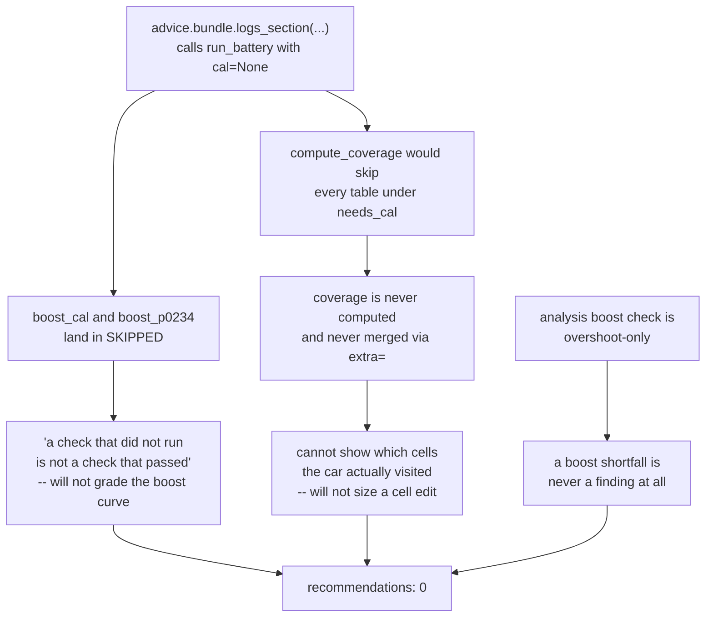

# The courier back-test — aggregate findings

The evidence U8 was built to produce, and the gate the brainstorm set for
stage 2 of [[2026-08-24-001-feat-tune-with-claude-courier-plan|Tune with
Claude]]. For a revision that already happened, `backtest.py` reconstructs the
session as it stood *before* it, exports a context bundle exactly as the app
would, and lets a model that has never seen the repository answer it. The reply
is replayed through the library's real guards and each recommendation is sorted
into one of four buckets against what the revision actually did.

**The answer is produced blind, and that is enforced rather than promised.**
`answer` copies the bundle, the answering guide, the schema reference and the
bundle reader into a throwaway directory outside this repository and runs a
fresh `claude -p` there — no repo, no `CLAUDE.md`, no auto-memory, no lineage.
Every run's full tool transcript is kept, and `replay` audits it. All audits so
far report **no tool call named a path outside the sandbox**.

## Bucket counts

| Revision | Recommendations | Agrees | Refused | Novel | Wrong | Case quality |
|----------|-----------------|--------|---------|-------|-------|--------------|
| R14      | 0               | 0      | 0       | 0     | 0     | weak — the actual change was not log-derived |
| R15      | 0               | 0      | 0       | 0     | 0     | **strong** — a log-driven change with its own logs in the bundle |
| R16      | *pending*       | —      | —       | —     | —     | fair — the actual change was later superseded unflashed |
| R10      | *not answered*  | —      | —       | —     | —     | **strong** — torque-limiter driven, and the battery has that check |
| **Total**| **0 so far**    | **0**  | **0**   | **0** | **0** | |

> [!important] The **Wrong** bucket is empty, and that is not yet a result
> Nothing has been recommended at all, so nothing could land in **Wrong**. An
> empty Wrong bucket earned by an empty Agrees bucket is not evidence that the
> answering side is safe — it is evidence that the courier is not yet producing
> recommendations to judge. The gate is not met, and it is not failed either.

## Why every reply so far is empty

Not model reticence. Each reply is a 7,000-character `summary` of correct,
checkable reasoning that stops one step short of an edit, and in each case the
step it stops at is the same one. Three symptoms, one root cause.



### 1. `cal=None` disables both the cal-aware checks and coverage

`simoscal/advice/bundle.py`'s `logs_section` calls the battery with `cal=None`.
The docstring gives a real reason — the cal-aware checks want the bin the logs
were *recorded on*, and a mid-edit session's working buffer has not been flashed
— and `advice-answering-guide.md` repeats it, telling the answerer that
`cal_resolved` is normally false and to say so in `summary` rather than guess.
Which is exactly what all three answers did.

But the reasoning does not hold for the case the courier is built for. The
bundle's own prompt is *"I flashed this calibration and drove it; these are the
logs from that session"* — in that case the session bin **is** the flashed bin.
The honest fix is to let the session say so, not to hard-code the pessimistic
answer.

`_op_advice_bundle` in `bridge.py` calls the same `logs_section`, so this is the
on-device behaviour too, not a property of the rig.

### 2. The guide promises a `coverage` section the bundle cannot produce

`advice-answering-guide.md` lists `coverage` in its table of what `logs` holds
(*"which table cells the logged operating points actually visited"*) and then
instructs the answerer to use it: *"Use `coverage` to check the cells you want
to move were actually visited."*

The bundle has no `coverage` key. `json.dumps(bundle).count("coverage")` is
**0** for all three exported bundles. `logs_section` never calls
`compute_coverage`, and never passes `extra=` to `findings_to_dict` — the
parameter that exists precisely to merge that section in. And even if it did,
`compute_coverage` skips every table when `ctx.cal is None`, per symptom 1.

This is what the R15 answer ran into head-on. It named `IP_FAC_BPA_SP[1]` —
Map for boost pressure actuator setpoint, VVL 1 — the exact table Sam edited —
and then refused, because *"its axes are exhaust flow factor × intake flow
factor and neither channel appears anywhere in this bundle, so I cannot show
which cells were visited or size a trim from evidence rather than from feel."*
The guide told it to check coverage. There was none to check.

### 3. The analysis battery has no boost-shortfall check

Separate root cause, and the one that fully explains R15. `simoscal.analysis`'s
`boost` check reports **overshoot only** — `_overshoot_zones` finds contiguous
regions where PUT exceeds setpoint. There is no undershoot, shortfall or deficit
check anywhere in the battery.

R15 exists to close a measured 4000–4500 rpm boost **shortfall**. That shortfall
is therefore not a finding in the bundle, in any form. Its raw signature is
present but unreported: the `wastegate` check's evidence carries
`max_wg_final_pct: 99.9985` — the gate driven fully closed — and that check's
own docstring already knows what that means (*"WG hit 100% only while under
setpoint during spool"*). The number reaches the bundle; the finding does not.

## What the answers got right

Worth recording, because it is the part that no guard supplies and the part
stage 2 would be buying:

- **Reconstructed the live switch-patch slot from first principles.** No channel
  in the bundle names the active slot. Both R14 and R15 recovered it by taking
  logged PUT minus logged setpoint error and matching the remainder to eight
  significant figures against a specific slot's breakpoints (slot 3 and slot 4
  respectively).
- **Refused to trust a dead PID.** R14: knock retard reads a flat 0.00° on every
  cylinder across every loaded WOT sample, and *"a dead PID and a clean engine
  look identical in that column."* It declined to recommend added boost or
  timing until the channel is verified live. A dry-run replay would not have
  caught that — the guards bound values, not premises.
- **Cross-domain sizing.** R15 computed that richening `IP_LAMB_BAS[1]` — Basic
  lambda setpoint grid from 0.800 to 0.75 needs ≈7 % more fuel, i.e. ≈104 % of
  what the pump actually delivered at 97.7 % HPFP effective volume — and used
  that to argue against adding boost at all: *"there is no fuel behind it."*
- **Declined to move a limit that does not bind.** Both replies found the lambda
  floors sitting leaner than the brief's stock figures, flagged that they must
  come down in the same revision that ever richens the setpoint grid or the
  enrichment gets clipped, and refused to move them alone.
- **Honoured the brief's traps.** Neither touched `C_M_AIR_CYL_SP_MAX` —
  Maximum allowed airmass setpoint. R15 explicitly noted it quoted no Calc HP or
  Calc TQ figure, so the in-gear trimming rule did not bear on any of its claims.

## Recommended next actions

In the order that would most change the bucket counts:

1. **Add a boost-shortfall check to the battery.** Until one exists the courier
   cannot reproduce a change of R15's kind however good the answering side is.
   The signal is already computed inside the `wastegate` check.
2. **Let a session declare that its bin is the one that was driven**, and pass
   the calibration to `logs_section` when it does. That un-skips `boost_cal` and
   `boost_p0234` and makes coverage computable, in one change.
3. **Wire coverage into the bundle** via `findings_to_dict(..., extra=...)`, or
   remove its row and its instruction from the answering guide. Promising a
   section that cannot be produced is worse than not having it.
4. **Re-run all four cases** once 1–3 land. Only then are the bucket counts
   evidence about the answering side rather than about the bundle.
5. **Carry the active switch-patch slot in the bundle**, since two independent
   sessions had to reconstruct it numerically to say anything about boost.

## Reproducing

```
Code/.venv/bin/python Docs/backtest/backtest.py list
Code/.venv/bin/python Docs/backtest/backtest.py export R15
Code/.venv/bin/python Docs/backtest/backtest.py answer R15
Code/.venv/bin/python Docs/backtest/backtest.py replay R15
```

Per-case detail is in `R<NN>/comparison.md`, which is what this repo tracks.

The artifacts themselves — `bundle.json`, `reply.json`, `replay.{json,md}`,
`state.json` and `answer_transcript.jsonl` — are **gitignored**. This remote is
public and a bundle is the entire decoded calibration in the clear, so the
evidence stays local and is regenerated by the four commands above rather than
published. `answer` costs an API call per case; `export` and `replay` are free
and deterministic.
