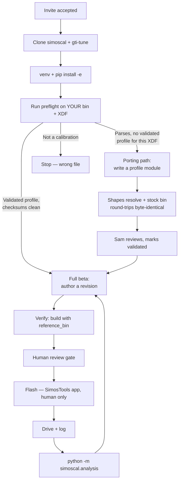

# Beta tester program — requirements

**Date:** 2026-08-17
**Status:** Brainstorm complete, ready for planning
**Supersedes in part:** `Docs/COLLABORATOR_QUICKSTART.md`, which welcomes a
*reviewer* of Sam's car ("you can get a lot out of these repos without touching
Python"). Beta testers tune their **own** cars, which is a different reader with
different risks.

## Problem

`simoscal` and `gti-tune` are private, single-author repos. Sam wants to open
them to beta testers recruited from the **SimosTools Users Facebook group**, who
will use `simoscal` to tune their own Simos18 cars. Four things block that:

1. **No entry point for that reader.** A newcomer lands on two repos, a 584-line
   API README, `index.md`, and a quickstart aimed at a reviewer. Nothing routes
   someone whose goal is "tune my car."
2. **The library only supports one car, and says so only by failing.**
   `simoscal` is built around the SC8S50 file structure and box code
   `5G0906259L_0002`. The SimosTools user base is much broader Simos18 — 18.1,
   18.6, 18.10, Golf R, S3, DQ250/DQ381 — so **most testers recruited from that
   group will not be on Sam's box code.** `Code/simoscal/preflight.py` already
   classifies any bin + XDF into exactly the verdict a newcomer needs, but it is
   a Python function with no CLI and no document tells anyone to run it. Today a
   tester on another box code discovers the limits by hitting them.
3. **The exclusions are one careless push from leaking.** The two things Sam
   will not share — `Code/android/` (Quick Edit app) and `Docs/promo/` (promo
   video) — live on *actively developed branches that are already pushed to the
   remotes testers would be invited to*. Their design docs are on `main`
   already.
4. **No terms.** `pyproject.toml` declares `license = "Proprietary"` and there is
   no LICENSE file, so testers have no statement of what they may do.

Underneath all four is the safety problem. Sam's calibration targets specific
hardware — IS20, upgraded intercooler, 92 octane, sea level to 6000 ft.
`Tunes/REV_LOG.md` reads like a recipe book. The realistic way this beta hurts
someone is a tester copying R15's boost targets onto different hardware.

## Goals & success criteria

1. **The workflow transfers.** Someone who is not Sam completes a full loop on
   their own car — revise → verify → flash → log → review — without Sam walking
   them through it.
2. **Bugs arrive from bins Sam does not own.** Crashes, wrong values, checksum
   failures, and confusing errors, reported against XDF/bin combinations outside
   Sam's car.
3. **At least one datalog from another car** lands in a form
   `python -m simoscal.analysis` can consume.
4. **At least one second box code is supported end-to-end**, via a profile
   module developed with a specific tester, without weakening the shape-checked
   resolution that makes the write gate meaningful.
5. **Zero leakage.** No promo or Android source is reachable from any ref a beta
   tester can see.

Explicitly **not** a goal: calibration peer review of Sam's tune. Testers are
here to exercise the tooling and the workflow; Sam's car is the worked example,
not the object of review.

**Verification:** clone every tester-visible remote fresh into a scratch
directory, run `git ls-tree -r --name-only` over *every ref* (not just `main`)
and grep for `promo|android|quickedit` — a hard pass/fail on goal 5. For goals
1–3, follow the new guide verbatim in a clean venv on a machine that is not
Sam's daily driver, run `pytest`, and run the documented preflight command
against the stock bin (expect recognised-writable), a non-SC8S50 Simos18 bin
(expect an unvalidated-profile verdict stated in plain English), and a file that
is not a calibration (expect a clean stop). For goal 4, the ported profile's
own stock bin must round-trip: open → save with no edits → byte-identical, and
checksums verify clean. For the license, `gh api repos/SamRyeIn/simoscal --jq
.license.spdx_id` returns `GPL-3.0` and a fresh clone carries the VW_Flash
BSD-2-Clause notice.

## Scope

**In — repository separation (chosen approach: evict to their own repos):**

- `Code/android/` moves to its own private repo (`simoscal-quickedit`). It
  depends on `simoscal/bridge.py`, which stays in `simoscal` — an accepted
  cross-repo dependency.
- `Docs/promo/` leaves the `gti-tune` remote — its own private repo, or
  untracked-and-local (the `.mp4`/`.wav` products are already gitignored).
- The four android/promo design docs currently on `gti-tune` `main` move with
  their code: `Docs/brainstorms/2026-07-21-simoscal-android-app-requirements.md`,
  `Docs/brainstorms/2026-07-25-simoscal-promo-video-requirements.md`,
  `Docs/plans/2026-07-21-001-feat-simoscal-android-app-plan.md`,
  `Docs/plans/2026-07-21-002-feat-simoscal-quickedit-v1-plan.md`.
- The `feat/quickedit-v1` and `feat/simoscal-promo-video` remote branches are
  deleted only *after* their content is safe in the new remotes.

**In — the compatibility gate:**

- A CLI entry point so a tester can run preflight as one command against their
  own bin and XDF, printing the verdict in plain English.
- The guide documents every verdict and what it means for the reader:
  recognised-and-writable → full beta; parses but no validated profile → read
  and explore, and here is the porting path; not a calibration → stop.

**In — porting to a second box code.** Pulled back into scope because the
recruiting channel makes it the majority case rather than an edge case. Three
sub-problems, all of which need answers before a second profile is written:

- **Where per-car safety knowledge lives.** It is currently spread across three
  places with a live duplication: `profiles/sc8s50.py` carries `TAG_FLOAT_BUG`
  on its specs, *and* `safety.FLOAT_BUG_SYMBOLS` carries the same four symbols
  as a module-level global. A per-car fact stored in a global is a porting bug
  waiting to happen. `sop_recipe.py` is worse — it has literal `5G0906259L`
  stock values inside its guidance strings. Consolidating onto the profile is
  the likely answer.
- **How a ported profile earns write access.** `preflight` hardcodes SC8S50 as
  the only writable profile. Replace with a registry lookup plus a graduated
  trust model: a new profile that resolves cleanly is *readable* immediately,
  but *writable* only once marked validated — and that mark is set by Sam after
  review, never by the contributor who submitted the profile.
- **A documented porting path** (`Code/docs/porting-to-another-xdf.md`) so a
  tester can attempt their own profile rather than waiting on Sam.

**In — the beta tester guide** (the primary deliverable):

- Lives in the `simoscal` repo, because that is the repo a tester installs and
  it must stand alone for someone who does not care about Sam's car.
- Copy-paste setup path a non-coder can follow, with the deeper reference
  (`Code/README.md`, `Code/docs/authoring-a-revision.md`) linked behind it.
- A load-bearing **"my car is not your car"** section, positioned before any
  content that could be read as a recipe.
- The house rules from `COLLABORATOR_QUICKSTART.md` that still apply: never
  flash unreviewed, never touch the stock recovery bin, new work in a new
  revision script, always name tables by ID + description, check gear indexing
  before reading logs, and the `C_M_AIR_CYL_SP_MAX` kg/stk trap.
- How to file a bug and what to include; how to submit a datalog.

**In — licensing and contribution terms:**

- `LICENSE` — GPL-3.0 at the `simoscal` root, matching `Switchleg1/SimosTools`
  (GNU General Public License v3.0), the norm the recruiting community already
  expects. `pyproject.toml` moves off `Proprietary`.
- `LICENSE-THIRD-PARTY` (or `NOTICE`) — retaining the VW_Flash BSD-2-Clause
  notice, © 2022-2024 Brian Ledbetter, for the checksum/CRC work
  `simoscal/checksum.py` adapts. BSD-2-Clause is GPL-compatible; the notice must
  survive redistribution, and a docstring is not a durable home for it.
- `CONTRIBUTING.md` — including a one-paragraph grant that contributors
  acknowledge in their PR, giving Sam a perpetual, irrevocable licence to use
  the contribution under any terms including relicensing. This preserves the
  option to ship Quick Edit on non-GPL terms later, which merged GPL
  contributions would otherwise foreclose.
- **A scoping statement, because the licence covers only Sam's own code.** It
  cannot cover `Code/bin/5G0906259L__0002.bin` (VW's copyrighted firmware) or
  `Code/xdf/*.xdf` (community-authored definitions). A bare GPL LICENSE at the
  repo root would implicitly claim to license both. The statement must say what
  the GPL grant does and does not reach.

**Out:**

- Making either repo public. The `simoscal` repo tracks OEM VW firmware and
  community-authored XDFs. Named collaborators on a private repo is the ceiling.
- Distributing the Quick Edit app or the promo video.
- A calibration peer-review workflow.

## Key flows

Two secondary flows the guide must cover: **filing a bug** (what to attach — the
preflight verdict, the revision script, the traceback; never a tuned bin in a
commit) and **submitting a datalog** (folder layout the analysis battery expects,
and the PID list used, since gear indexing depends on it).

## Acceptance examples

- **AE1** — A tester clones both repos, follows only the guide's setup section,
  and `pytest` passes in their fresh venv. No step required asking Sam.
- **AE2** — A tester runs the documented preflight command against the stock bin
  and gets a clear recognised-and-writable verdict.
- **AE3** — A tester runs it against a Simos18 bin from a different box code and
  gets a plain-English verdict that names the reason, points at the porting
  path, and produces no traceback.
- **AE4** — A tester runs it against a file that is not a calibration and gets a
  clear stop, not a crash.
- **AE5** — A fresh clone of every tester-visible ref contains no path matching
  `promo`, `android`, or `quickedit`.
- **AE6** — A tester authors and builds their first revision against their own
  bin, and `build()` fails loudly when they omit `reference_bin=`, or when a
  table they did not declare changed.
- **AE7** — A tester drops a datalog into the documented folder layout, runs
  `python -m simoscal.analysis`, and gets `analysis_findings.md` plus evidence
  plots with no hand-holding.
- **AE8** — A reader who skims only the guide's first screen comes away knowing
  that Sam's published tune values are hardware-specific and must not be copied.
- **AE9** — A newly contributed profile that resolves cleanly but has not been
  marked validated permits reads and **refuses every write**, with an error that
  explains why and what validation requires.
- **AE10** — A second box code's stock bin opens, saves with no edits, and is
  byte-identical to the input, with checksums verifying clean.

## Key decisions

1. **Testers tune their own cars** — not review Sam's. This is the decision that
   sizes everything else: it demands install docs, a compatibility gate, and a
   safety story, none of which a reviewer-oriented doc needs.
2. **Evict the excluded work into its own repos** (over cleaning the current
   remotes, or maintaining `*-beta` mirrors). It is the only option whose
   guarantee does not depend on Sam remembering something six weeks from now,
   and the only one that preserves off-machine backup on work that is still
   active. Mirrors were rejected for the permanent sync burden and the need to
   port tester PRs back by hand.
3. **Preflight is the front door.** The design answers "is your car supported?"
   at runtime instead of assuming it. Costs one small CLI.
4. **The guide lives in `simoscal`, not `gti-tune`.** The tool repo must stand
   alone. `COLLABORATOR_QUICKSTART.md` is reduced to "what is in this repo and
   why you would read it," pointing at the guide — one welcome doc, so the two
   cannot drift. Cheap to reverse if it reads wrong in practice.
5. **Porting is in scope, but the write gate is not weakened.**
   `preflight.py:64` refuses to write a bin it cannot fully resolve, because "a
   4×6 boost setpoint and an 8×12 boost setpoint are not the same table,
   whatever they are called." Porting widens *which* profiles exist; it must not
   loosen *how* a profile qualifies. Hence validated-by-Sam rather than
   trusted-on-arrival — a contributor cannot self-certify write access to their
   own engine.
6. **Both repos stay private, indefinitely.** OEM firmware and community XDFs
   are tracked in git.
7. **GPL-3.0**, matching `Switchleg1/SimosTools`. Community-normal for the
   recruiting channel, and compatible with the BSD-2-Clause VW_Flash code
   `checksum.py` adapts.
8. **Contribution grant in `CONTRIBUTING.md`**, acknowledged per PR, over a
   formal CLA bot (too heavy for a beta), DCO (grants no relicensing rights), or
   nothing (forecloses a non-GPL Quick Edit the moment a PR merges). With
   porting in scope, tester-written profile modules are the expected
   contribution, which makes this the load-bearing choice it would not otherwise
   have been.
9. **The licence grant is scoped explicitly.** Sam can license his code; he
   cannot license VW's firmware or community XDFs that ship alongside it.

## Deferred / out of scope for later

- Any public release of either repo.
- Quick Edit app distribution — its own program when the app is ready.
- Calibration peer review of Sam's tune.
- Porting beyond the second box code — generalising to 18.10, DQ250/DQ381, and
  other families. Get one port right first; the second one teaches what the
  abstraction actually needs.

## Outstanding questions

**Resolved during the brainstorm:**

- ~~Who are the first testers?~~ SimosTools Users Facebook group members.
- ~~What license?~~ GPL-3.0 + `CONTRIBUTING.md` grant + third-party notice.

**Deferred, answerable during planning:**

- Does `Docs/promo/` get its own repo or just become untracked-and-local? Its
  `hook_data.py` reads `Logs/`, so a separate repo inherits a data dependency on
  `gti-tune`.
- Is `simoscal/bridge.py` + `tune/catalog.py` staying on `simoscal` `main`
  acceptable? It is library code, not app code, but its docstrings announce that
  a Quick Edit app exists.
- Where do tester bug reports go — GitHub Issues on `simoscal`, or a channel
  outside git?
- How are testers vetted before an invite? Recruiting from a public Facebook
  group means the invite list is not a known set of people, and the repo
  contains OEM firmware.
- Which second box code, and which tester? Picking the port target is a
  planning-time decision that depends on who actually volunteers.
