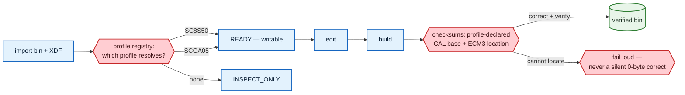

# Supporting other file structures — requirements

Make `SCGA05` (box code `3CN906259B`) a first-class **writable** profile, by moving
every per-car fact onto `Profile` and re-expressing `SC8S50` through the same
mechanism. Bench-verified only: no A05 bin is a validated tune until someone drives one.

Related: [[2026-08-17-beta-tester-program-requirements]] · [[2026-08-20-full-profile-coverage-requirements]] · [[ecu-tuning-basics]]

## Problem

`simoscal` is structurally single-car — not by design, but by accumulation. Per-car
facts sit in module globals and hardcoded constants, so a second calibration cannot
be supported without editing shared safety-critical code.

This was measured, not assumed. Against a real A05 set (`3CN906259B__0002_SCGA05.bin`
+ `SCGa05_cal.xdf`):

| Layer                | A05 result                                                               | Cause                                                |
|----------------------|--------------------------------------------------------------------------|------------------------------------------------------|
| Base XDF parse       | Parses, 2,915 tables                                                     | —                                                    |
| `BASEOFFSET`         | Declares **`0`**; S50 declares `0x200000`; A05 patch declares `0x220000` | Per-XDF, not per-tool                                |
| Base profile resolve | **50 of 69 resolve**; 19 miss                                            | 10 absent names, 9 shape variants                    |
| Patch profile        | **0 of 92 resolve**                                                      | `SWITCH_PATCH_2933` keyed to S50 hex addresses       |
| `CAL_CRC`            | Cannot verify — **one constant away**                                    | `CAL_BASE_ADDRESS` is `0x80800000`, not `0xA0800000` |
| `ECM3`               | Cannot verify — **genuinely relocated**                                  | ASCII part number sits at the S50 header offset      |
| `correct()`          | Changes **0 bytes**, raises nothing                                      | Cannot locate either checksum                        |
| `preflight`          | `INSPECT_ONLY`, never writable                                           | SC8S50 hardcoded as the only writable profile        |

Two consequences define the work:

1. **A foreign bin can never be made flash-ready today.** `correct()` returns the
   data unchanged. Write support is gated on checksum discovery, not on a registry.
2. **The nine shape variants are a safety result, not a defect.**
   `IP_IGA_BAS_IVVT_VVL_PORT_L[STND][i][e]` — Basic ignition angle by VVT/VVL, port
   injection — exists on A05 under the same symbol at **(16, 18)** where the SC8S50
   map declares **(16, 16)**. Mutation testing confirmed the shape check is the
   *only* barrier: declare the foreign grid and all nine resolve. Name-only
   resolution would write a 16×16 ignition map into a 16×18 table.

## Goals & success criteria

1. **A05 is writable and bench-correct.** Import → edit → build produces a
   checksum-valid, byte-audited A05 bin.
2. **SC8S50 is provably unchanged.** The existing 869-test suite passes without
   modification — it is the regression net for the refactor.
3. **No per-car fact lives outside a `Profile`.** A grep for car-specific constants
   outside `profiles/` returns nothing.
4. **A third profile is cheap.** Adding one is writing a profile module, not editing
   `checksum.py`, `safety.py`, or `preflight.py`.

## Scope

**In:**

- Move per-car facts onto `Profile`: CAL base address, ECM3 header location, float-bug
  symbols (`safety.FLOAT_BUG_SYMBOLS`), patch-space addresses, and the stock-value
  references currently inlined in `sop_recipe.py` guidance strings.
- Re-express `SC8S50` through that mechanism — it stops being the default and becomes
  one profile among two.
- **ECM3 header location discovery for A05.** The critical path.
- A05 base profile: the 69-spec equivalent, including per-car shape declarations for
  the nine ignition variants.
- A05 patch profile: the 92-spec equivalent, re-derived from
  `A05 Switch Patch.29.33.V2.xdf` (185 tables, parses cleanly).
- `preflight` profile registry, replacing the hardcoded SC8S50 writability check.
- Domain **machinery** ports; domain **guidance** stays silent unless the active
  profile declares its own values.

**Out:**

- Any claim that an A05 bin is a validated tune. Bench verification only.
- Calibration guidance, recipes, or safe-value recommendations for A05.
- Flashing. Unchanged: the library never flashes.
- A third or fourth box code.
- The 93 new specs from [[2026-08-20-full-profile-coverage-requirements]] — a moving
  target; A05 mirrors the map as it stands, not as it is becoming.
- A contributor-submitted profile trust model. Sam hand-builds this one.

## Key flow

## Acceptance examples

- **AE1** — Opening the A05 bin and saving with no edits produces a **byte-identical**
  file.
- **AE2** — `preflight` on the A05 set returns `READY` and `writable=True`, naming
  profile `SCGA05`.
- **AE3** — `verify()` on the stock A05 bin reports both checksums verifiable and
  clean, using the profile's own CAL base address and ECM3 location.
- **AE4** — Editing one A05 cell and building produces a bin whose checksums verify
  clean and whose byte audit shows only the journaled edit plus checksum bytes.
- **AE5** — The nine ignition tables resolve on A05 at (16, 18) and on SC8S50 at
  (16, 16), and a shape mismatch is still refused on both.
- **AE6** — The 869-test SC8S50 suite passes unmodified, and
  `test_foreign_structure.py`'s F1–F5 are updated to reflect A05's new writable
  status rather than deleted.
- **AE7** — `correct()` on a bin whose checksums cannot be located **raises** rather
  than returning unchanged bytes.
- **AE8** — A bin matching no registered profile is still `INSPECT_ONLY`, and the
  refusal names the detected software rather than only saying "not SC8S50".

## Key decisions

1. **Writable A05, hand-built** — not read-only, and not a general contributor
   registry first. Sam builds the second profile himself.
2. **Bench-verified only** — nobody drives an A05, so success is round-trip,
   checksum, and byte-audit correctness. No calibration claim is made.
3. **Mirror the current 161-spec map** (69 base + 92 patch), not the post-coverage
   215. Porting a moving target compounds two efforts.
4. **Approach C — the second profile as a forcing function.** Rather than special-casing
   A05, make the codebase structurally incapable of hardcoding a car. The existing
   suite makes this unusually safe to attempt, and it is what keeps profile three cheap.
5. **Domain machinery ports; domain guidance does not.** `sop_recipe.py` carries
   literal `5G0906259L` stock values in its guidance. Without an A05 to log, that
   guidance cannot be validated, so it stays silent rather than transferring.

## Outstanding questions

**Blocking:**

- **Can the ECM3 header be located on A05?** Unknown — genuine discovery, and the
  critical path. At the S50 offset A05 holds an ASCII part number, so the header
  moved rather than changed shape. **Fallback if it cannot be found:** A05 stays
  `INSPECT_ONLY` and the forcing-function refactor still lands as its own win. The
  port is never half-shipped as a writable profile with unverifiable checksums.
- **Do the A05 patch XDF's 185 tables cover the 92 patch specs' semantics?** The file
  parses and has the right shape, but no one has checked that every slot, flag, and
  limiter the S50 patch profile declares has an A05 counterpart.

**Deferred:**

- What happens to A05 when `full-profile-coverage` adds 93 specs to SC8S50 — parity,
  or an accepted gap?
- Does the app need UI distinguishing "bench-verified profile" from "validated on a
  car"? Likely yes before any A05 owner uses it, but not before the port exists.
- The contributor trust model for profiles Sam did not write.
