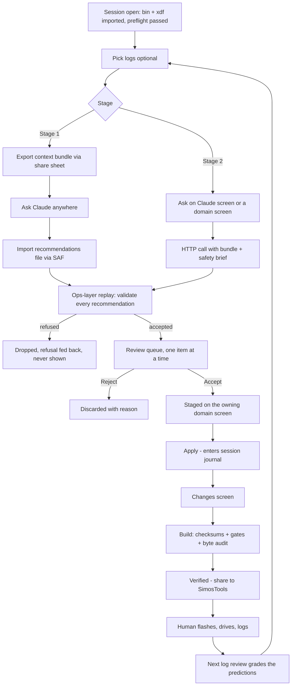

# Tune with Claude — requirements

Let a person open a session in the Android app and get **Claude's judgment on
their own calibration and their own logs** — as a queue of individually
reviewable recommendations, each of which must survive the app's existing
validation before a human ever sees it.

Built in two stages: an **off-device courier** that spends no Android
permission, then an **in-app API key** that does — and only once the courier
stage has proven the recommendations are worth the permission.

Related: [[2026-08-20-app-domain-screens-log-overlay-requirements]] ·
[[2026-08-20-full-profile-coverage-requirements]] ·
[[2026-08-17-beta-tester-program-requirements]] · [[ecu-tuning-basics]]

## Problem

The app edits well and now visualizes well, but it has no judgment. It will
happily let someone draw a boost curve that its own ceilings permit and that a
knock-limited engine hates. Today that judgment lives in exactly one place — a
Mac with Claude Code, the `simoscal` repo, `CLAUDE.md`, and the accumulated
knowledge notes — which means:

- **For Sam:** the loop breaks at the tablet. Log a pull at the track, and
  reviewing it properly still means walking back to the laptop.
- **For a beta tester:** the judgment does not exist at all. They get the
  editors and the safety ceilings, and none of the reasoning about *what to
  change and why*. They are flashing bins with the tooling but not the
  expertise.

> [!warning] What this collides with
> The app's central product claim is that it declares **zero Android
> permissions** — enforced by `verifyDebugNoPermissions` (reads the *merged*
> manifest, wired into `check`), stated in `docs/privacy-policy.md`, and the
> sole reason every Play Data safety answer is "No". `docs/play-data-safety.md`
> names this exact scenario as its trigger to be rewritten. Any in-app API call
> costs `INTERNET`, flips Data safety to **Yes / Files and docs**, and relaxes a
> gate that is currently absolute. That cost is why stage 1 exists.

## Goals & success criteria

1. A person with a session open can ask Claude about their calibration and
   their logs, and receive recommendations that **name tables the project's
   way** (`` `ID` — Description ``), in physical units, with evidence.
2. **No recommendation reaches the review queue without passing the same
   validation a typed edit passes.** A refused recommendation is dropped and
   the refusal is fed back, not shown as a suggestion with a warning on it.
3. Every recommendation is accepted or rejected **individually**. There is no
   "accept all", and nothing enters the session journal without a per-item
   human decision.
4. Stage 1 ships with the permission count still at zero.
5. Stage 2 unlocks only after the **back-test** passes (§ Stage gate).
6. An accepted recommendation is gradeable: it carried a prediction, and the
   next log review can say whether the prediction held.

## Scope

### In — stage 1: the off-device courier

- **Export a context bundle.** The app writes a single file containing the full
  session context: the `catalog()` (every mapped table, its ID, description,
  axes, and current physical values), the session edit journal, and any log
  files the person picked. Leaves via the existing FileProvider share sheet.
- **Import a recommendations file.** A schema-validated reply file, produced by
  Claude anywhere (Claude Code, claude.ai, a phone), picked back through SAF.
- **The review queue.** Each recommendation is presented one at a time with
  Accept / Reject / Show-me. Accept stages the edit on the owning domain
  screen; Reject discards it with a reason recorded.
- **The ops gate.** Every recommendation is replayed through the domain-op
  validation before it is queued. Refusals never render.
- **The safety brief.** A prompt document, generated from
  `knowledge/ecu-tuning-basics.md` so there is one place to fix it, shipped
  inside the bundle so whoever answers has the hard-won facts —
  `C_M_AIR_CYL_SP_MAX` — Maximum allowed airmass setpoint is kg/stk;
  `C_PRS_IM_SP_MAX` / `C_PRS_IM_SP_LIM` — Maximum / limit requested
  intake-manifold pressure setpoint are float32 with a meaningless declared max;
  overboost routing is `IP_PUT_AMP_DIF_MAX_PRS_DIF_THR` — Overboost
  pressure-difference threshold; the gear-header indexing rule; the Calc HP
  gear-flip trim.

### In — stage 2: the in-app API key

- **BYO key only.** The person supplies their own Anthropic API key. The app
  never ships, proxies, or subsidizes a key.
- **Two entry points.** A dedicated Claude screen for whole-session
  conversation, plus an "Ask Claude" affordance on each domain screen that
  pre-scopes the question to that domain. Both feed the same review queue.
- **Same bundle, same schema, same queue.** Stage 2 replaces the file
  round-trip with an HTTP call and changes nothing else. That is the point of
  the staging.
- **The policy rewrite, as a deliverable.** `privacy-policy.md`,
  `play-data-safety.md`, and the `verifyNoPermissions` allowlist are updated in
  the same change that adds the permission — not after.

### Out (explicitly)

- **Flashing.** Unchanged and non-negotiable. Claude's output ends at a bin the
  human shares to SimosTools.
- **Bypassing the human review gate.** No mode, flag, or setting accepts a
  recommendation without a person pressing Accept on it.
- **Sending the `.bin` or `.xdf` themselves.** Decoded values leave; the binary
  files do not.
- **A hosted/managed key, accounts, or any server component.** There is no
  backend in this product and this feature does not introduce one.
- **Claude authoring a whole revision** as one accept-or-reject unit. Rejected
  in favor of the per-item queue.
- **On-device local models.** Not for this.

## Key flows

### What a recommendation carries

Every item in the queue shows all of the following. An item that cannot supply
evidence is not shown at all.

| Field          | Content                                                                    |
|----------------|----------------------------------------------------------------------------|
| Table          | `` `ID` — Description ``, per the project naming rule. Both, always.        |
| Change         | Current → proposed, in physical units, per affected cell or axis point.     |
| Intent         | One line, the same shape an `intent=` carries in a revision script.         |
| Evidence       | The log rows or table values that justify it, citable and deep-linkable.    |
| Risk tier      | cosmetic / performance / **safety-relevant** — styled distinctly.           |
| Confidence     | Claude's own stated confidence in the recommendation.                       |
| Prediction     | What the next drive should show if this change is right.                    |

## Acceptance examples

- **AE1 — a recommendation that survives.** A 3rd-gear pull shows knock counts
  rising past 5200 rpm. Claude flags one change to `IP_FAC_BPA_SP[1]` — Map for
  boost pressure actuator setpoint, showing 62.0% → 57.5% at 5500 rpm, intent
  "pull wastegate duty where the pull knocked", evidence "pull #3, rows
  188–204, knock count 3, IAT 48 °C", risk tier *safety-relevant*, prediction
  "knock count returns to 0 across 5000–6000 rpm at similar IAT". Sam presses
  *Show on Boost*, sees it staged against the live curve, presses Accept. It
  enters the journal as one op with that intent.

- **AE2 — the kg/stk trap.** Claude recommends writing `2000` to
  `C_M_AIR_CYL_SP_MAX` — Maximum allowed airmass setpoint. The ops-layer replay
  refuses it (the store is kg/stk; 2000 raises the ceiling ~1.44 M×). The
  recommendation **never appears in the queue**; the refusal and its reason are
  returned to Claude, and the person sees a count of dropped recommendations,
  not the recommendation itself.

- **AE3 — no evidence, no flag.** Claude asserts a pedal-map change with no log
  rows or table values cited. The schema validation rejects the item as
  malformed. It is not rendered.

- **AE4 — stage 1 costs no permission.** After the courier flow ships,
  `verifyReleaseNoPermissions` still passes with the existing single-entry
  allowlist, and `play-data-safety.md` still answers "No" to collection —
  re-verified against the shipping commit.

- **AE5 — rejection is free.** Sam rejects 2 of 3 recommendations. The session
  journal contains exactly one new op. The build's byte-level audit against the
  previous bin allows exactly the bytes that one op touches, and an undeclared
  byte fails the build.

- **AE6 — the back-test.** Run the courier against the session state that
  preceded R14, R15, and R16. For each, Claude's recommendations either agree
  in direction with what Sam actually did (verifiable against
  [[REV_LOG]] and the matching `log_review.md`), or are refused by the ops
  layer. Disagreements are enumerated and explained before stage 2 begins.

- **AE7 — a graded prediction.** A recommendation accepted in revision N
  carried the prediction "peak boost tracks setpoint within 10 kPa through
  5500 rpm". The revision-N log review can state plainly whether it held.

- **AE8 — stage 2 changes only the transport.** The same session, asked the
  same question through stage 1 and stage 2, produces recommendations that go
  through the same schema, the same ops replay, and the same queue.

## Key decisions

| # | Decision                                                                 | Why                                                                                                                       |
|---|--------------------------------------------------------------------------|---------------------------------------------------------------------------------------------------------------------------|
| 1 | **Both audiences, staged** — Sam first, testers second                    | Sam is the proving ground with a known answer key; a tester is the thing that has to be earned.                            |
| 2 | **A review queue, not bulk apply**                                        | Claude flags everything it recommends; the person steps through them one at a time. No accept-all exists to be pressed.    |
| 3 | **Whole-session context** — full catalog, journal, and logs               | Cross-domain interaction is where the real insight is; scoping to one table gets shallow advice. Accepts the larger footprint. |
| 4 | **Binaries never leave** — decoded values only, never the `.bin`/`.xdf`   | Keeps the transmitted set to something a person can actually read and reason about before sending.                        |
| 5 | **Prompt subordinate to ops** — the code is the law                       | The safety brief makes recommendations start sensible; the ops layer is what makes them safe. A model honoring a prompt is not a guardrail. |
| 6 | **Both surfaces** — a Claude screen and per-screen entry points           | Whole-session context deserves a place to talk about the whole session; domain screens keep the domain-shaped philosophy.  |
| 7 | **Back-test on Sam's own revisions is the stage gate**                    | R13–R16 have known outcomes in the logs. Agreement or refusal is a checkable answer key, not a vibe check.                 |
| 8 | **Evidence + risk tier + prediction on every flag**                       | Evidence makes it reviewable, the risk tier makes safety-relevant items hard to thumb past, the prediction closes the loop. |
| 9 | **C then A** — courier first, API key second                              | The courier exercises every hard part (bundle, schema, queue, refusal loop) for the price of a JSON schema, and spends the permission only once earned. |
| 10 | **BYO key only; no backend, ever**                                       | This product has no server and must not grow one.                                                                          |
| 11 | **Rejected: library-side (B)**                                            | `simoscal`'s value is being deterministic and byte-reproducible, and it feeds the V0 parity gate. Network I/O does not belong in it. |

## Deferred / out of scope

- **Streaming responses.** A recommendation queue does not need token-by-token
  rendering.
- **Multi-turn conversation history persisted across sessions.**
- **Claude reading the `Logs/` analysis battery output** (`analysis_findings.json`)
  rather than raw CSVs — a plausible later shortcut, not needed to start.
- **Pops & bangs and any other domain the app does not already reach.** Claude
  can only recommend against tables that have a spec. No spec, no access — this
  rides on [[2026-08-20-full-profile-coverage-requirements]].
- **Cost display / token budgeting in-app.** Stage 2 concern at the earliest.

## Outstanding questions

**Blocking stage 2 (not stage 1):**

1. **Key storage.** Where does the API key live, and does it persist? The app
   currently stores nothing sensitive; a credential at rest is a new category
   for it. Android Keystore, session-only, or paste-per-request?
2. **Model choice and cost.** Which model, and what does a whole-session bundle
   cost per question? Consult the `claude-api` skill at plan time rather than
   assuming — do not carry model IDs or pricing forward from this doc, which
   deliberately names none.
3. **Failure behavior.** What does the app do when the call fails mid-review —
   network drop, rate limit, invalid key — with items already accepted?
4. **Tester disclaimer.** What exactly does a tester acknowledge before this is
   enabled for them, and where is it recorded?

**Deferred (answer during planning):**

5. Does the context bundle need any redaction (VIN, box code) before it leaves
   the device, or is a calibration dump acceptable as-is to the person sending it?
6. Does the bundle carry the safety brief, or does the answering side fetch it
   from the public `simoscal` repo? (Bundled is self-contained; fetched cannot
   go stale.)
7. Is the recommendations file schema versioned independently of the bridge
   protocol version?
