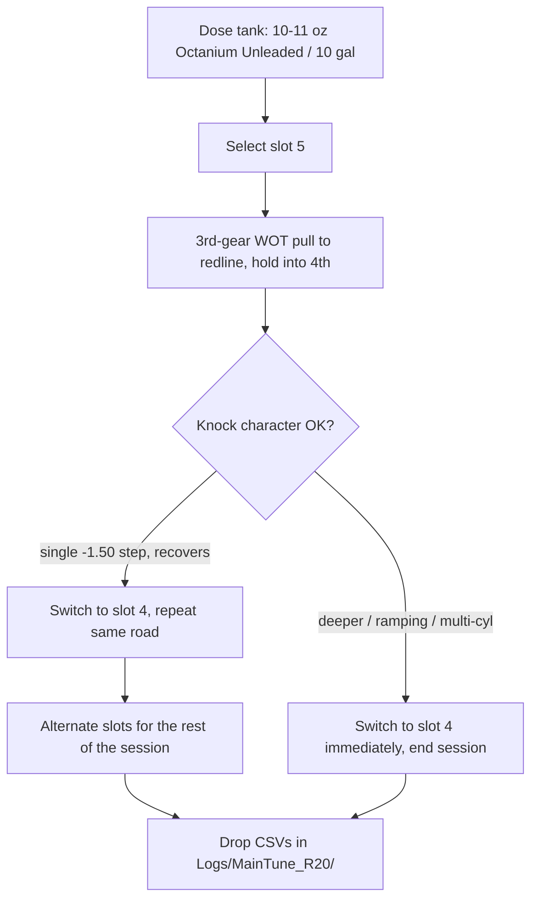

# Slot 5 booster timing map — requirements

Convert map slot 5 from the 10 psi valet map into an aggressive timing slot for
use on a tank dosed with an emissions-safe octane booster, while leaving slot 4
byte-identical as the everyday map and the in-drive fallback.

> [!important] The whole point of this design
> Slot 4 and slot 5 live in the **same bin**. This is the first revision in the
> lineage that can be A/B tested **within a single drive, on one tank, in one
> set of weather**, by switching slots between pulls. Every prior revision had to
> compare R(n) against R(n−1) across two flashes and two days of different air.

---

## Problem

`Logs/BasicsGuide_R19/log_review.md` found the delivered timing over loaded WOT
spans −14.6 to +3.4 °CRK with **clean knock and no torque-limiter activity** —
the pull-back is spark-map scheduling, not the engine defending itself. There is
apparent headroom, but on 92 AKI pump fuel it cannot be safely claimed: R17 tried
and produced a repeatable knock pocket at 4563–4973 rpm, which R18 had to retard
back out.

Raising the octane of the fuel is the one lever that moves the knock boundary
itself rather than trading against it. Nothing in the current calibration lets
that be exploited, because a bin holds one base-timing calibration shared by
every slot — so timing sized for boosted fuel would also apply on a normal tank.

**Who this is for:** Sam, on a dosed tank, on a known road, in cool air. Not a
daily-driver map.

## Goals & Success Criteria

1. Slot 5 delivers measurably more timing than slot 4 across 3000–6500 rpm at
   WOT airmass, and slot 4 is provably unchanged.
2. On a dosed tank, slot 5 produces **no knock event deeper than a single
   −1.50 °CRK step**, no ramping retard, no simultaneous multi-cylinder retard,
   and no event that fails to recover inside its own pull.
3. Slot 5 shows a **measurable F=ma wheel-horsepower gain over slot 4** in the
   same session, same tank, same air.
4. Knock event **rate** on slot 5 does not materially exceed R19's slot-4
   baseline of 8.63 events per loaded minute.
5. Switching back to slot 4 mid-drive returns the car to known R19 behavior.

## Scope

### In scope

Exactly two per-slot tables in the `Map Slot 5` category:

| Table | Current | Target |
|--------------------------|--------------------------|-------------------------------|
| `PUT setpoint` (`0x7d71a`) | flat 1705 hPa (10.0 psi) | copy of slot 4 (`0x7d65a`), 2243–2809 hPa |
| `Spark modifier` (`0x7d31a`) | all zeros | the map below |

### The slot 5 `Spark modifier` map

Degrees °CRK, added to shared base timing. **Only the 1200 and 1400 mg/stk rows
are written. All other 224 cells stay 0.00.**

| mg/stk | 3000 | 3500 | 4000 | 4500 | 5000 | 5500 | 6000 | 6500 |
|--------|-------|-------|-------|-------|-------|-------|-------|-------|
| 1200   | +1.00 | +1.50 | +2.00 | +2.75 | +3.50 | +2.00 | +1.50 | +1.00 |
| 1400   | +1.00 | +1.50 | +2.00 | +2.75 | +3.50 | +2.00 | +1.50 | +1.00 |

Composed of two layers:

- **Guide restore** — +0.75 at 4500 rpm, +1.50 at 5000 rpm. This hands back
  exactly what R18 retarded, returning slot 5 to the
  `knowledge/ecu-tuning-basics.md` starting table. Verified: the current bin
  already matches that table in 252 of 256 cells; these four are the only
  difference.
- **Octane credit** — +1.00 to +2.00 on top, tapered, weighted to the 4000–5500
  rpm band where the logs say knock actually limits.

Resulting **delivered** base timing, 1400 mg/stk row:

| rpm | 3000 | 3500 | 4000 | 4500 | 5000 | 5500 | 6000 | 6500 |
|--------|-------|-------|-------|-------|-------|-------|-------|-------|
| Slot 4 | −7.50 | −6.75 | −4.50 | −3.75 | −2.25 | +0.75 | +1.88 | +3.38 |
| Slot 5 | −6.50 | −5.25 | −2.50 | −1.00 | **+1.25** | +2.75 | +3.38 | **+4.38** |

### Out of scope

- **The nine `IP_IGA_BAS_IVVT_VVL_PORT_L[STND][i][e]` — Basic ignition angle
  maps must not change.** They are shared across all five slots; editing them
  would change slot 4. This is the single most important invariant.
- Every other per-slot table. `RPM limiter`, `Speed limiter`, all five torque-
  request curves and every feature flag are **already identical** between slots
  4 and 5 — verified against the R19 bin. No cloning needed.
- Slots 1, 2 and 3. Untouched.
- Knock-response tables. R19's `IP_IGA_DEC_KNK` — Spark retard at recognised
  knocking stays as flashed; this revision does not stack a knock change onto a
  timing change.
- Boost. Slot 5 gets slot 4's boost grid unchanged — **no boost increase
  anywhere in this revision.**

## The fuel

| Item | Value |
|--------------------------|--------------------------------------------------|
| Product | **VP Octanium Unleaded** — NOT Octanium 2855 |
| Dose | 10–11 oz per 10 US gallons |
| Claimed gain | 4.2 numbers at VP's 11 oz / 10 gal spec |
| Assumed effective octane | 92 AKI → ~96 AKI |
| Conversion used | ~1 °CRK per octane number, **half taken** |

> [!danger] Do not use VP Octanium 2855
> SKU 2855 contains TEL (tetraethyl lead). VP states it is for engines that do
> **not** have oxygen sensors or catalytic converters. This car has both, and
> every log review in this repo depends on the wideband O2 sensor. 2855 will
> poison the catalyst and the sensor. The correct product is **Octanium
> Unleaded**, which is the O2/cat-safe formulation.

> [!warning] 11 oz / 10 gal is a ceiling, not a step
> VP's headline "up to 7 numbers" requires 23–32 oz per 10 gallons, which is the
> **non-ECD dose**. Do not chase the headline number on this car.

## Key Flows

## Acceptance Examples

- **AE1** — Bin comparison of the R20 candidate against the R19 bin shows
  changes in exactly two tables: slot 5 `Spark modifier` and slot 5
  `PUT setpoint`. All 51 `IP_IGA_BAS_*` tables byte-identical.
- **AE2** — Slot 4's `Spark modifier` and `PUT setpoint` read back byte-identical
  to R19 off the saved file.
- **AE3** — Reading slot 5 `Spark modifier` back off the saved bin returns the
  16×16 map above, with 224 cells at exactly 0.00 and 16 cells non-zero.
- **AE4** — Slot 5 `PUT setpoint` reads back equal to slot 4's, cell for cell,
  peak 2809 hPa.
- **AE5** — In the validation session, a slot-4 pull and a slot-5 pull on the
  same road within the same tank show slot 5 with higher `Ign Avg` at matched
  rpm and airmass, by approximately the map values above.
- **AE6** — Across all slot-5 pulls, no `Knock Cyl n` channel goes below
  −1.50 °CRK, and no event window shows two cylinders retarding within the same
  sample.
- **AE7** — Slot 5 shows a higher peak F=ma wheel hp than slot 4 in the same
  session, computed with the in-gear trim from the `Calc HP` gear-flip rule.

## Key Decisions

| # | Decision | Why |
|---|--------------------------------------------|--------------------------------------------------------------------|
| 1 | Use per-slot `Spark modifier`, not base timing | Base timing is shared across all slots; only 24 tables are per-slot. `Spark modifier` is a full 16×16 rpm × airmass map in degrees on the same grid as the guide's table. |
| 2 | Start from the basics-guide table | The bin already matches it in 252/256 cells; the restore is four known cells the car has already run under R17, with logged consequences. |
| 3 | **Increments, not scale factors** | Base timing is signed, spanning −7.5 to +3.4° across the WOT band. A multiplier removes timing where the table is negative and adds it where positive — the opposite of the intent in half the map. |
| 4 | Take half the octane credit (~2° of ~4°) | The 1°/number rule spans 0.5–1.5; it only applies where knock-limited, and R19 shows the top end is scheduling-limited. Leaves margin for octane that cannot be verified in the tank. |
| 5 | Keep +1.00° at the 3000 rpm column | Sam's call. The R19 tip-in knock cluster at 3025–3149 rpm sits here, so if it recurs it will be harder to attribute — accepted knowingly. |
| 6 | Accept the undosed-tank risk | Sam's call. An accidental slot-5 selection on plain 92 will knock and be caught by knock control at −1.50°/event. Discipline, not calibration, is the control. |
| 7 | Copy slot 4 boost exactly, do not raise it | Keeps this a single-variable revision. Timing is the only thing being tested. |
| 8 | Lose the valet slot | Accepted. Slots 1–3 (stock / conservative / intermediate) remain as tamer maps; nothing hard-caps a stranger to 10 psi any more. |

## Deferred / Out of Scope

- A second, more advanced revision spending the remaining ~2° of octane credit,
  gated on this one logging clean.
- Anything about the R19 3rd-gear boost shortfall. `log_review.md` established
  it is sweep-rate lag, not missing feedforward, and it needs a closed-loop
  dynamics change, not a map change.
- Closing code-review P1 on the R19 intake-axis re-breakpoint. Still open, still
  needs a part-throttle high-rpm log.
- Restoring a valet map on another slot.

## Outstanding Questions

**Blocking — must be resolved in planning:**

- **Is `Spark modifier` additive?** Every slot currently holds all zeros and the
  car runs normally, which strongly implies `0 = no change` and therefore an
  additive offset onto base timing. But this has not been traced in code, and if
  it were a multiplier or an absolute value, writing +3.50 would be badly wrong.
  Confirm before the first flash — via `knowledge/ecu-tuning-not-the-basics.md`,
  the BinToolz patch source, or a deliberate small-value test.
- **Does the switch patch `Spark modifier` apply at WOT**, or only in some
  control states? Same class of question as the unresolved `PUT setpoint`
  override routing noted in `knowledge/sc8s50-switchpatch-xdf.md`.

**Non-blocking:**

- WOT airmass in the R19 logs reaches ~1600 mg/stk while the map's top Y
  breakpoint is 1400. Confirm the ECU clamps to the 1400 row rather than
  extrapolating — if it extrapolates along the 1200→1400 slope, the effective
  advance above 1400 mg/stk is unbounded. The map is flat between those two rows
  precisely so this cannot bite, but the behavior should be stated.
- Whether the booster's octane gain is uniform in a partially full tank, and how
  long after dosing it is fully mixed.

## Validation gate

Standard tuning-loop gate plus one addition unique to this revision:

1. Human review of the R20 report and comparison PNGs before flashing.
2. **Alternate slots within one session on one dosed tank** — this is the
   controlled A/B that no previous revision could run. At least three slot-5
   pulls and three slot-4 pulls, same road, interleaved.
3. Keep the per-cylinder knock-sensor channels in the logging list.
4. Cool air. Full 3rd-gear WOT pulls to redline, holding WOT into 4th.
5. Drop a `*.bin.txt` record of the flashed file into the log folder — three
   revisions running, the log folders cannot prove what was flashed beyond a
   filename.

**Stop signals** (switch to slot 4 immediately and end the session): any retard
deeper than −1.50 °CRK, retard that ramps rather than decaying, two cylinders
retarding in the same sample, accumulated retard approaching the untouched
`IP_IGA_MAX_KNK` — Maximum knock retard floor, or loss of lambda or fuel-
pressure control.

Related: [[ecu-tuning-basics]], [[sc8s50-switchpatch-xdf]],
[[ecu-tuning-not-the-basics]]
