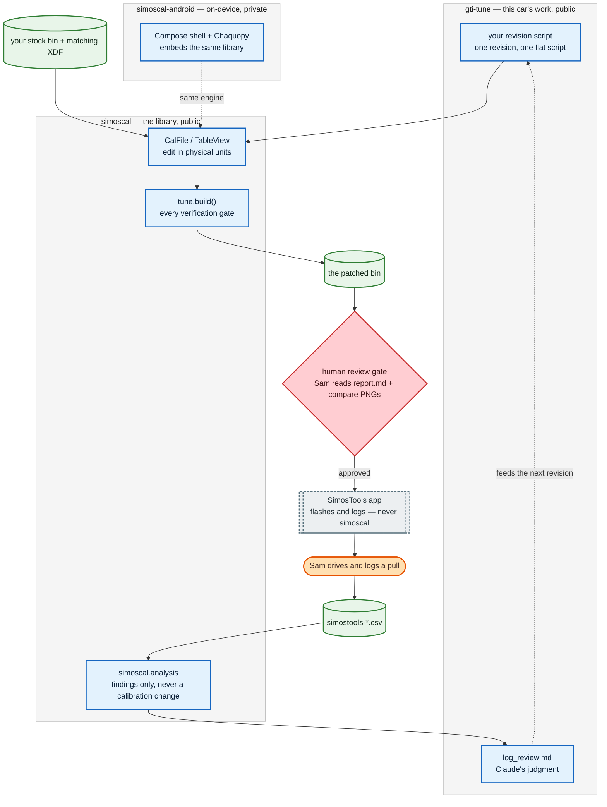
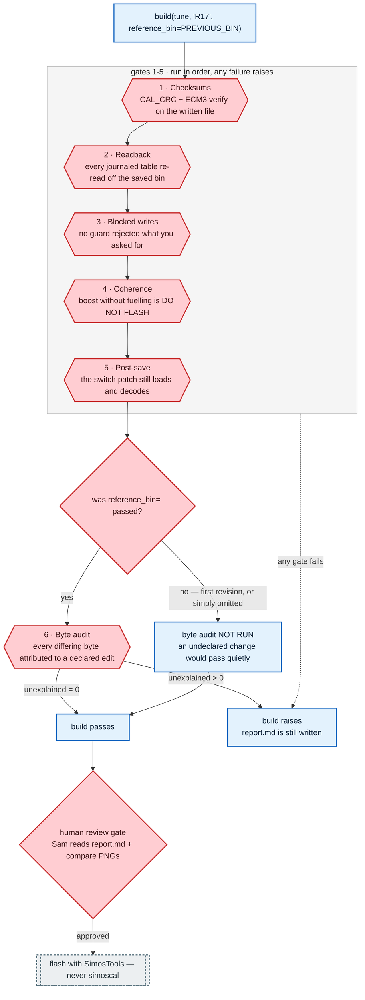

# Diagram conventions

Canonical visual vocabulary for mermaid diagrams across the three repositories:
`gti-tune` (this repo), `simoscal` (`Code/`), and `simoscal-android`.

Plan: `Docs/plans/2026-08-20-001-feat-mermaid-documentation-diagrams-plan.md`
Requirements: `Docs/brainstorms/2026-08-20-mermaid-documentation-diagrams-requirements.md`

> [!important] Mermaid has no include mechanism.
> Every diagram inlines its own `classDef` block. This file is the **canonical
> copy** — paste from here, never retype. Diagram drift across repos is the
> single largest decay risk in this work, and it will not announce itself.

## The five roles

| Role       | Shape            | Class      | Means                                                                        |
|------------|------------------|------------|------------------------------------------------------------------------------|
| Human step | `([stadium])`    | `human`    | Sam does this. Flashing, driving, logging, final approval.                   |
| Automated  | `[rectangle]`    | `auto`     | Code or Claude does this. Scripts, builds, analysis, reviews.                |
| Gate       | `{{hexagon}}`    | `gate`     | A check that can fail and stop the flow.                                     |
| Branch     | `{rhombus}`      | `gate`     | A yes/no fork. Same class as a gate, different shape.                        |
| External   | `[[subroutine]]` | `external` | Not ours. SimosTools, TunerPro, VW_Flash. Dashed border.                     |
| Data file  | `[(cylinder)]`   | `data`     | A file on disk. Bins, CSVs, `.md` outputs.                                   |
| Boundary   | `subgraph`       | `boundary` | A repository or bounded system. Style it — the default is a clashing yellow. |

Shape carries the meaning **redundantly with colour**, so the diagrams stay
readable for colourblind readers and in greyscale print. Never rely on colour
alone to distinguish two roles.

## The `classDef` block

Paste this verbatim into every diagram, then drop the classes that diagram does
not use:

```
  classDef human    fill:#FFE0B2,stroke:#E65100,stroke-width:2px,color:#3E2723
  classDef auto     fill:#E3F2FD,stroke:#1565C0,stroke-width:2px,color:#0D2137
  classDef gate     fill:#FFCDD2,stroke:#C62828,stroke-width:2px,color:#3E1416
  classDef external fill:#ECEFF1,stroke:#546E7A,stroke-width:2px,color:#263238,stroke-dasharray:4 3
  classDef data     fill:#E8F5E9,stroke:#2E7D32,stroke-width:2px,color:#14281A
```

Subgraphs take `style`, not `classDef`. Style every one — mermaid's default
subgraph fill is a yellow that fights the palette above:

```
  style REPO_ID fill:#F5F5F5,stroke:#BDBDBD,stroke-width:1px,color:#212121
```

Fill, stroke **and** text colour are all set explicitly. That is deliberate: it
makes every node theme-independent, so the same source renders identically in
Obsidian's light and dark themes and in GitHub's. Only edge lines and text
outside nodes follow the viewer's theme.

## Rules

1. **Quote every label containing a table ID.** This project's IDs carry
   brackets. `A[IP_FAC_BPA_SP[0]]` fails to render and `mmdc` exits 1 with no
   output; `A["IP_FAC_BPA_SP[0]"]` renders. When in doubt, quote.
2. **ID in the node, description in a legend beneath.** `CLAUDE.md` requires
   both the parameter ID and its plain-English description. Two-line node
   labels wreck the layout, so the node carries the ID and a small aligned
   table directly under the diagram carries the descriptions.
3. **No LaTeX in node labels.** Obsidian renders LaTeX in note bodies but not
   inside mermaid labels. Use Unicode and plain expressions; keep any real
   maths in the surrounding prose.
4. **Mermaid replaces ASCII art — the two never coexist.** Leaving the old
   drawing in place guarantees they drift apart.
5. **Avoid parentheses inside `[(cylinder)]` labels** — they terminate the
   shape early. Everywhere else, quoted labels take literal parentheses
   perfectly well: write `["tune.build()"]`.
6. **Never use HTML entities such as `&#40;` to escape a character.** They do
   not decode — they render literally as `&(`. If a label needs a special
   character, quote the label instead.
7. **Keep labels self-explanatory.** A fresh Claude session reads `CLAUDE.md`
   as unrendered source, so the text should make sense without the picture.

## Verifying a diagram

```
mmdc -i diagram.mmd -o diagram.svg
```

Exit 0 and a non-empty SVG means the syntax is good.

> [!warning] `mmdc` is necessary but not sufficient.
> `mmdc` bundles mermaid 11.16.0; Obsidian 1.12.7 ships its own build. A clean
> compile proves syntax, **not** that the vault renders it. Any diagram landing
> in `knowledge/` or `index.md` also needs an eyeball in Obsidian, light and
> dark.

Piping `mmdc` output through `tail` masks its exit code. Check the code itself.

## D1 — the system map (canonical source)

Appears verbatim in all three READMEs. Diff against this copy when auditing.



Subgraphs take `style`, not `classDef`. Style every one — mermaid's default
subgraph fill is a yellow that fights the palette above:

```
  style REPO_ID fill:#F5F5F5,stroke:#BDBDBD,stroke-width:1px,color:#212121
```

The loop is the point: a revision produces a bin, the human flashes and drives
it, the logs come back, and the review feeds the next revision. Labels are kept
generic on purpose — this block is duplicated verbatim into a public library
README, where one car's filenames would read as canonical. The dashed edge is
the only thing android adds — it runs the same library on a tablet.

## D10 — the `build()` gate sequence

The six gates run in order and the build fails if any of them does. The branch
is the reason this diagram exists.



`SKIP` is drawn as an ordinary step, not a gate, on purpose: nothing failed, so
nothing is red. That is exactly what makes omitting `reference_bin=` dangerous
— the build still passes. A first revision has no predecessor and legitimately
reports "not run"; every revision after it should pass the previous output.
