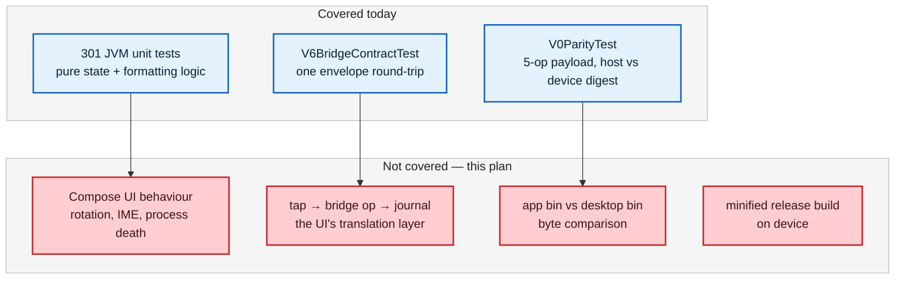
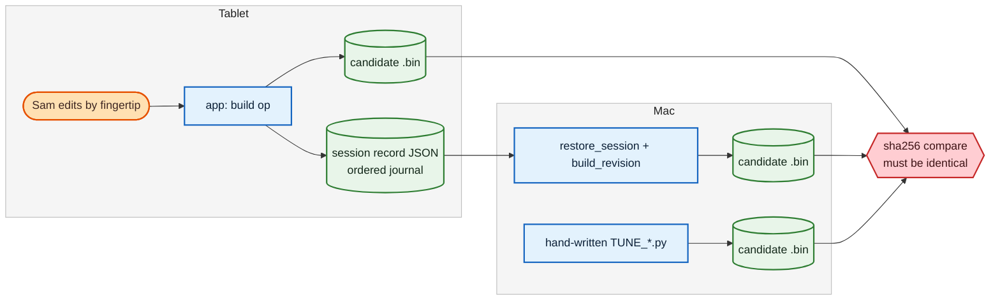

# Android beta-release test plan

Date: 2026-08-22
Type: test
Origin: Play Store beta (closed testing) readiness
Depth: Deep (9 units; `simoscal-android` + a new cross-repo parity harness)
Status: ready for execution

## Summary

Everything that has to be true before `simoscal-android` goes to a closed
Play Store track. The app is not a normal Android app: its output is a file a
human flashes into an engine controller, so the release question is not "does
the UI work" but **"is the bin this app produced the same bin the desktop
library would have produced?"**

That question has never been asked end-to-end. It is unit **T4**, and it is the
centrepiece of this plan. **T4B** then widens it beyond the single bin and single
XDF everything is currently tested against — the beta's recruiting channel means
most testers will not be on Sam's box code. The remaining units exist to make
those answers trustworthy and to cover the ordinary Android risks the beta will
otherwise find on Sam's behalf.

> [!warning] The failure mode this plan exists to prevent
> A tester edits a boost curve on the tablet, the app reports a verified build,
> they flash it, and the bytes differ from what the same edits produce on the
> desktop. Nothing in the current suite would catch that. The app and the
> desktop share a Python library but reach it down **two different call paths**
> — `simoscal.tune` on the desktop, `simoscal.bridge` from Kotlin — and only
> the second is untested above the envelope layer.

## Goal

A closed-track release for which every one of these is true:

1. A real editing session performed by fingertip on the tablet produces a
   candidate bin **byte-identical** to one produced on the Mac from the same
   source bin and the same edits (T4).
2. The structural basis is wider than one bin and one XDF: the 37,133-table
   `SC8S50.ALL.xdf` is characterised on hardware, foreign box-code XDFs are
   pinned inspect-only, and malformed inputs fail loudly (T4B).
3. The minified release APK — not just the debug build — passes the device
   suite (T5).
4. Every screen survives rotation, process death, and the software keyboard on
   the actual target hardware (T2, T3).
5. The Play listing, Data safety form, and privacy policy are complete and
   consistent with the permission-free manifest the build already enforces (T7).
6. Testers have a documented, safe way to report a wrong bin (T8).

## Verified baseline (measured 2026-08-22, `main` @ `18e189e`)

Facts, not assumptions — each was read off the repo or a run, and each is a
number this plan later depends on.

| Item                          | Measured                                                            |
|-------------------------------|---------------------------------------------------------------------|
| JVM unit tests                | **301 passing, 0 failures, 0 errors**, across 21 classes            |
| README's stated test total    | **226** — stale for the fifth time (see below)                      |
| Instrumented tests            | **2** — `V0ParityTest`, `V6BridgeContractTest`                      |
| Compose UI tests              | **0** — no `androidx.compose.ui:ui-test-junit4` dependency          |
| Production Kotlin             | ~11,400 lines across 38 files; largest is `EditorViewModel` (1,372) |
| Shipped ABI                   | `arm64-v8a` only                                                    |
| `minSdk` / `targetSdk`        | 26 / 35                                                             |
| `versionCode` / `versionName` | 1 / `0.1.0`                                                         |
| Release build                 | R8 minify + resource shrink ON, `proguard-rules.pro` load-bearing   |
| Build-enforced gates          | permission gate (merged manifest), release-signing gate             |
| Bins available to test with   | **1 structure only** — every `.bin` on disk is `5G0906259L_0002`    |
| XDFs available to test with   | 2 SC8S50 base (3,912 and **37,133** tables) + 5 foreign patch defs  |
| Writable profiles             | **1** — `preflight` hardcodes SC8S50; no registry exists            |

The four test classes missing from the README's table are `LimitersUiStateTest`
(24), `LambdaUiStateTest` (18), `PedalUiStateTest` (16), `LogOverlayTest` (13)
and `BoostPlotOverlayTest` (4). The README already documents that this figure
has gone stale four times and calls itself "this document's stated pass
criterion". It is stale again, which means the stated pass criterion currently
cannot distinguish a complete run from a partial one — fixed in T1.

## What is already covered, and what it does not cover



`V0ParityTest` is genuinely strong but genuinely narrow. It proves the embedded
runtime computes identically to the desktop for **one fixed payload**: XDF parse
at 5.8 MB, numpy decode, checksum arithmetic, the minimal-diff writer, and the
psi→hPa floor. It does not touch `EditorViewModel`, `BoostCurve`,
`LimitersUiState`, or any other code that decides *what to ask Python for*.

`V6BridgeContractTest` asserts one `bridge_info` call crosses as JSON. That is
the entire on-device coverage of a 1,386-line bridge with 30-odd operations.

---

## T1 — Baseline hygiene

Cheap, and everything downstream reads more honestly once it is done.

1. **Correct the README test table** to 301 and add the five missing classes.
   Then make it self-maintaining: add a JVM test that asserts the total, so the
   next drift is a red test rather than a stale sentence. Reading the count out
   of the JUnit XML is not available to a unit test — instead assert the
   *class list* is the expected set by reflection, or add a Gradle task that
   diffs the XML total against a checked-in number.
2. **Re-run and record** the full gate from a clean build directory, not an
   up-to-date one. `./gradlew clean` first — the run that produced 301 above
   reported `testDebugUnitTest UP-TO-DATE` on first invocation, which is exactly
   the shape of a green run that tested nothing.
3. **Triage the `simoscal` code-review backlog.** 40-odd findings sit `Open` in
   `Code/code_review.md`, most in the test layer. Three are High and directly
   weaken the acceptance suite the app now depends on: `CR-20260706-01` (byte
   diff blind to appended bytes), `CR-20260706-02` (safety suite silently
   skips), `CR-20260706-03` (offset math ignores `base_subtract`). These gate
   T4's credibility — a byte comparison is only as good as the diff that
   performs it. Fix or explicitly accept each, in writing, before T4 runs.

**Exit:** clean-build gate green, README total matches the run, three High
findings closed or documented as accepted with reasoning.

---

## T2 — Close the Compose UI gap

Zero UI tests against ~4,900 lines of Compose across ten screens is the largest
untested surface in the app.

Add `androidx.compose.ui:ui-test-junit4` and write instrumented UI tests. Keep
them behavioural — assert what a person sees and can do, not internal state,
which the 301 JVM tests already cover well.

**Priority order (highest risk first):**

| # | Screen / behaviour                         | What must be asserted                                                                  |
|---|--------------------------------------------|----------------------------------------------------------------------------------------|
| 1 | Boost canvas drag                          | A drag never produces a cap the engine refuses; the two ceilings both render           |
| 2 | Typed-value refusal                        | A typed out-of-range number is **refused**, never silently clamped — the cardinal rule |
| 3 | Build → share gating                       | Share is unreachable unless `BuildState.Verified`; a stale build invalidates it        |
| 4 | Rotation on every screen                   | State survives; no crash; no lost draft                                                |
| 5 | IME open on every screen with a text field | Canvas never sized negative; content stays reachable                                   |
| 6 | Process death mid-edit / mid-build         | Recovery restores the journal; the bin is re-verified                                  |

> [!important] Two landscape crashes recorded but not yet re-confirmed
> A prior session found two reproducible landscape-only crashes on `main` — a
> nested `horizontalScroll` in the log overlay, and the IME squeezing the boost
> canvas to a negative size. No fix commit is visible in the log and no
> `CR-` entry exists for either. **Re-confirm both on hardware first**, then log
> them as findings and fix them. Items 4 and 5 above are the regression tests.
> `BoostScreen.kt` carries `horizontalScroll` at four call sites (465, 560, 878,
> 911) inside two `verticalScroll` containers — that is where to look.

**Exit:** UI suite green on the target tablet in both orientations; the two
landscape crashes either reproduced-and-fixed or shown not to reproduce, with
evidence either way.

---

## T3 — Hardware checklist

The README's own "What V7 still owes" list, which has no host-side substitute.
Run every item on the **Galaxy Tab A9+ (`SM-X210`, Android 16, arm64)** — the
actual target device, not an emulator.

- [ ] Share hand-off to SimosTools with a real bin (receives, opens, correct size)
- [ ] Airplane-mode import → edit → build → export (proves no network dependency)
- [ ] Process-death recovery during **copy**, during **edit**, during **build**
- [ ] Rotation on all ten screens
- [ ] Low-storage behaviour during build (fill the volume, confirm a loud failure, not a truncated bin)
- [ ] **Tablet layout** — currently renders as a phone-width column on a 1200 px
      tablet. This is a beta blocker in a way it would not be for a phone-first
      app: the target device *is* a tablet, SimosTools runs on the same one, and
      the boost editor is a direct-manipulation canvas whose usability scales
      with drawn width.
- [ ] Play Protect: confirm a sideloaded release APK installs, and note the
      warning testers will see if they sideload rather than install from the track

**Exit:** every box ticked with a note; tablet layout addressed or explicitly
deferred with a tester-facing note explaining it.

---

## T4 — Bin parity: the app's output vs desktop `simoscal` — CENTREPIECE

The unit the user asked for, and the one that decides whether the beta is safe.

### The three levels

Each is strictly stronger than the last. Level 2 is the new work; Level 3 is
the claim that actually matters for a tester who works in both places.



#### Level 1 — Runtime parity (already exists; re-run it)

`parity/push_fixtures_and_compare.sh push` → run `V0ParityTest` → `compare`.

Two standing hazards, both already documented in the harness and both worth
restating because they produce a **green run that proved nothing**:

- A missing boost fixture records the leg `SKIPPED`; host and device then agree
  at a different self-consistent digest and print `PARITY: MATCH`. The `compare`
  branch greps for `"skipped"` and fails — do not bypass it.
- The host half must run under Python **3.13**, matching what Chaquopy embeds.
  A 3.14 host disagreeing tells you nothing.

Re-run on the **release** build too (T5), not only debug.

#### Level 2 — Session-replay parity (NEW — build this)

This is the mechanism that closes the tap → bin gap, and the library already
has every piece it needs.

`bridge._op_session_serialize` returns a recovery record carrying the **ordered
journal** — the exact sequence of edits, not the bin bytes.
`tune/recovery.py:restore_session` consumes it on the desktop, and
`tune/build_service.py:build_revision` produces the candidate.

**Procedure:**

1. On the tablet, perform a scripted editing session through the UI — a fixed,
   written-down sequence of taps covering every domain screen: a boost slot cap,
   an rpm-axis re-breakpoint, a limiter, a pedal-map cell, a lambda cell, and a
   generic table cell. Write it down *before* running it, so it is repeatable.
2. Build with a known revision label.
3. Capture three things off the device: the candidate bin, the serialized
   session record, and `build_report.json`.
4. On the Mac, replay: `restore_session(record)` against the same source bin and
   XDF, then `build_revision(...)` with the same revision label and the same
   `reference_bin`.
5. **Compare sha256 of the two candidate bins. They must be identical.**

**Comparison hygiene — do not skip:**

- Compare **bytes, not paths**. `build_revision` writes into a fresh
  `staging_dir/<revision>-<id>/` per build by design, so the paths differ and
  the file names may differ. The bytes must not.
- Compare the two `build_report.json` files **after normalising** timestamps,
  paths, and any per-build id. The gate list, the edit journal, the changed-table
  set, and the checksum values must all match exactly.
- Assert **file length** as well as content. A truncated write and a byte
  difference are different bugs and one hash comparison hides which.
- If the hashes differ, the diff is the finding. Reduce it to a table+offset and
  attribute it to a specific op before changing anything.

**Automate it.** Add `parity/replay_session_parity.py` alongside the existing
harness, in Python, importing from the `simoscal` checkout the same way
`run_host_parity.py` does — same repo, same language, same idiom. Give it the
same loud-failure discipline: refuse a partial input rather than reporting a
match over a session that replayed nothing.

#### Level 3 — Equivalence to a hand-written revision script

The strongest claim, and the one a beta tester's workflow depends on: someone
may edit on the tablet and then continue in `simoscal.tune` on a laptop, or the
reverse. The two front-ends must be interchangeable.

Take the Level 2 session and hand-write the equivalent
`TUNE_MainTune_R<NN>.py` using the `simoscal.tune` domain API — physical units,
an `intent=` on every call, per the authoring guide. Build it. Compare against
the app's bin.

> [!note] A difference here may be legitimate — but it must be explained
> The app and a script can reach the same calibration by different journal
> orderings, and the byte-audit allowance is derived from the journal. If the
> bins differ, determine whether it is an ordering artefact or a real
> disagreement **before** deciding whether byte-identity is the right bar. If it
> is ordering, either pin the order or state in the beta guide that the two
> front-ends agree on values but not on journal order. Do not quietly relax the
> bar.

### T4 exit criteria

- Level 1 green on debug **and** minified release, zero `SKIPPED` legs.
- Level 2 automated, and byte-identical across at least **three** distinct
  scripted sessions — one trivial (single cell), one broad (every domain
  screen), one adversarial (edit, undo, redo, edit again, re-breakpoint an axis).
- Level 3 either byte-identical or with every difference explained in writing.
- The whole procedure written into `simoscal-android/README.md` so it can be
  re-run against any future build, by someone who is not the person who wrote it.

---

## T4B — Alternate bin and XDF file structures

Everything in T4 runs against **one** bin and **one** XDF. That is the narrowest
possible basis for a beta whose recruiting channel is the SimosTools Users
Facebook group, where 18.1 / 18.6 / 18.10, Golf R, S3 and DQ250/DQ381 are all
represented and **most testers will not be on Sam's box code**.

This unit widens the structural basis. It is split by what is actually available
on this machine today, because a plan that assumes files Sam does not have is a
plan that quietly does not run.

### Inventory — measured 2026-08-22

| File                                     | Tables | Size      | `deftitle`   | `BASEOFFSET`                                        |
|------------------------------------------|--------|-----------|--------------|-----------------------------------------------------|
| `Code/xdf/SC8S50.V1.0.xdf` (primary)     | 3,912  | 5.8 MB    | `SC8S50.a2l` | `0x200000` (hex)                                    |
| `Code/xdf/SC8S50.ALL.xdf`                | 37,133 | **59 MB** | `SC8S50.a2l` | `2097152` (**decimal**)                             |
| `BinToolz .../S50 Switch Patch.29.33.V2` | 185    | 283 KB    | `SC8S50`     | `2097152`                                           |
| `BinToolz .../A05 Switch Patch.29.33.V2` | 185    | 283 KB    | `SCGA05`     | **`2228224`** (`0x220000`)                          |
| `BinToolz .../O30`, `LB6`                | 185    | 283 KB    | (per box)    | (per box)                                           |
| `BinToolz .../V30 Switch Patch.29.33.V2` | 185    | 283 KB    | `SCGV30`     | (per box) — **differs in size from the other four** |

Bins: **every `.bin` on this machine is `5G0906259L_0002`.** There is no second
box code to test against. `Tunes/android/test00.bin` is 4 MiB and differs from
stock in 24,287 bytes — it is an app-edited SC8S50 bin from 2026-08-15, useful
as a regression fixture but *not* a different structure.

### Tier A — available today, nothing to source

Measured by running `preflight` read-only against the stock bin:

| XDF                        | Verdict        | Writable | Wall clock |
|----------------------------|----------------|----------|------------|
| `SC8S50.V1.0.xdf`          | `READY`        | yes      | **2.0 s**  |
| `SC8S50.ALL.xdf`           | `READY`        | yes      | **18.5 s** |
| `A05 Switch Patch` (other) | `INSPECT_ONLY` | no       | 0.3 s      |
| `V30 Switch Patch` (other) | `INSPECT_ONLY` | no       | 0.3 s      |
| `S50 Switch Patch` (own)   | `INSPECT_ONLY` | no       | 0.3 s      |

Three test cases fall straight out of that table.

#### A1 — `SC8S50.ALL.xdf` on the tablet — the highest-value new test

This is a **legitimate, fully writable definition for the same bin**, and it is
9.5× slower and 10× larger than the primary: 37,133 tables against 3,912, 59 MB
of XML against 5.8 MB. A tester who has it will load it, and nothing in the
current suite has ever parsed it on a device.

> [!warning] This is an untested OOM / ANR risk, not a performance nicety
> 18.5 s on an M-series Mac with no memory ceiling says very little about a
> Galaxy Tab A9+. 59 MB of XML expands to a much larger DOM, and Android will
> kill the process rather than swap. The failure mode to look for is not
> slowness — it is a silent process death mid-import, or an ANR, or a partial
> parse that reports success.

- [ ] Import `SC8S50.ALL.xdf` on the target tablet; measure wall clock and peak
      memory (`adb shell dumpsys meminfo com.simoscal.engine`)
- [ ] Confirm the UI stays responsive, or shows honest progress, for the whole parse
- [ ] Confirm the app is not killed, and that a kill mid-parse is recoverable
- [ ] Run **T4 Level 2 session-replay parity using `ALL` as the XDF** — the
      journal must replay on the Mac to a byte-identical bin, exactly as with V1.0
- [ ] Confirm the table catalog and search remain usable at 37,133 entries
      (this is a UI scale question the 3,912-table case never asked)
- [ ] If it cannot be made to work, **refuse it by name with a clear message**
      rather than letting it fail as an out-of-memory crash

#### A2 — Decimal vs hex `BASEOFFSET`

`V1.0` writes `offset="0x200000"`; `ALL` writes `offset="2097152"`. Same value,
two notations, and the offset math is what every byte-level claim in this
project rests on — the byte-diff rule is `file offset = 0x200000 + XDF address`.

A1 already exercises this incidentally. Make it explicit instead: a parser unit
test in `Code/tests/` asserting both notations resolve to the same integer, so a
regression here fails in CI rather than as a mystery byte diff on a tablet.

#### A3 — Foreign box-code XDFs against Sam's bin

All four foreign definitions are correctly refused as `INSPECT_ONLY` in 0.3 s.
Lock that in as a regression test, and check the wording on device.

> [!important] A message that will mislead the exact reader most likely to see it
> The **`S50` patch XDF — Sam's own box code** — is refused with *"This is a
> valid calibration file, but not the SC8S50 (GTI) layout this tool edits."* Its
> `deftitle` is literally `SC8S50`. The refusal is **correct** — a 185-table
> patch definition is not a base XDF — but a tester who is genuinely on an S50
> car and picked the wrong file reads that as *"this tool says my car is wrong."*
> Reword to name the actual problem: this is a patch definition, not a base one,
> and here is where the base XDF goes.

- [ ] Regression test: each of `A05`, `O30`, `V30`, `LB6` → `INSPECT_ONLY`,
      `writable=False`, no session can be opened
- [ ] Prove inspect-only is enforced **through the UI**, not only in the library:
      no edit control reachable, no build, no share
- [ ] Reword the patch-vs-base refusal; add a test pinning the new wording
- [ ] `V30` differs in byte size from the other four — confirm that is a content
      difference and not a structural variant that needs its own case

#### A4 — Constructed malformed inputs

Buildable today from the stock bin, no sourcing required. Each must produce a
`BLOCKED` verdict with a plain-English reason, and **never** a session:

- [ ] Truncated to 2 MiB (a CAL-only slice — `FULL_BIN_SIZE` is `0x400000`)
- [ ] Zero bytes
- [ ] One byte over and one byte under 4 MiB
- [ ] Stock bin with a corrupted checksum region
- [ ] A JPEG, a ZIP, and a text file renamed to `.bin`
- [ ] A truncated XDF, and an XDF with malformed XML
- [ ] An XDF whose `BASEOFFSET` points outside the image

Build these into `Code/tests/` as generated fixtures rather than committed
files — they derive from the stock bin, which is not redistributable.

### Tier B — a genuine second file structure (bin + XDF + switch patch)

**Supplied and characterised 2026-08-22.** The foreign set is on disk and B0 has
run. This section now records **measured results**, not intentions.

| File                                 | Size     | `deftitle`           | `BASEOFFSET`    | Tables |
|--------------------------------------|----------|----------------------|-----------------|--------|
| `bin/3CN906259B__0002_SCGA05.bin`    | 4.00 MiB | —                    | —               | —      |
| `xdf/SCGa05_cal.xdf`                 | 4.96 MB  | `SCGA0531_C_OEM.a2l` | **`0`** (`0x0`) | 2,915  |
| `xdf/SCGA05_switchpatch29.33_v1.000` | 4.33 MB  | `SCGA05`             | `0x220000`      | 2,572  |
| `BinToolz .../A05 Switch Patch.V2`   | 283 KB   | `SCGA05`             | `0x220000`      | 185    |

Box code `3CN906259B`, software `SCGA05` — a different vehicle *and* a different
software line from `5G0906259L` / `SC8S50`. Full 4 MiB image. This is a real
second file structure, which is exactly what was wanted.

#### B0 results — five findings

**1. The base XDF uses `BASEOFFSET = 0`.**
`SC8S50.V1.0` uses `0x200000`; `SCGa05_cal.xdf` uses **zero**, while the A05
*switch patch* uses `0x220000`. So the base and patch definitions for the same
car disagree on base offset, and the project's standing rule — *file offset =
`0x200000` + XDF address* — **does not hold for this XDF**. Every byte-level
claim rests on that arithmetic, so this is the highest-value structural case in
the plan and it must be exercised deliberately, not incidentally.

**2. Preflight correctly refuses it: `INSPECT_ONLY`, not writable, in 2.1 s.**
Working as designed. The summary text, however, is the A3 wording problem again
at higher stakes — it says *"not the SC8S50 (GTI) layout"* without naming what
the file **is**. A tester on an Arteon should be told their car is recognised as
`SCGA05` and unsupported for writing, not merely that it is not a GTI.

**3. 19 of 69 SC8S50 profile tables fail to resolve — and *50 do*.**
That 72% partial match is the finding to sit with. Two distinct classes:

- **10 name misses** — tables genuinely absent (`C_M_AIR_CYL_FL` — Airmass at
  full load, the thermal-management axes, the lambda axes,
  `IP_FAC_TQ_REQ_DRIV_*_OFRD_DCT` — Driver pedal torque request, offroad DCT,
  `C_N_MAX_FCUT_OFS_VST` — Engine speed offset for fuel cut-off).
- **9 shape mismatches** — `IP_IGA_BAS_IVVT_VVL_PORT_L[STND][i][e]` — Basic
  ignition angle by VVT/VVL, port injection, **resolves to shape (16, 18) where
  the map declares (16, 16)**.

> [!important] The shape check is load-bearing, and this proves it
> Those nine ignition tables exist under the *same symbol name* with a
> *different grid size*. Name-only resolution would have matched them and
> written a 16×16 ignition map into a 16×18 table — corrupting adjacent
> calibration and producing a bin that flashes and runs wrong timing. The
> resolver refused instead. This is the single strongest piece of evidence in
> the plan that shape-checked resolution must never be relaxed to widen box-code
> support, and it should be quoted verbatim in the porting guide.

**4. Both switch patches fail — loudly, and by different mechanisms.**

| Patch XDF                            | Outcome                                                                                  |
|--------------------------------------|------------------------------------------------------------------------------------------|
| `SCGA05_switchpatch29.33_v1.000.xdf` | **`XdfParseError`** — `uniqueid 0x1d368 reused with DIFFERENT data`; cannot parse at all |
| `A05 Switch Patch.29.33.V2.xdf`      | Parses, but **0 of 92** `SWITCH_PATCH_2933` tables resolve                               |

The second is the informative one: `SWITCH_PATCH_2933` keys its tables by
**hardcoded S50 hex addresses** (`0x7cb18`, `0x7cb31`, `0x7d7f5`…), so it is not
merely untested against another box code — it is **non-portable by
construction**. Both failures are loud, and neither degrades into an
unpatched-looking session, which is the `CR-20260815-02` class of bug. That is
the right behaviour; pin it with a regression test.

The parse failure is the same class already recorded against both
`SC8S50_switchpatch*` XDFs, so it is a property of the simoscal-style patch
definitions generally, not of A05.

**5. Checksums cannot be located — and the reason splits in two.**

Both report `can_verify=False` on this bin. Investigating the header bytes shows
these are **not** the same problem:

- **`CAL_CRC` is one constant away.** The A05 header at `0x200300` is
  structurally *identical* to S50's — same location, same 2-area count, same
  field layout. Only the CAL base address differs: **`0x80800000`** against
  S50's `0xA0800000`. Overriding `CAL_BASE_ADDRESS` in memory makes it verify
  **clean**: stored `0x7CB819EE` == computed `0x7CB819EE`, covering
  `0x200000–0x200300` and `0x200A00–0x21FBE0`.
- **`ECM3` is a genuine structural difference.** At `0x200400` S50 holds a real
  ECM3 header; A05 holds **ASCII** (`10388553AA------`, `SCG02-111S`) — a part
  number string. The ECM3 header lives somewhere else entirely on this
  structure, and finding it is discovery work, not a constant.

> [!note] Two useful consequences
> The clean CAL CRC is good evidence this bin is **stock and self-consistent**,
> which makes it a sound B2 fixture. And `CAL_BASE_ADDRESS` is a per-car fact
> currently living as a module-level global — precisely the "per-car knowledge
> in a global is a porting bug waiting to happen" pattern the beta brainstorm
> flags. That belongs on the profile.

#### B0 regression suite — written 2026-08-22

`Code/tests/test_foreign_structure.py` — **20 tests, all passing**, pinning all
five findings. It follows the repo's skip-if-absent convention for the
non-redistributable A05 files, and closes that convention's known weakness
(`CR-20260706-02`): **`SIMOSCAL_REQUIRE_FOREIGN=1` turns "absent" from a skip
into a failure**, so a green run can be read as evidence in CI.

> [!important] The suite was mutation-tested, not just run green
> A passing safety test proves nothing until it is shown to fail when the thing
> it guards breaks. Four mutations were run:
>
> | Mutation                                                        | Result                              |
> |-----------------------------------------------------------------|-------------------------------------|
> | F5 given the wrong CAL base address                             | correctly failed                    |
> | Fixture path pointed at a missing file, strict mode             | correctly failed (skips without it) |
> | `_detect_switch_patch` reverted to the CR-20260815-02 behaviour | correctly failed                    |
> | SC8S50 map re-declared with A05's `(16, 18)` grid               | **all 9 ignition tables resolved**  |
>
> The last one is the important measurement. Declaring the foreign grid drops
> total misses from **19 to 10** and every VVL0 ignition table resolves — proving
> the shape check is the **only** barrier between a name match and a 16×16
> ignition map written into a 16×18 table. Finding 3 is not a theoretical
> hazard.

One test written during this work was **found to be vacuous and replaced**:
`switch_patch_present` is simply absent from an `INSPECT_ONLY` verdict, so
asserting `is not False` passed trivially. It became two honest tests — a
refused bin makes *no* patch claim, and the CR-20260815-02 error path is pinned
on the S50 set where detection actually runs, with a passing control so the
assertion cannot survive a permanently broken detector.

#### B0 follow-up tasks

- [x] Pin all five findings as regression tests — **done**, 20 tests, mutation-verified
- [ ] Reword the `INSPECT_ONLY` summary to name the detected software (`SCGA05`)
- [ ] Quote finding 3 verbatim in `Code/docs/porting-to-another-xdf.md`
- [ ] Record findings 4 and 5 in `Code/code_review.md` — they are portability
      limits rather than defects, but they are exactly what a porting attempt
      will hit first
- [ ] **Do not** change `CAL_BASE_ADDRESS` as part of testing. Moving it onto the
      profile is Tier C library work with safety implications, and it must not be
      done as a side effect of a test plan.

#### B1 — Preflight and the read-only path

- [ ] Preflight → expect `INSPECT_ONLY`, stated in plain English, naming the
      actual box code rather than only saying "not SC8S50"
- [ ] Confirm read/inspect works end-to-end on device: catalog, table detail,
      heatmap — every read path, no write path
- [ ] Confirm **no** route to a shareable bin exists from an inspect-only session
- [ ] Measure parse time and memory on the tablet, as in T4B/A1

#### B2 — The round-trip bar

- [ ] Open → save with no edits → **byte-identical**. This is the beta
      brainstorm's own stated bar for a ported profile, and it is the single
      most informative test a foreign bin can provide.
- [ ] Verify the foreign bin's checksums independently, and confirm a no-edit
      save leaves them untouched rather than "corrected" into different bytes

> [!note] Stock is worth much more than patched here
> If there is a choice, supply a **stock** foreign bin. A bin already through
> BinToolz carries someone else's edits and possibly a stale checksum, which
> makes B2 ambiguous: a byte difference could be the tool's fault or the file's
> history. The probe reports checksum staleness and whether patch slot 1 decodes
> to a real range, so a patched image will announce itself — but a stock image
> removes the ambiguity rather than diagnosing it.

#### B3 — The foreign switch patch

Genuinely new ground: every switch-patch test to date has run against
`SWITCH_PATCH_2933` on S50.

- [x] Does `SWITCH_PATCH_2933` resolve against the foreign patch XDF? **No —
      0 of 92**, and the simoscal-style patch XDF does not even parse. See B0
      finding 4.
- [ ] Confirm the app surfaces both failure modes as clear messages rather than
      as a crash or an empty boost screen — this is now the *only* live question
      in B3, since neither patch can resolve
- [ ] If it does not resolve: confirm the failure is **loud** and does not
      degrade into an unpatched-looking session — `CR-20260815-02` was exactly
      this class of bug (an unreadable patch XDF reported as an absent patch)
- [ ] Confirm the switch-patch build gate behaves on a structure it was not
      written for, rather than passing vacuously

#### B4 — Cross-contamination

The failure that would matter most, and the one only two structures can reveal.

- [ ] Open the foreign bin, then Sam's bin, in the same app session. Confirm no
      state, table address, ceiling, or profile leaks between them.
- [ ] The reverse order too — `preflight` claims to hold no state between calls;
      prove it through the UI, where a ViewModel might.
- [ ] Build from Sam's bin **after** an inspect-only foreign session, and confirm
      T4 Level 2 parity still holds byte-for-byte. A structural test that
      silently corrupts the primary path would be worse than not running it.

### Tier C — out of scope for testing, but it blocks the beta's own goal

`preflight` **hardcodes** SC8S50 as the only writable profile: it imports
`SC8S50` directly and sets `writable=True` on that path alone. There is no
registry and no way for a second profile to become writable.

That means **no amount of testing makes a second box code editable** — the
capability does not exist. The beta brainstorm already identified this and asks
for a registry lookup plus a graduated trust model (readable on clean
resolution; writable only once Sam marks it validated, never the contributor).

That is a **feature, not a test**, so it is out of this plan's scope. It is
recorded here because it caps what the beta can achieve: goal 4 of the beta
program ("at least one second box code supported end-to-end") cannot be met
without it, and testers on other box codes are read-only until it ships. Say so
in the tester guide rather than letting them find out by hitting it.

### T4B exit criteria

- Tier A complete: `ALL.xdf` characterised on hardware with a decision recorded
  (support it, or refuse it by name), all four foreign XDFs pinned as
  `INSPECT_ONLY` by regression test, malformed-input fixtures in `Code/tests/`,
  patch-vs-base wording fixed.
- Tier B: the foreign set characterised (B0), inspect-only enforced through the
  UI (B1), round-trip byte-identical (B2), the foreign switch patch either
  working or failing loudly (B3), and no cross-contamination between the two
  structures in one session (B4).
- Tier C: not required to ship; the limitation is stated in the tester guide.

---

## T5 — The minified release build

The instrumented suite defaults to `debug`, where R8 is off — so **the on-device
suite currently proves nothing about the artifact that ships**. The build
already provides the switch:

```bash
./gradlew :engine:connectedAndroidTest -PtestReleaseBuild \
    -Psimoscal.dir=/Users/sam/SimosTools/Code
```

This needs release signing material present. It is the only way to catch a
missing Chaquopy ProGuard keep, which fails at runtime on a device while the
build stays green — the exact quiet failure this project rejects everywhere else.

- [ ] Full instrumented suite (V0 parity, bridge contract, and the new T2 UI
      tests) against the minified release variant
- [ ] T4 Level 1 and Level 2 re-run against the release build
- [ ] `aapt dump badging` on the release APK confirms `targetSdkVersion:'35'`,
      `native-code: 'arm64-v8a'`, and the expected `versionCode`
- [ ] Merged-manifest permission gate green on the release variant
      (`verifyReleaseNoPermissions`)
- [ ] `bundleRelease` produces a signed AAB, and the signing gate fires correctly
      when material is absent

**Exit:** the artifact uploaded to Play is the artifact the suite ran against.

---

## T6 — Adversarial and robustness testing

Ordinary use is what T2–T5 cover. This unit covers a tester doing something
unexpected, which in a beta is the normal case.

**Input abuse — every one must fail loudly, never produce a shareable bin:**

- [ ] A truncated bin, a zero-byte bin, a bin of the wrong size
- [ ] A `.bin` that is actually a JPEG or a ZIP
- [ ] An XDF that does not match the bin's file structure
- [ ] A malformed / truncated XDF
- [ ] A bin from a **different box code** — covered in depth by **T4B Tier B**
- [ ] The known-refused XDFs: both `SC8S50_switchpatch*` variants are rejected
      while the BinToolz `S50 Switch Patch.29.33.V2.xdf` loads **as a patch
      space**. That is a different code path from base preflight, where the same
      S50 file is refused — see T4B/A3 for the wording problem that creates.

**Concurrency and lifecycle:**

- [ ] Rapid repeated taps on Build — the single-threaded engine dispatcher should
      serialise, not queue up duplicate builds
- [ ] Backgrounding mid-build
- [ ] Two builds in one session; confirm the first candidate's bytes are
      untouched (`build_revision` promises a fresh directory per build — verify it)
- [ ] Share a bin, then build again, then re-open the first share URI

**The safety invariants, asserted on device rather than trusted:**

- [ ] `C_M_AIR_CYL_SP_MAX` — Maximum allowed airmass setpoint cannot be written
      in its mislabelled mg/stk unit (`CR-20260815-04` closed this; prove it
      still holds through the UI)
- [ ] The source bin is never written — hash it before and after a full session
- [ ] `Code/bin/5G0906259L__0002.bin` is untouched after every run
- [ ] A failed build has `verified: false` **and** a null share path, and the
      share sheet is unreachable

---

## T7 — Play Store submission requirements

Build-side is done: `targetSdk` 35 clears the current bar. What remains is
paperwork, and it is all consistency work against claims the build already
enforces.

- [ ] **Check Play's current minimum `targetSdk`** — it rises annually around
      August, and today is 2026-08-22. Verify before uploading; a separate plan
      (`2026-08-21-001-feat-android-api36-migration-plan.md`) already exists for
      the move to API 36 if it is now required.
- [ ] Privacy policy published and reachable at a stable URL (the GitHub Pages
      site off `docs/` exists — confirm it resolves publicly)
- [ ] **Data safety form** — must say *no data collected, no data shared*, which
      the permission-free merged manifest independently enforces. Cross-check the
      form against `docs/play-data-safety.md`.
- [ ] Content rating questionnaire
- [ ] Store listing: title, short and full description, screenshots (take them on
      the tablet, in the orientation the app is actually used in), feature graphic
- [ ] App category and contact details
- [ ] Closed testing track created, tester list configured
- [ ] `versionCode` incremented from 1 — it must never repeat across uploads
- [ ] Upload key created and stored **outside** the repo; confirm
      `keystore.properties` is gitignored and no key material is in any ref

> [!warning] Listing copy is a safety surface
> The store description must not read as though the app tunes a car for you. It
> edits a calibration file; a human flashes it with separate software and accepts
> the risk. Say that in the listing, not only in the app.

---

## T8 — Beta cohort and feedback

- [ ] **Tester-facing quick start** — the beta-program brainstorm's primary
      deliverable. Route someone whose goal is "tune my car", state the
      compatibility verdicts plainly, and say what this app does not do.
- [ ] **A wrong-bin reporting path.** The single most valuable bug report from
      this beta is "the bin was wrong", and it is useless without the session
      record. Make the serialized session record exportable from the UI (T4 needs
      the same capability) so a tester can attach it — journal only, no bin bytes,
      no personal data.
- [ ] **Leakage check before inviting anyone.** Clone every tester-visible remote
      fresh and run `git ls-tree -r --name-only` over **every ref**, not just
      `main`, grepping for `promo|android|quickedit` — and for `.bin`, `.xdf`,
      and car data, since both `simoscal` and `simoscal-android` are public.
- [ ] **Start small.** Two or three testers, at least one on a different box
      code, before widening. The compatibility gate is the thing most likely to
      be wrong, and it is cheapest to learn that from three people.
- [ ] Set the expectation in writing that Sam's `REV_LOG.md` values are for
      Sam's hardware — IS20, upgraded intercooler, 92 octane — and are not a
      recipe to copy.

---

## Go / no-go gates

Ordered. A `NO-GO` stops the release; it does not get weighed against the others.

| Gate | Condition                                                                             | Blocking |
|------|---------------------------------------------------------------------------------------|----------|
| G1   | T4 Level 2 byte-identical across all three scripted sessions                          | **Yes**  |
| G2   | T4 Level 1 green on the **release** build, zero `SKIPPED` legs                        | **Yes**  |
| G3   | Full instrumented suite green against the minified release variant                    | **Yes**  |
| G4   | Every T6 input-abuse case fails loudly; none produces a shareable bin                 | **Yes**  |
| G5   | Source bin and stock recovery bin provably unmodified after every run                 | **Yes**  |
| G6   | Foreign box-code XDFs pinned `INSPECT_ONLY`; no write path reachable                  | **Yes**  |
| G7   | Every malformed-input fixture yields `BLOCKED`; never a session                       | **Yes**  |
| G8   | `SC8S50.ALL.xdf` characterised on hardware — supported, or refused by name            | **Yes**  |
| G9   | The two landscape crashes fixed, or shown not to reproduce                            | **Yes**  |
| G10  | Process-death recovery works during copy, edit, and build                             | **Yes**  |
| G11  | Data safety form consistent with the permission-free manifest                         | **Yes**  |
| G12  | No bins, XDFs, or car data in any ref of either public repo                           | **Yes**  |
| G13  | T4 Level 3 byte-identical, or every difference explained in writing                   | Yes      |
| G14  | Foreign set: round-trip byte-identical, inspect-only enforced, no cross-contamination | **Yes**  |
| G15  | Tablet layout addressed, or deferred with a tester-facing note                        | No       |
| G16  | README test total matches the run and is self-maintaining                             | No       |

## Suggested order

T1 → T4 Level 2 (build the harness early; it is the long pole and it will find
things) → **T4B Tier A** → T2 → T3 → T5 → T4 Levels 1 and 3 on the release build
→ T6 → T7 → T8, with **T4B Tier B** as soon as the foreign set lands.

T4 Level 2 goes early on purpose. It is the only unit that could invalidate the
premise of the release, and every later unit is cheaper to run once it exists.
T4B Tier A follows immediately because it reuses the same harness against a
second XDF, and because the `ALL.xdf` memory question could force a UI change —
which is much cheaper to discover before T2 writes UI tests than after.

T4B Tier B runs as soon as the foreign set lands — Sam is supplying it, so it is
no longer schedule-limited. Run **B0 first**: the divergence figure it reports
determines how much of B1–B4 is meaningful, and it costs one command.

## Verification of this plan's own claims

Every measured number above came from:

```bash
# test totals, per class and summed
cd /Users/sam/simoscal-android
for f in engine/build/test-results/testDebugUnitTest/*.xml; do
  grep -o 'tests="[0-9]*"' "$f" | head -1 | grep -o '[0-9]*'
done | awk '{s+=$1} END {print "TOTAL:", s}'

# the gate itself, from clean
JAVA_HOME=/opt/homebrew/opt/openjdk@17 ANDROID_HOME="$HOME/Library/Android/sdk" \
  ./gradlew clean :engine:testDebugUnitTest :engine:verifyDebugNoPermissions \
  -Psimoscal.dir=/Users/sam/SimosTools/Code
```

The two landscape crashes are the one item here carried from session memory
rather than re-measured, and T2 marks them as re-confirm-first for that reason.

## Related

- [[2026-08-21-001-feat-android-api36-migration-plan]] — the API 36 move, if
  Play's minimum has risen
- [[2026-08-17-beta-tester-program-requirements]] — the cohort, the
  compatibility gate, and the leakage rules T8 draws on
