# Supporting other file structures — implementation plan

Date: 2026-08-22
Type: feat
Origin: [[2026-08-22-other-file-structures-requirements]]
Depth: Deep (8 units, `simoscal` library only)
Status: ready for execution

## Summary

Make `SCGA05` (box code `3CN906259B`) a first-class **writable** profile by moving
every per-car fact out of module globals and onto `Profile`, then re-expressing
`SC8S50` through that same mechanism. Bench-verified only — no A05 bin is claimed
as a validated tune.

The work is gated on one unknown: **can the ECM3 header be located on A05?** U1 is a
discovery spike that answers it before any refactor begins. If the answer is no, U2–U4
still land as their own win and A05 stays inspect-only.

## Problem frame

`simoscal` is structurally single-car by accumulation, not design. Measured against a
real A05 set: 50 of 69 base profile tables resolve, 0 of 92 patch tables resolve,
`CAL_CRC` is one constant away from working, `ECM3` is genuinely relocated, and
`correct()` changes zero bytes while raising nothing.

Two consequences shape every decision below:

1. **Write support is gated on checksums, not on a registry.** A profile registry
   without checksum support produces a bin that cannot be flashed.
2. **The nine ignition shape variants are a safety result.**
   `IP_IGA_BAS_IVVT_VVL_PORT_L[STND][i][e]` — Basic ignition angle by VVT/VVL, port
   injection — is (16, 18) on A05 and (16, 16) on SC8S50. Mutation testing proved the
   shape check is the only barrier. Per-car shape declarations must never become a
   way to bypass it.

## Requirements carried forward

From the origin doc: goals 1–4, AE1–AE8, and all five key decisions. The scope
boundary that matters most for execution: **domain machinery ports, domain guidance
does not.**

## Key technical decisions

1. **Per-car binary layout becomes a `StructureSpec` value object, passed explicitly.**
   The eight constants in `checksum.py` are read *only* inside that module, so the
   blast radius is the module plus ~5 call sites (`calfile.py`, `preflight.py`,
   `btp.py`). Passing it explicitly — rather than setting a module-level "active
   structure" — is deliberate: implicit global state is the exact defect this plan
   removes, and re-introducing it in a new shape would be worse than leaving it.

2. **`SC8S50` is migrated, not special-cased.** It becomes one `StructureSpec`
   instance among two. The 869-test suite is the regression net: if SC8S50 behaviour
   changes at all, the migration is wrong. No behavioural change is expected from
   U2–U4, and that is itself the acceptance criterion.

3. **`correct()` must raise when it cannot locate a checksum.** Today it returns
   unchanged bytes and no exception — a silent no-op on the one operation whose whole
   job is to make a bin flash-ready. This is fixed as part of the structure work,
   because "cannot locate" only becomes a well-formed question once the layout is
   declared per profile.

4. **The A05 patch space is a separate profile module, not a parameterised
   `SWITCH_PATCH_2933`.** Its 92 specs are keyed to hardcoded S50 uniqueids
   (`0x7d41a`, `0x7d83f`, …). Threading a per-car address table through the existing
   module would leave one module owning two cars' addresses; a sibling module keeps
   each car's addresses in one readable place.

5. **No validation gating.** A05 behaves exactly as SC8S50 once the port works
   (decided 2026-08-22). See Risks.

## High-level design

```mermaid
flowchart TB
  subgraph BEFORE["Today — per-car facts scattered"]
    CK1["checksum.py<br/>8 module constants"]
    SF1["safety.py<br/>FLOAT_BUG_SYMBOLS"]
    PF1["preflight.py<br/>SC8S50 hardcoded writable"]
    SR1["sop_recipe.py<br/>literal 5G0906259L values"]
  end

  subgraph AFTER["After — per-car facts on the profile"]
    PROF["Profile<br/>+ StructureSpec<br/>+ float-bug symbols<br/>+ stock references"]
    S50["profiles/sc8s50.py"]
    A05["profiles/scga05.py"]
    REG{{"profile registry"}}
  end

  CK1 --> PROF
  SF1 --> PROF
  SR1 --> PROF
  PF1 --> REG
  S50 --> REG
  A05 --> REG

  classDef auto fill:#E3F2FD,stroke:#1565C0,stroke-width:2px,color:#0D2137
  classDef gate fill:#FFCDD2,stroke:#C62828,stroke-width:2px,color:#3E1416
  class CK1,SF1,PF1,SR1,PROF,S50,A05 auto
  class REG gate
  style BEFORE fill:#F5F5F5,stroke:#BDBDBD,stroke-width:1px,color:#212121
  style AFTER fill:#F5F5F5,stroke:#BDBDBD,stroke-width:1px,color:#212121
```

## Implementation units

### U1. ECM3 location spike — go/no-go

**Goal** — Determine whether the A05 ECM3 header can be located, and what varies
between the two structures. This is discovery, not implementation.

**Requirements** — Unblocks AE3, AE4. Resolves the origin doc's blocking question.

**Dependencies** — none.

**Files** — `Code/probe_foreign.py` (extend); findings recorded in
`Code/docs/porting-to-another-xdf.md` (new).

**Approach** — At the SC8S50 ECM3 offset, A05 holds an ASCII part number, so the
header moved rather than changed shape. Search the CAL block for the ECM3 header
signature — a plausible area count in range, followed by area address pairs that
resolve inside the CAL block once the A05 base address (`0x80800000`) is applied.
The CAL CRC result is the reference: its two areas are already known good, so a
correct ECM3 discovery must produce areas consistent with them.

**Test scenarios**
- *Happy path* — a candidate offset yields an area count ≤ 16 and address pairs that
  all resolve within the CAL block.
- *Verification* — the stored ECM3 value at the discovered location matches the value
  computed over the discovered areas, on the untouched stock bin.
- *Negative control* — the same search over the SC8S50 bin rediscovers the known
  `ECM3_HEADER = 0x400`, proving the search is not fitting noise.
- *Error path* — search exhausts the CAL block without a consistent candidate.

**Verification** — A written go/no-go. **Go:** the A05 ECM3 offset is known and its
stored value verifies against its own areas. **No-go:** U5–U8 are cut, U2–U4 proceed,
and A05 remains `INSPECT_ONLY` with the reason documented.

---

### U2. `StructureSpec` — binary layout as data, and `correct()` fails loud

**Goal** — Move the eight per-car layout constants into a value object, and make a
non-locatable checksum an error rather than a silent no-op.

**Requirements** — Goal 3; AE3, AE7.

**Dependencies** — U1 (its outcome supplies A05's ECM3 field, or proves it absent).

**Files** — `Code/simoscal/checksum.py`, `Code/simoscal/calfile.py`,
`Code/simoscal/preflight.py`, `Code/simoscal/btp.py`, `Code/simoscal/__init__.py`,
`Code/tests/test_checksum.py`.

**Approach** — A frozen dataclass carrying CAL file offset, CAL base address, CAL
block length, CRC header offset, ECM3 header offset, ASW1 file offset, and the two
ECM3 address locations. `verify`, `correct`, `verify_cal_crc`, `verify_ecm3`,
`stored_checksum_ranges`, and `correction_patches` take it. SC8S50's values become one
instance; the module constants are deleted, not merely shadowed, so nothing can read
them by habit.

`correct()` raises when either checksum cannot be located. Callers that legitimately
tolerate an unverifiable bin (preflight's classification path) must ask via `verify()`
and branch, rather than calling `correct()` and inspecting unchanged bytes.

**Test scenarios**
- *Happy path* — SC8S50 stock bin verifies clean through the new signature.
- *Integration* — the full existing suite passes unmodified (the migration's core claim).
- *Edge* — the A05 bin verifies its `CAL_CRC` clean when given an A05 `StructureSpec`.
- *Error path* — `correct()` on a bin whose checksums cannot be located raises, and the
  exception names which checksum and why.
- *Regression* — `test_foreign_structure.py::test_f5_cal_crc_is_one_address_constant_away`
  is rewritten to pass a `StructureSpec` instead of monkeypatching a global.

**Verification** — 869 existing tests pass with no edits to their bodies; a grep for
the deleted constants outside `checksum.py` and the profile modules returns nothing.

---

### U3. Per-car safety facts onto `Profile`

**Goal** — Eliminate the remaining per-car globals and inlined car-specific values.

**Requirements** — Goal 3; origin doc Decision 5.

**Dependencies** — U2.

**Files** — `Code/simoscal/tune/profile.py`, `Code/simoscal/safety.py`,
`Code/simoscal/sop_recipe.py`, `Code/simoscal/tune/profiles/sc8s50.py`,
`Code/tests/test_tune_profile.py`.

**Approach** — `Profile` gains its `StructureSpec` and its float-bug symbol set.
`safety.FLOAT_BUG_SYMBOLS` is removed as a module global; the guard reads the active
profile's set. This also resolves the live duplication the beta brainstorm flagged —
the same four symbols currently exist both as `TAG_FLOAT_BUG` on specs and as the
global.

`sop_recipe.py` carries literal stock values in guidance strings (e.g. *"On
5G0906259L stock is 0.72-0.75"*). Those become profile-supplied references. Where a
profile declares none, the guidance omits the comparison rather than inventing one —
this is the mechanism that keeps A05 guidance silent.

**Test scenarios**
- *Happy path* — the float-bug guard still rejects an over-limit write on the four
  SC8S50 symbols.
- *Edge* — a profile declaring no float-bug symbols applies no such guard, and this is
  explicit rather than incidental.
- *Edge* — SOP guidance for a profile with no stock references omits the comparison
  clause and produces no placeholder text.
- *Regression* — no module-level per-car constant remains outside `profiles/`.

**Verification** — SC8S50 SOP output is unchanged verbatim; the safety suite passes.

---

### U4. Profile registry and preflight resolution

**Goal** — Replace the hardcoded SC8S50 writability check with a registry lookup, and
make refusals name the detected software.

**Requirements** — Goal 4; AE2, AE8.

**Dependencies** — U3.

**Files** — `Code/simoscal/preflight.py`, `Code/simoscal/tune/profiles/__init__.py`,
`Code/tests/test_preflight.py`, `Code/tests/test_foreign_structure.py`.

**Approach** — A registry of known profiles. `preflight` attempts each in turn and
takes the one that fully resolves; `writable` follows from a profile matching, not
from a hardcoded name. On no match, the verdict names the XDF's `deftitle` so the
message says what the file *is*, not only what it is not.

SC8S50 remains the only registered profile at the end of this unit, so behaviour is
unchanged — which makes this unit independently verifiable before A05 exists.

**Test scenarios**
- *Happy path* — SC8S50 set still returns `READY`, `writable=True`, profile `SC8S50`.
- *Edge* — a bin matching no registered profile returns `INSPECT_ONLY` and the summary
  names the detected `deftitle`.
- *Edge* — resolution order does not affect the outcome when exactly one profile matches.
- *Error path* — two profiles both fully resolving is an explicit, loud failure, not a
  first-match win.

**Verification** — `test_preflight.py` passes unchanged; A05 still `INSPECT_ONLY`, now
with a message naming `SCGA0531_C_OEM.a2l`.

---

### U5. A05 base profile — 69 specs

**Goal** — Map A05's equivalent of the SC8S50 base profile, including per-car shapes.

**Requirements** — AE1, AE2, AE5.

**Dependencies** — U1 (go), U4.

**Files** — `Code/simoscal/tune/profiles/scga05.py` (new),
`Code/simoscal/tune/profiles/__init__.py`, `Code/tests/test_foreign_structure.py`.

**Approach** — 50 of 69 names already resolve against `SCGa05_cal.xdf` and can be
carried over directly. The 19 misses split into two classes needing different work:
**10 absent names** require finding the A05 equivalent symbol or declaring the table
genuinely unavailable on this car; **9 shape variants** require declaring (16, 18)
for the ignition tables.

The shape declarations are the sensitive part. They must be per-profile *declarations*
checked against the XDF exactly as SC8S50's are — never a relaxation or a wildcard.
A profile that declares the wrong shape must still fail resolution.

**Test scenarios**
- *Happy path* — the A05 profile fully resolves against `SCGa05_cal.xdf`.
- *Edge* — the nine ignition tables resolve at (16, 18) on A05 and (16, 16) on SC8S50.
- *Error path* — declaring (16, 16) for A05's ignition tables still fails resolution,
  proving the shape check is intact and not bypassed by per-car declaration.
- *Error path* — the A05 profile does **not** resolve against the SC8S50 XDF.
- *Integration* — `preflight` on the A05 set returns `READY` and `writable=True`.

**Verification** — AE1 holds: opening the A05 bin and saving with no edits is
byte-identical.

---

### U6. A05 patch profile — 92 specs

**Goal** — Re-derive the switch-patch space for A05. The dominant cost in this plan.

**Requirements** — Origin doc scope (mirror the current 161-spec map).

**Dependencies** — U5.

**Files** — `Code/simoscal/tune/profiles/switchpatch_2933_a05.py` (new),
`Code/tests/test_tune_switchpatch.py`.

**Approach** — `SWITCH_PATCH_2933` keys every spec to hardcoded S50 uniqueids, so 0 of
92 resolve on A05. The A05 addresses come from `A05 Switch Patch.29.33.V2.xdf` (185
tables, parses cleanly). Each of the 92 specs needs its A05 counterpart identified by
role — slot grids, per-slot flags, limiters, launch control — not by address
arithmetic from the S50 values.

> **Unverified precondition.** Nobody has confirmed the A05 patch XDF's 185 tables
> cover all 92 specs' semantics. Establish that mapping *before* writing specs; if a
> role has no A05 counterpart, declare the gap rather than approximating it.

**Test scenarios**
- *Happy path* — the A05 patch profile fully resolves against the A05 patch XDF.
- *Edge* — slot 1 decodes to a plausible range on the stock A05 bin (patch not applied).
- *Error path* — the A05 patch profile does not resolve against the S50 patch XDF, and
  vice versa.
- *Regression* — `test_f4b` is updated: it currently pins 0/92 resolving as correct
  behaviour, which after this unit is only true for the *S50* profile against A05.

**Verification** — Both patch profiles resolve against their own XDFs and neither
resolves against the other's.

---

### U7. Domain machinery without domain guidance

**Goal** — Let the domain modules operate on A05 without transferring SC8S50's
calibration guidance.

**Requirements** — Origin doc Decision 5.

**Dependencies** — U6.

**Files** — `Code/simoscal/tune/domains/` (`boost.py`, `limits.py`, `fueling.py`,
`ignition.py`, `wastegate.py`, `switchpatch.py`), `Code/tests/test_tune_domains.py`.

**Approach** — Domain code reads ceilings and stock references from the active profile
rather than from constants. Where A05 declares none, the domain still performs the
edit and its structural guards, but emits no recommendation and no stock comparison.

The distinction to hold: **structural guards are universal, calibration advice is
per-car.** A boost cap must still be refused for exceeding the base ceiling on any
car — that is arithmetic against the bin in hand. What must not transfer is "this is
a sensible target", which was learned on Sam's hardware.

**Test scenarios**
- *Happy path* — SC8S50 domain output is unchanged verbatim.
- *Edge* — an A05 boost edit is still refused when it exceeds the A05 base ceiling.
- *Edge* — A05 domain output contains no stock comparison and no recommended value.
- *Error path* — a domain reaching for a guidance value the profile does not declare
  fails loudly at import or first use, never with a silent SC8S50 default.

**Verification** — No SC8S50-derived number appears in any A05 output.

---

### U8. Acceptance and regression consolidation

**Goal** — Prove AE1–AE8 and bring the foreign-structure suite up to A05's new status.

**Requirements** — AE1–AE8; goals 1 and 2.

**Dependencies** — U7.

**Files** — `Code/tests/test_foreign_structure.py`, `Code/tests/test_roundtrip.py`,
`Code/docs/porting-to-another-xdf.md`, `Code/README.md`.

**Approach** — `test_foreign_structure.py` currently pins A05 as *correctly refused*.
Five of its 20 tests assert behaviour this plan deliberately changes. They are
**rewritten, not deleted** — the F1/F3/F5 structural claims stay (base offsets differ,
shapes differ, ECM3 differs from CAL_CRC in kind), while F2's `INSPECT_ONLY` assertion
becomes `READY` and F4's patch assertions move to the S50-profile-against-A05 case.

Add the A05 build acceptance: edit → build → checksums correct → byte audit shows only
the journaled edit plus checksum bytes.

Document the port in `porting-to-another-xdf.md`, including U1's ECM3 findings and the
shape-variant warning quoted verbatim from the origin doc.

**Test scenarios**
- *Happy path* — AE1–AE8 each have a named test.
- *Integration* — the full suite passes, and its total is recorded.
- *Regression* — `SIMOSCAL_REQUIRE_FOREIGN=1` still converts an absent A05 fixture into
  a failure rather than a skip.
- *Edge* — the SC8S50 round-trip and byte-audit results are identical to before U2.

**Verification** — AE1–AE8 all pass; no SC8S50 test body was edited across U2–U8.

## Scope boundaries

**Out:** any validated-tune claim for A05; calibration guidance for A05; flashing; a
third box code; the 93 specs from `full-profile-coverage`; a contributor trust model.

### Deferred to follow-up work

- **Android surfacing.** No Kotlin changes are planned. A second profile will appear in
  the app through the existing catalog and preflight paths; whether the UI should
  distinguish bench-verified from validated is deferred by the origin doc.
- **`full-profile-coverage` interaction.** That effort adds 93 SC8S50 specs. Whether
  A05 mirrors them is an accepted open question, not a commitment.
- **`Code/android/`** — a stale 288 MB pre-split copy sitting untracked in the public
  repo. Unrelated to this plan; worth removing separately.

## Risks & dependencies

| Risk                                                               | Severity | Mitigation                                                                                            |
|--------------------------------------------------------------------|----------|-------------------------------------------------------------------------------------------------------|
| ECM3 cannot be located on A05                                      | High     | U1 is an explicit go/no-go before any refactor; U2–U4 land regardless                                 |
| A05 patch XDF does not cover all 92 spec roles                     | Medium   | Establish the role mapping before writing specs (U6); declare gaps, don't approximate                 |
| The U2–U4 migration silently changes SC8S50 behaviour              | High     | 869 tests must pass with **no edits to their bodies** — that is the acceptance criterion              |
| Per-car shape declarations become a way to bypass the shape check  | High     | U5 includes an explicit negative test: a wrong declared shape must still fail                         |
| A bench-verified A05 bin is indistinguishable from a validated one | Medium   | **Accepted** (decided 2026-08-22, no gating). The origin doc's bench-only framing is the only control |

> [!warning] The accepted risk, stated once
> With no validation gating, an A05 build passes the same byte-level gates as an
> SC8S50 build and presents identically. Nothing in the library will distinguish a
> calibration nobody has driven from one validated over sixteen revisions. That was a
> deliberate call; it is recorded here so a future reader does not mistake it for an
> oversight.

## Open questions

- **Blocking:** U1's outcome. Everything from U5 onward assumes ECM3 is locatable.
- **Non-blocking:** whether any of the 10 absent A05 names have equivalents under
  different symbols, or are genuinely absent on that car. Resolved during U5.
