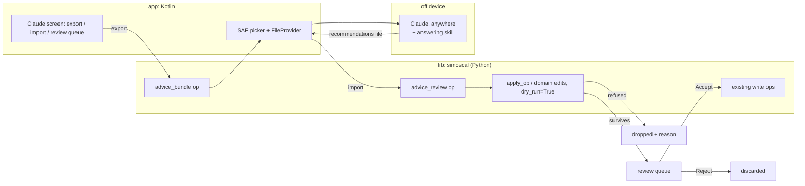

# Tune with Claude — stage 1 (off-device courier) — plan

## Summary

Build the courier half of [[2026-08-24-tune-with-claude-requirements]]: the app
exports a **context bundle** describing the open session, a person asks Claude
anywhere, and the app imports a **recommendations file** which it replays
through the library's real edit guards before showing anything to a human. Every
surviving recommendation is accepted or rejected one at a time; an accepted one
stages on its owning domain screen and enters the journal only when applied.

The app gains **no Android permission**. The whole feature is two files moving
through the Storage Access Framework and the existing FileProvider.

This plan also delivers the **back-test rig** (U8), which is the gate the
brainstorm set for stage 2 and which runs entirely on the Mac — no app needed.

### Path convention

Two repos. Paths are prefixed by which:

- `lib:` → the `simoscal` library repo (checked out at `Code/` from this repo's root)
- `app:` → the `simoscal-android` repo
- unprefixed → this repo (`SimosTools`)

### Branch and dependency

This work **branches off `feat/file-structure-support`, not `main`.** That branch
has already landed the pieces this plan leans on:

| Commit | What it changed | Why the courier needs it |
|--------|-----------------|--------------------------|
| `cc055a3` | Per-car safety facts moved onto `Profile` (`structure`, `float_bug_symbols`, `stock_references`, `unavailable`) | U3's brief renders those facts instead of restating them |
| `58e4c0d` | Calibration resolved through a profile **registry** | "Which car" is now a runtime answer, so U4's bundle must record it |
| `d43ae00`, `d48251c` | SCGA05 mapped as a real second structure; XDF address convention declared per car | An address in a bundle is meaningless without the convention it was written in |

Written against `main`, U3 would re-author in prose exactly the per-car
duplication `Profile` just absorbed, and U4 would ship a bundle whose addresses
cannot be interpreted. The dependency is on merged code, not on a promise.

## Problem frame

The app edits well and now visualizes well, but has no judgment — that lives on
a Mac with Claude Code and the repo. Meanwhile the app's single strongest
product claim is that it declares zero permissions, enforced by
`verifyDebugNoPermissions` against the *merged* manifest and load-bearing for
every Play Data safety answer. Stage 1 exists to deliver the judgment without
spending that claim, and to find out whether the recommendations are good enough
to be worth spending it later.

## Requirements carried forward

From the origin doc (goals G1–G6, acceptance examples AE1–AE8):

| Ref | Requirement                                                                  |
|-----|------------------------------------------------------------------------------|
| G1  | Recommendations name tables `` `ID` — Description ``, in physical units, with evidence |
| G2  | Nothing reaches the queue without passing the same validation a typed edit passes |
| G3  | Per-item accept/reject; no accept-all; no journal entry without a human decision |
| G4  | Stage 1 ships with the permission count still at zero                        |
| G5  | The back-test is a deliverable, not a promise                                |
| G6  | Every accepted recommendation carried a gradeable prediction                 |

## Key technical decisions

| # | Decision | Rationale |
|---|----------|-----------|
| D1 | **Dry-run through the real edit path.** Add `dry_run` to `apply_op` and the domain edit calls; same guards, same encode, same `EditRejected`, journal untouched. | One validation implementation with two entry points. The alternatives (apply-then-undo, throwaway session) either put unaccepted edits in the journal transiently or hold a second multi-MB `Tune` on a tablet. *Confirmed by Sam 2026-08-24.* |
| D2 | **Bundle assembly and reply parsing live in Python bridge ops.** | Catalog, journal, and log data already originate in Python; Kotlin would re-serialize what Python just serialized. Host-testable, and the back-test (U8) can then run with no app in the loop — which is the point of the back-test. *Confirmed by Sam 2026-08-24.* |
| D3 | **No new write path.** Recommendations are replayed through the existing ops (`edit`, `boost_edit`, `boost_rpm_axis`, `slot_flag`, `limiters_edit`, `lambda_fl_edit`). | `bridge.py` states the rule: an op exists when the write carries an invariant no grid edit can see. A recommendation is not a new invariant, so it gets no new write op — it gets the ones that already exist. |
| D4 | **Two new ops, both read-only-ish and additive.** `advice_bundle` (pure read) and `advice_review` (dry-run replay, journals nothing). | Additive ops leave `BRIDGE_VERSION` alone, per the precedent set by the V8 and domain-screen ops: an older app never names them, a newer app on an older engine gets a clean `UNKNOWN_OP`. |
| D5 | **The recommendations schema is versioned independently** of `BRIDGE_VERSION`. | The reply file is authored *outside* the app by a model, and will change shape faster than the bridge. A mismatch must be a clean, explained rejection, not a misread field. |
| D6 | **A recommendation with no evidence is malformed, not weak.** Schema-level requirement. | AE3. Makes "reject with no evidence" structural rather than a reviewer's discipline. |
| D7 | **The bundle is a single file, deterministic byte-for-byte** for a given session state. | Makes the back-test reproducible and lets a person diff two bundles to see what changed between revisions. |
| D8 | **Bundle exports through a new staging subdirectory**, not `imports/`. | `file_paths.xml` deliberately exposes only `staging/`; the imports directory holding the source bin and XDFs must stay unshareable. The bundle is generated, so it belongs in staging with the built bins. |
| D9 | **The safety brief is half generated, half authored.** Per-car facts render from the active `ResolvedProfile` at bundle time; car-independent facts are prose in the public repo. | The facts genuinely divide that way. `Profile` already owns the per-car half after `cc055a3`, so restating it as prose would duplicate it into a second place that drifts — and into a *public* one. The gear-header rule and the Calc HP trim have no `Profile` home and never will, so forcing them into one would be worse. Also resolves Q1. |

## High-level technical design

---

## Implementation units

### U1. Dry-run through the edit path

**Goal** — Give the library a way to ask "would this edit be accepted, and what
would it encode to?" without journaling anything.

**Requirements** — G2. Foundation for AE2.

**Dependencies** — none.

**Files**
- `lib: simoscal/tune/editing.py` (modify — `apply_op`, `EditResult`)
- `lib: simoscal/tune/domains/boost.py`, `limits.py`, `fueling.py`, `switchpatch.py` (modify — thread the flag through each edit entry point)
- `lib: tests/` (new tests alongside the existing editing/domain tests)

**Approach** — A `dry_run: bool = False` keyword threaded through `apply_op` and
each domain edit call. When set: run every guard, perform the encode/decode
round-trip, compute requested-vs-encoded and quantization exactly as the real
path does, then return a result whose journal entry is absent and whose write to
the underlying image never happened. A refusal raises the same `EditRejected`
with the same message the real path would raise — the refusal *reason* is the
product here, so it must not be a second, parallel wording.

The default is `False` everywhere, so no existing caller changes behavior. The
critical invariant to test is that dry-run and real disagree about *nothing*
except whether state moved.

**Test scenarios**
- *Happy path* — a valid boost-slot edit, run dry then run for real: identical
  requested/encoded arrays, identical quantization flag, identical warning text.
- *Happy path* — after a dry run, the journal length and the underlying bytes are
  unchanged, and `can_undo` is unchanged.
- *Edge* — an edit that quantizes: the dry run reports the same
  `max_abs_quantization` as the real one.
- *Edge* — an axis table, where writes must strictly increase: dry-run refuses a
  non-monotonic write with the same message as the real path.
- *Error* — an out-of-range value: both paths raise `EditRejected`; the messages
  are equal, and nothing was written in either case.
- *Error* — an owner-locked table addressed through the generic editor: refused
  in dry-run exactly as it is refused for real.
- *Integration* — a dry run interleaved between two real edits leaves the journal
  reading as though it were not there.

**Verification** — Every domain edit entry point accepts the flag; a
dry-run/real equivalence test exists per entry point; the full existing library
test suite is unchanged and green.

---

### U2. The recommendations schema

**Goal** — Define and validate the file a person imports, strictly enough that a
malformed or under-evidenced recommendation is rejected before any replay.

**Requirements** — G1, G6, D5, D6. AE3.

**Dependencies** — none (can proceed in parallel with U1).

**Files**
- `lib: simoscal/advice/__init__.py` (new)
- `lib: simoscal/advice/schema.py` (new)
- `lib: tests/test_advice_schema.py` (new)
- `lib: docs/` (new — the schema reference the answering side reads)

**Approach** — A pure, dependency-free module: no I/O, no session, no numpy in
the public surface. It defines one versioned envelope and one recommendation
record carrying exactly the fields the origin doc's table specifies — table
identity (both the ID *and* the description, per the project naming rule), the
proposed change addressed the same way an op addresses it (space, table,
selection, operation, value or array), the intent line, the evidence, the risk
tier from a closed set, the confidence, and the prediction.

Validation is a rejection list, not a boolean: a caller gets every problem with
every record at once, each naming the record and the field, so an answering
model can fix a whole file in one pass rather than one error per round trip.

Two rules deserve explicit tests because they are product requirements rather
than type checks: **evidence is mandatory** (D6), and the **risk tier is a
closed set** so a new tier cannot arrive unnoticed and render unstyled.

**Test scenarios**
- *Happy path* — a well-formed file with three recommendations validates clean;
  every field round-trips.
- *Edge* — a file with zero recommendations is valid (Claude found nothing) and
  distinguishable from a parse failure.
- *Error* — a recommendation with an empty evidence field is rejected as
  malformed, naming the record and the field.
- *Error* — an unknown risk tier is rejected rather than passed through.
- *Error* — a schema version newer than this library understands is rejected
  with a message that says so, not a field-by-field failure.
- *Error* — a missing description on a named table is rejected (the project rule
  is that both halves are always present).
- *Error* — malformed JSON produces one clear failure, not a stack trace.

**Verification** — Round-trip and rejection tests pass; the schema reference doc
describes every field and closed set; no module in `advice/` imports the bridge
or a session.

---

### U3. The safety brief — generated per car, authored where it is general

**Goal** — Ship the hard-won ECU facts with the bundle so whoever answers has
them, with each fact stated from the one place that already owns it.

**Requirements** — Origin doc § safety brief; underpins AE2.

**Dependencies** — None inside this plan. Depends on already-merged
file-structure work: `cc055a3` (per-car facts on `Profile`) and `58e4c0d`
(profile registry). See § Branch and dependency.

**Files**
- `lib: simoscal/advice/brief.py` (new — renders the per-car half from a `ResolvedProfile`)
- `lib: docs/advice-safety-brief.md` (new — the car-independent half, as prose)
- `knowledge/ecu-tuning-basics.md` (source for the authored half; unchanged by this unit)
- `lib: tests/test_advice_brief.py` (new)

**Approach** — The brief has two halves, sourced differently, because the facts
themselves divide that way (D9).

*Generated, per car.* Facts that are properties of **this calibration** render
from the active `ResolvedProfile` at bundle time and are never restated in prose:

| Fact | Source on `Profile` |
|------|---------------------|
| `C_M_AIR_CYL_SP_MAX` — Maximum allowed airmass setpoint stores kg/stk despite an identity mg/stk label | `TAG_KG_PER_STROKE` on the spec |
| `C_PRS_IM_SP_MAX` / `C_PRS_IM_SP_LIM` — Maximum / limit requested intake-manifold pressure setpoint have a declared max that is a display artifact, not an ECU ceiling | `TAG_FLOAT_BUG` → `float_bug_symbols` |
| Which axes must stay strictly increasing | `TAG_AXIS` |
| What stock reads on this car | `stock_references` |
| Which logical tables this car does **not** have, and why | `unavailable` |
| Which CAL layout applies, and whether the XDF numbers from the CAL block or the whole bin | `structure`, `xdf_addresses_from_cal` |

A profile that declares none of a given fact renders **no sentence for it** — no
empty heading, no placeholder. Silence is the correct output for a car nobody
has measured; this is the rule file-structure U3 already established for SOP
guidance, applied to the same data for the same reason.

*Authored, general.* Facts that are not about any one car's tables stay
hand-written prose in the public repo: overboost fault routing lives in
`IP_PUT_AMP_DIF_MAX_PRS_DIF_THR` — Overboost pressure-difference threshold
rather than in a pressure-limit table; the gear-header indexing rule (`Gear ()`
is zero-indexed, `Gear (gear)` is not); the Calc HP gear-flip trim; and the
standing rule that an XDF-declared max is a display artifact rather than a
limit. None of these has a `Profile` home and none should be given one.

This split is also the answer to Q1: the file that lands in the **public** repo
holds no car's numbers, because the car's numbers are rendered on device into a
bundle that never enters the repo.

The brief remains a *stated non-guardrail* — it makes recommendations start
sensible, and U1's dry-run is what makes them safe. The authored half says so in
its own first paragraph, so nobody reading it later mistakes it for the safety
mechanism.

**Test scenarios**
- *Happy path* — a brief rendered from the SC8S50 profile names the kg/stk
  table, every float-bug symbol, and each declared stock reference, by parameter
  ID, in the `` `ID` — Description `` form.
- *Happy path* — the authored half names the gear-header rule, the Calc HP trim,
  and the overboost routing table; silently dropping one fails the suite.
- *Edge* — a profile declaring no `stock_references` and no float-bug symbols
  renders those sections absent rather than empty.
- *Edge* — a merged base + switch-patch profile renders the patch-added tables'
  facts too, once each, with no duplication from the merge.
- *Edge* — a profile whose XDF numbers from the CAL block renders that fact
  explicitly, so a reader cannot mistake its addresses for whole-bin addresses.
- *Edge* — the authored half is embedded in a bundle verbatim; embedding does not
  alter its bytes.
- *Regression* — no car-specific numeric value or box code appears as a literal
  in `docs/advice-safety-brief.md`.

**Verification** — `pytest tests/test_advice_brief.py` passes, including the
regression test that keeps car data out of the public prose; the rendered
SC8S50 brief is embedded by U4.

---

### U4. `advice_bundle` — export the context

**Goal** — One deterministic file describing the whole session: catalog with
current values, edit journal, picked logs, and the safety brief.

**Requirements** — Origin doc decisions 3 and 4 (whole-session context;
binaries never leave). D7, D8.

**Dependencies** — U2 (envelope versioning), U3 (brief renderer to call and
authored half to embed). Also depends on merged file-structure work: the profile
registry (`58e4c0d`) is what makes "which profile" a value worth recording.

**Files**
- `lib: simoscal/advice/bundle.py` (new)
- `lib: simoscal/bridge.py` (modify — register `advice_bundle` in `OPS`)
- `lib: tests/test_advice_bundle.py` (new)
- `app: engine/src/main/res/xml/file_paths.xml` (modify — expose a bundle subdirectory under `staging/`)

**Approach** — A read-only op taking a session id and an optional list of
verified log paths, writing one file to a caller-named destination and returning
its path, hash, and a summary (table count, journal entry count, log names,
byte size) for the UI to show *before* the person shares it.

What goes in: the `catalog()` output including current physical values and axes,
`table_detail` for anything the catalog summarizes, the journal as
`_entry_summary` already renders it, the parsed log content the analysis module
already produces, provenance, and the brief U3 renders for that profile.

**Provenance now includes structure identity.** Since `58e4c0d` the profile is a
registry lookup rather than an assumption, so the bundle must state which one
resolved: the profile name, its `StructureSpec`, and its `xdf_addresses_from_cal`
convention, alongside the bin and XDF hashes. Without that last field an address
in a recommendation is ambiguous — `SC8S50.V1.0.xdf` numbers from the whole 4 MB
bin and `SCGa05_cal.xdf` numbers from the extracted CAL block, so the same
address names two different bytes. A bundle that omits it invites a reply that
is confidently wrong about where it is writing.

What stays out, enforced by test: the `.bin` and `.xdf` bytes themselves. The
bundle carries their hashes, never their contents.

Determinism (D7) means stable key ordering, no timestamps in the payload body,
and no dict-iteration-order dependence — the same session state exported twice
produces identical bytes.

**Test scenarios**
- *Happy path* — a session with two edits and one log exports; the bundle
  contains those two journal entries, that log's data, the full catalog, and the
  brief.
- *Happy path* — exporting the same session state twice produces byte-identical
  files.
- *Edge* — a session with no edits and no logs exports a valid bundle.
- *Edge* — a session with the switch-patch space open includes the patch-space
  tables, not just base, and the provenance names the merged profile.
- *Happy path* — the bundle names the resolved profile, its `StructureSpec`, and
  its address convention; a bundle exported against a different profile differs
  in those fields.
- *Error* — a log path whose hash does not match fails with `HASH_MISMATCH`
  before anything is written, leaving no partial file.
- *Error* — an unknown session id fails `UNKNOWN_SESSION`.
- *Integration* — no bin or XDF byte sequence appears anywhere in the bundle;
  their hashes do.
- *Integration* — `BRIDGE_VERSION` is unchanged by adding the op, and
  `bridge_info` lists it.

**Verification** — Bundle exports deterministically, contains what it should and
nothing it shouldn't, and the binary-exclusion test is explicit rather than
implied.

---

### U5. `advice_review` — replay and gate

**Goal** — Turn an imported recommendations file into a queue of survivors plus
an accounted list of drops, without touching the session.

**Requirements** — G2, G3. AE2, AE3, AE5.

**Dependencies** — U1 (dry-run), U2 (schema).

**Files**
- `lib: simoscal/advice/review.py` (new)
- `lib: simoscal/bridge.py` (modify — register `advice_review` in `OPS`)
- `lib: tests/test_advice_review.py` (new)

**Approach** — Takes a session id and a verified recommendations file path.
Validates against U2's schema; then, for each recommendation, routes it to the
op that owns that table (D3) and replays it with `dry_run=True`.

Three outcomes per record, and the op returns all three lists:
1. **Queued** — accepted by the guards. Carries the dry-run preview
   (requested vs encoded, quantization) alongside the recommendation's own
   fields, so the UI can draw the real effect rather than the claimed one.
2. **Dropped** — refused by the guards. Carries the refusal reason verbatim from
   `EditRejected`. Never rendered as a suggestion (AE2), but counted.
3. **Malformed** — failed the schema. Counted separately from refused, because
   the two mean different things to whoever is improving the answering side.

The op mutates nothing: the journal, the history, and the bytes are all as they
were. That is the property most worth a test, since it is the whole safety claim.

Ordering matters and must be handled explicitly: recommendations are validated
**independently against current session state**, not cumulatively. Two
recommendations touching the same cells may each pass alone and conflict
together; the op flags such an overlap on the queued items so the reviewer sees
it rather than discovering it at Apply time.

**Test scenarios**
- *Happy path* — three valid recommendations, all within guards: three queued,
  zero dropped, each carrying its dry-run preview.
- *Happy path (AE2)* — a recommendation writing `2000` to
  `C_M_AIR_CYL_SP_MAX` — Maximum allowed airmass setpoint is dropped with the
  guard's own reason, and does not appear in the queued list.
- *Edge* — a mixed file: some queued, some dropped, some malformed; all three
  counts are reported and sum to the input count.
- *Edge* — two recommendations touching overlapping cells are both queued but
  flagged as overlapping.
- *Edge* — a recommendation against an owner-locked table routed to its domain op
  rather than the generic editor.
- *Error* — the file references a table that does not exist in this profile:
  dropped with a reason that says so, rather than an internal error.
- *Error* — a recommendations file built for a different bin (provenance hash
  mismatch) is refused wholesale, before any replay.
- *Integration (the safety claim)* — before and after a review of a file
  containing every outcome type, the journal, `can_undo`/`can_redo`, and the
  session bytes are identical.

**Verification** — All three outcome lists populated correctly; the
session-untouched integration test passes; refusal reasons are the guards' own
words, not restatements.

---

### U6. Kotlin — bundle out, recommendations in

**Goal** — Move the two files across the app boundary using the mechanisms that
already exist, adding no permission.

**Requirements** — G4. AE4.

**Dependencies** — U4, U5.

**Files**
- `app: engine/src/main/java/com/simoscal/android/AdviceStore.kt` (new)
- `app: engine/src/main/java/com/simoscal/android/ShareBin.kt` (modify, or a sibling `ShareBundle.kt` — see approach)
- `app: engine/src/main/java/com/simoscal/android/AdviceUiState.kt` (new — pure)
- `app: engine/src/test/java/com/simoscal/android/AdviceUiStateTest.kt` (new)
- `app: engine/src/main/res/xml/file_paths.xml` (modify — with U4)

**Approach** — Import follows `ImportStore` exactly: SAF pick → app-private copy
→ hashed while streaming → the engine gets a path plus hash it re-verifies.
There is no reason to invent a second import discipline for this file.

Export needs a decision `ShareBin` currently forecloses: that object accepts a
`BuildState.Verified` and nothing else, deliberately, so a candidate bin can
never be shared. A bundle is not a bin and must not weaken that. Prefer a
**sibling object** for bundle sharing over adding a second entry point to
`ShareBin` — the narrowness of `ShareBin` is a stated safety property and is
worth preserving literally.

`AdviceUiState` is pure and holds the state machine: no bundle → exported →
reply imported → reviewed → queue. Testable on the JVM, like every other
`*UiState` in the app.

**Test scenarios**
- *Happy path* — export produces a file under staging and a shareable URI; the
  summary (counts, size, hash) matches what the op returned.
- *Happy path* — a picked reply file lands in app-private storage with a hash the
  engine accepts.
- *Edge* — importing a second reply file replaces the first; the review queue
  resets rather than merging two files' recommendations.
- *Edge* — a reply imported after the session has been edited further is flagged
  stale (its provenance no longer matches), following the same rule the app
  already applies to invalidating a completed build.
- *Error* — a picked file that is not a valid reply surfaces the engine's own
  malformed-count and message, not a generic failure.
- *Error* — a reply file whose provenance names a different bin is refused with
  that reason.
- *Integration (AE4)* — the merged-manifest permission check still passes with
  the existing single-entry allowlist.
- *Integration* — the imports directory remains unexposed by the FileProvider;
  only staging and the bundle subdirectory are shareable.

**Verification** — Round trip works on a device; `verifyDebugNoPermissions` and
`verifyReleaseNoPermissions` pass unchanged; `AdviceUiState` transitions are
covered by JVM tests.

**Implementation result (2026-08-25)** — Host implementation complete on
`app: feat/tune-with-claude-courier`; the physical-device leg remains open. The
transport lives on the Build screen rather than adding U7's navigation early:
optional logs and notes export through `advice_bundle`, a typed sibling
`ShareBundle` shares only the generated JSON, and an imported reply is copied
and hashed by the existing `ImportStore` discipline before `advice_review`
returns queue/refused/malformed counts. The full parsed queue is retained in
pure `AdviceUiState` for U7, but no item is rendered or actionable yet.

The existing FileProvider `staging/` root already included
`staging/bundles/...`; U6 corrected its documentation and added an instrumentation
test rather than adding an overlapping path entry. `imports/` remains absent.
All 332 JVM tests pass, the debug APK assembles, and both merged-manifest gates
report no unexpected permissions. No device was connected, so the FileProvider
instrumentation test and export → share → import round trip were not run.

One planned stale check was narrower than the schema can support. Recommendation
provenance identifies the profile, source-bin hash, and XDF hash; editing the
working session changes none of those. U6 therefore invalidates any bundle,
imported reply, and review already held by the app after every successful edit,
undo, or redo. It cannot detect a reply exported before an edit but imported
only afterward. Detecting that case requires a deterministic session-state
fingerprint in U2/U4/U5's bundle and reply provenance; it is not silently claimed
as completed here.

---

### U7. Kotlin — the review queue

**Goal** — Present survivors one at a time, with everything needed to accept or
reject in one glance, and stage an accepted one on the screen that owns it.

**Requirements** — G1, G3, G6. AE1, AE5.

**Dependencies** — U6.

**Files**
- `app: engine/src/main/java/com/simoscal/android/ui/AdviceScreen.kt` (new)
- `app: engine/src/main/java/com/simoscal/android/ui/SimoscalApp.kt` (modify — navigation entry)
- `app: engine/src/main/java/com/simoscal/android/AdviceViewModel.kt` (new)
- `app: engine/src/main/java/com/simoscal/android/AdviceUiState.kt` (modify — queue transitions)
- `app: engine/src/test/java/com/simoscal/android/AdviceUiStateTest.kt` (modify)

**Approach** — One item on screen at a time, showing all seven fields from the
origin doc's table: table named both ways, current → proposed in physical units,
intent, evidence, risk tier, confidence, prediction. Plus the dry-run preview
from U5, which is what the value will *actually* encode to — shown next to what
was requested, the same requested-vs-encoded discipline the editors already use.

Three actions: Accept, Reject, and Show-me (deep-links to the owning domain
screen with the change staged, so a boost recommendation is seen drawn on the
boost canvas before it is accepted).

Rules to enforce in the pure state, not the composable:
- **No accept-all.** There is no bulk affordance to build.
- **Accept stages; it does not journal.** The journal entry happens when the
  person applies on the domain screen, as it does for every other edit.
- **Safety-relevant items are styled distinctly** and require a deliberate press
  — the existing palette's `accent` role already means "the thing that changed".
- **Dropped and malformed counts are always visible**, so a person knows Claude
  said more than they were shown, without seeing what was refused.

**Test scenarios**
- *Happy path (AE1)* — a queued boost recommendation renders all seven fields;
  Accept stages it on the boost screen and adds nothing to the journal.
- *Happy path (AE5)* — accept one of three, reject two: exactly one staged edit
  results; after applying, the journal holds exactly one new entry.
- *Edge* — an empty queue with a non-zero dropped count renders as "nothing to
  review, N refused", distinct from "no reply imported".
- *Edge* — rejecting the last item ends the queue cleanly; re-entering the screen
  does not resurrect rejected items.
- *Edge* — overlapping recommendations (flagged by U5) surface the overlap before
  the second is accepted.
- *Edge* — rotation mid-queue preserves position and any staged-not-applied item,
  consistent with the existing rotation handling.
- *Error* — accepting an item whose staging is refused at the domain screen (state
  moved since review) shows the refusal and returns the item to the queue.
- *Integration* — the Changes screen shows only applied items; accepted-but-not-
  applied items appear nowhere in the journal.

**Verification** — All queue rules live in pure state with JVM tests; a full
export → ask → import → review → accept → apply → build → share round trip
completes on the Galaxy Tab A9+; no permission added.

---

### U8. The answering side and the back-test

**Goal** — Make the courier's other half real, and produce the evidence that
gates stage 2.

**Requirements** — G5. AE6, AE7.

**Dependencies** — U4, U5. **Deliberately independent of U6 and U7** — the
back-test runs on the Mac with no app in the loop, which is the reason D2 put
bundle and review in Python.

**Scope — SC8S50 only, stated deliberately.** R14, R15 and R16 are SC8S50
revisions, so the bucket counts are evidence about SC8S50 recommendations and
nothing wider. A second registered profile has no tune lineage and no logs to
back-test against, so it cannot contribute to the stage-2 gate even in principle;
if stage 2 happens it ships SC8S50-first for the same reason. The bundles this
unit produces still carry structure identity (U4), so a future profile's
back-test slots into the same rig rather than needing a new one.

**Files**
- `lib: docs/advice-answering-guide.md` (new — how to turn a bundle into a valid reply)
- `.claude/skills/` (new skill in this repo — reads a bundle, writes a schema-valid reply)
- `Docs/backtest/` (new — one folder per back-tested revision, holding bundle, reply, and the comparison)
- `lib: tests/` (a fixture-driven test that a known-good reply validates and replays)

**Approach** — The answering guide is what a model reads alongside a bundle: the
schema, the safety brief's status, the naming rule, and the requirement that
every recommendation carry evidence and a prediction. The skill in this repo
wraps that for Claude Code so the loop is one command on the Mac.

The back-test then reconstructs session state as it stood before R14, R15 and
R16, exports a bundle for each, asks Claude, and compares the recommendations to
what Sam actually did — verifiable against `Tunes/REV_LOG.md` and the matching
`Logs/<Tune>_R<NN>/log_review.md`. Each recommendation lands in one of four
buckets, and the count in each is the stage-2 evidence:

| Bucket | Meaning |
|--------|---------|
| **Agrees** | Same table, same direction as what Sam actually did |
| **Refused** | Dropped by the guards — a safe failure, and the system working |
| **Novel** | Something Sam did not do; judged on its merits, not automatically wrong |
| **Wrong** | Would have passed the guards and been a mistake. The bucket that matters |

A non-empty **Wrong** bucket does not by itself block stage 2 — but it must be
enumerated and explained, and each entry should produce either a guard that
would now refuse it or a line in the safety brief.

**Test scenarios**
- *Happy path* — a captured known-good reply file validates and replays against
  its bundle fixture, producing the expected queued/dropped split. This is a
  regression test on the whole chain, not a one-off script.
- *Edge* — a reply produced against an older schema version fails cleanly with a
  version message.
- *Integration (AE6)* — back-test results for R14–R16 exist as written artifacts
  with all four buckets counted.
- *Integration (AE7)* — at least one accepted recommendation's prediction is
  restated in the relevant `log_review.md` with a held / did-not-hold verdict.

**Verification** — The three back-test folders exist with their four-bucket
comparisons; the **Wrong** bucket is enumerated with a disposition for each
entry; the fixture regression test is in the library suite. Each back-test
folder's bundle names `SC8S50` in its provenance, so the scope limit is visible
in the artifacts rather than only in this plan.

**Implementation result (2026-08-27)** — The rig is built and four cases are
defined (R10, R14, R15, R16; R10 was added beyond the plan's three because its
actual change was torque-limiter driven and the battery has that check). The
answering guide and the `answer-bundle` skill exist. Blind answering is
*enforced* rather than promised: `answer` runs a fresh `claude -p` in a
throwaway directory outside the repo with no `CLAUDE.md`, no auto-memory and no
lineage, and `replay` audits the transcript for any path outside the sandbox.
Every audit so far is clean.

**The bucket counts do not yet meet the gate, and the reason is upstream of the
model.** R14 and R15 returned zero recommendations; R16 returned three, all
queued, none dropped or malformed — **3 Novel, 0 Wrong**. Full findings in
`Docs/backtest/README.md`. Three defects in what the bundle carries account for
the empty replies, and all three are in this plan's own units, not in the
answering side:

1. **U4.** `logs_section` passes `cal=None`, which sends `boost_cal` and
   `boost_p0234` to SKIPPED *and* makes `compute_coverage` skip every table. Its
   stated rationale (the session buffer is not the flashed bin) does not hold
   for the case the courier is built for — the bundle's own prompt is "I flashed
   this calibration and drove it". The session should be able to say so.
2. **U8/U4 mismatch.** `advice-answering-guide.md` documents a `coverage`
   section and instructs the answerer to use it. No bundle contains one:
   `logs_section` never calls `compute_coverage` and never passes `extra=` to
   `findings_to_dict`. This is what the R15 answer ran into after correctly
   naming the exact table Sam edited.
3. **Outside this plan.** `simoscal.analysis`'s `boost` check is overshoot-only;
   there is no shortfall check. R15's whole premise was a boost *shortfall*, so
   its motivating evidence is absent from the bundle by construction.

Also recorded: the bundle names neither the active switch-patch slot (both R14
and R15 reconstructed it numerically to eight significant figures) nor which of
the nine cam-position ignition maps is live (R16's stated reason for leaving
timing alone — where the lineage's own answer is "edit all nine").

Not done: the plan's fixture-driven regression test on a captured known-good
reply. R16's reply is now a real candidate for that fixture, but `simoscal` is
public and the decision to put calibration values in its test data is Sam's.
Back-test artifacts are gitignored in this repo for the same reason — a bundle
is the whole decoded calibration in the clear, and this remote is public.

---

## Scope boundaries

**In:** everything above — stage 1 end to end, plus the back-test rig.

**Out:**
- Stage 2 (in-app API key, HTTP, `INTERNET`, the privacy/Data-safety rewrite,
  key storage, model choice, cost). A separate plan, gated on U8's results.
- The per-domain-screen "Ask Claude" entry points — stage 2 scope in the origin doc.
- Streaming, persisted conversation history, in-app cost display.
- Any table without a spec: Claude can only recommend against tables the profile
  already exposes.

### Deferred to follow-up work

- **Bundle size on a tablet.** A full catalog plus several logs could be large.
  Nothing here compresses or trims it; if U4's real-world sizes are unwieldy,
  that is a follow-up, not a reason to scope the context down now (origin
  decision 3 chose whole-session deliberately).
- **Feeding refusals back automatically.** U5 returns refusal reasons, but stage 1
  has no loop that hands them back to Claude — the person copies them. Automating
  that is stage 2 shaped.
- **Reading `analysis_findings.json` instead of raw logs** into the bundle.
  Listed as deferred in the origin doc; revisit if bundle size bites.

## Open questions

| Q | Question | Blocking |
|---|----------|----------|
| Q1 | ~~The safety brief lands in the **public** `simoscal` repo.~~ **Resolved (2026-08-24) by D9's split** — the public file holds only car-independent prose, and its regression test enforces that; every per-car number renders from `Profile` into a bundle that never enters the repo. | Resolved |
| Q2 | ~~Does the bundle carry the brief, or does the answering side fetch it?~~ **Resolved by D9** — the generated half only exists at bundle time, so it must travel in the bundle; the authored half travels with it to keep the file self-contained. | Resolved |
| Q3 | Should the bundle redact provenance detail (box code) before leaving the device? Plan assumes **no redaction** — the person is choosing to send it. | Non-blocking; U4 |
| Q4 | Does a rejected recommendation's reason get recorded anywhere durable, for improving the answering side? Plan records it in UI state only. | Non-blocking; U7 |
| Q5 | Should the answering side **refuse** a bundle whose profile it has no back-tested guidance for, or answer with a stated caveat? Refusing is safer; caveating keeps a second car usable at all. Plan assumes **caveat**, since U5's guards are the real gate and U8 only ever covers SC8S50. | Non-blocking; U8 |

## Risks

| Risk | Mitigation |
|------|------------|
| **D1 touches the library's most safety-critical function.** A dry-run bug that diverges from the real path would make the gate a lie. | The dry-run/real equivalence tests in U1 are the mitigation, and they are written per entry point rather than once. |
| **Recommendations that pass the guards and are still wrong.** The guards bound the values, not the judgment. | This is exactly what U8's **Wrong** bucket measures, and why stage 2 is gated on it rather than on stage 1 shipping. |
| **The courier's clunkiness kills the feature before it is judged.** Two apps and a file round trip is friction; a bad verdict might reflect the ergonomics rather than the recommendations. | Judge stage 1 on U8's bucket counts (which have no ergonomics in them), not on how often the round trip gets used day to day. |
| **Scope creep toward stage 2.** The API call is a small diff and a large decision. | The permission check failing is the tripwire — it cannot be added quietly. |
| **`simoscal` is public.** Nothing car-specific may enter it. | D9 makes the public half structurally car-free and U3's regression test enforces it; plus the existing repo discipline that keeps bins, XDFs and logs out. |
| **The file-structure branch moves under this one.** The courier is built on `feat/file-structure-support`, whose U6–U8 are still open. | The courier only reads `Profile`'s public surface (`structure`, `float_bug_symbols`, `stock_references`, `unavailable`, tags), which U1–U5 already fixed. If a later unit changes that surface, U3's brief test fails loudly rather than rendering a stale fact. |

## Sources

- `Docs/brainstorms/2026-08-24-tune-with-claude-requirements.md` — origin
- `lib: simoscal/bridge.py` — op registry, envelope, error codes, the "an invariant, not a screen" rule for adding ops
- `lib: simoscal/tune/editing.py`, `simoscal/tune/catalog.py` — the edit path and `TableInfo`
- `lib: simoscal/tune/domains/` — the domain edit calls the replay routes to
- `lib: simoscal/tune/profile.py`, `simoscal/tune/profiles/` — `Profile`'s per-car facts and guard tags, the source of U3's generated half
- `Docs/plans/2026-08-22-002-feat-other-file-structures-plan.md` — the branch this one builds on; its U3/U4 are the dependency
- `app: engine/build.gradle.kts` — `VerifyNoPermissionsTask` and its single-entry allowlist
- `app: engine/src/main/res/xml/file_paths.xml`, `ShareBin.kt`, `ImportStore.kt` — the file boundary
- `app: docs/privacy-policy.md`, `docs/play-data-safety.md` — what stage 2 would cost
