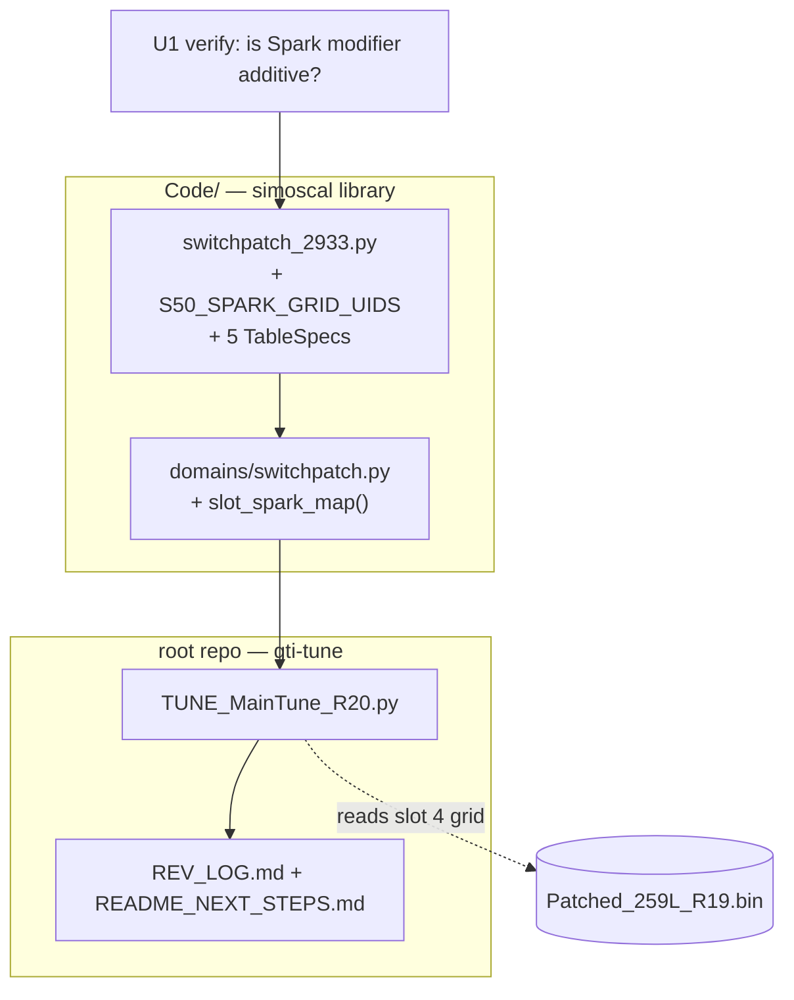

# R20 — slot 5 booster timing map

## Summary

Turn map slot 5 from the 10 psi valet map into an aggressive timing slot for a
tank dosed with VP Octanium Unleaded, leaving slot 4 byte-identical as the
everyday map and the in-drive fallback.

Two tables change in the bin. But the library cannot currently write one of
them, so most of this plan is library work: the `SwitchPatch2933` profile binds
92 tables and the five per-slot `Spark modifier` grids are not among them.

## Problem Frame

`Logs/BasicsGuide_R19/log_review.md` established that delivered WOT timing is
scheduling-limited, not knock-limited, at the top end — there is headroom, but
92 AKI cannot claim it (R17 tried; R18 had to retard it back out). Raising fuel
octane moves the knock boundary itself. A bin holds one shared base-timing
calibration, so the only way to have boosted-fuel timing available *without*
also applying it on a normal tank is the switch patch's per-slot
`Spark modifier` offset map.

## Requirements

From the origin doc. Success criteria SC1–SC5 and acceptance examples AE1–AE7
are carried forward verbatim and are not restated here.

The invariant that dominates every technical decision:

> The nine `IP_IGA_BAS_IVVT_VVL_PORT_L[STND][i][e]` — Basic ignition angle maps
> are **shared across all five slots** and must not change. Editing them would
> change slot 4.

## Key Technical Decisions

### KTD1 — Add the grids to the profile rather than writing them generically

`Code/code_review.md` (CR-20260815 series, and the "generic bridge edits to
domain-owned tables are refused" contract at lines 1408–1524) establishes that
every table in the `SwitchPatch2933` profile must declare exactly one write
path via its `owner` field, and that generic edits to domain-owned tables are
deliberately refused so a structural table cannot be moved without its guards.

So `Spark modifier` cannot be written as a one-off from the revision script. It
needs a profile spec **and** a domain method, or the profile's own consistency
check rejects it. This is the library working as designed, not an obstacle.

### KTD2 — `spark_grid_uids` is an optional parameter to `build_switch_patch_profile`

That builder is shared with `SWITCH_PATCH_2933_A05`. A05's `Spark modifier`
uniqueids are unknown and cannot be derived by offsetting from S50's — the
module docstring is explicit that address arithmetic does not work across cars.
Making the new parameter **optional** lets S50 gain the grids while A05 keeps
working unchanged and gains them later when someone reads them off an A05 patch
XDF.

### KTD3 — Guard on delivered timing, not on the offset

A guard that only caps the offset at, say, +4° would happily allow +4° on a cell
whose base timing is already +3.38°. The meaningful quantity is **base +
modifier**. The domain method should read the shared base ignition map and
refuse if the resulting delivered timing exceeds a declared ceiling. This is the
same shape as `_check_below_base_ceiling` for the boost grids.

### KTD4 — Copy slot 4's boost grid by reading it, never by retyping it

`slot_curve()` already accepts a per-breakpoint `hpa` sequence. Read slot 4's
grid off the bin and pass those values to slot 5, so the two slots cannot drift
through a transcription error. Assert the read grid is uniform across its eight
Y rows first — `slot_curve` tiles one row across all eight, so a slot 4 grid
that was not uniform would be silently flattened.

### KTD5 — Two repos, two commits

`Code/` is a separate public repo (`SamRyeIn/simoscal`). U2 and U3 land there
and must contain no bins, XDFs or car data. U4 and U5 land in the root repo.
See the `simoscal-repo-is-public` and `inflight-work-commit-separately` notes.

## High-Level Technical Design

Delivered timing, 1400 mg/stk row, once R20 is flashed:

| rpm | 3000 | 3500 | 4000 | 4500 | 5000 | 5500 | 6000 | 6500 |
|--------|-------|-------|-------|-------|-------|-------|-------|-------|
| Slot 4 | −7.50 | −6.75 | −4.50 | −3.75 | −2.25 | +0.75 | +1.88 | +3.38 |
| Modifier | +1.00 | +1.50 | +2.00 | +2.75 | +3.50 | +2.00 | +1.50 | +1.00 |
| Slot 5 | −6.50 | −5.25 | −2.50 | −1.00 | +1.25 | +2.75 | +3.38 | **+4.38** |

---

## Implementation Units

### U1. Establish `Spark modifier` semantics

**Goal:** Prove the per-slot `Spark modifier` grid is an **additive** offset onto
shared base timing, and that it applies in the WOT control state. Everything
downstream is unsafe until this is settled.

**Requirements:** Origin doc, Outstanding Questions — both blocking items.

**Dependencies:** none.

**Files:**
- `knowledge/ecu-tuning-not-the-basics.md` — read; extend if it settles it
- `BinToolz-main/definitions/S50 Switch Patch.29.33.V2.xdf` — scaling and range
- `BinToolz-main/patches/SL PATCH.29.33 - S50.btp` — the patch payload

**Approach:** Three lines of evidence, cheapest first.

1. **XDF scaling.** The grid decodes `0.375 * raw − 35.625`, range −35.62 to
   +60.0°, and every slot currently reads exactly 0.00. A multiplicative or
   absolute interpretation would mean the car is currently commanding either
   zero timing or a 0× multiplier, which contradicts it running normally. This
   is strong but circumstantial.
2. **Patch payload.** Look for the read of the grid and whether the result is
   added to the base-timing lookup result or replaces it.
3. **Empirical fallback.** If 1 and 2 leave doubt, a deliberate small-value
   probe revision — write **+1.00° flat** into slot 5 only, flash, and compare
   `Ign Table` on slot 5 against slot 4 at matched rpm and airmass. An additive
   offset shows a clean +1.00° shift; anything else shows something obviously
   different. This is the honest way to resolve it and costs one flash.

**Test scenarios:**
- *Documentary:* the conclusion is written down with its evidence, so the next
  revision does not re-litigate it.
- *Negative:* if the evidence is ambiguous, U1 **fails closed** — it does not
  hand a guess to U2. The probe revision becomes a prerequisite.

**Verification:** A written statement of the semantics with cited evidence, in
`knowledge/ecu-tuning-not-the-basics.md`. If the probe path was taken, a log
folder showing the measured offset.

---

### U2. Bind the five `Spark modifier` grids in the switch-patch profile

**Goal:** Give `SwitchPatch2933` an address book entry and a `TableSpec` for
each slot's `Spark modifier` grid, without disturbing A05.

**Requirements:** Prerequisite for AE3.

**Dependencies:** U1.

**Files:**
- `Code/simoscal/tune/profiles/switchpatch_2933.py` — modify
- `Code/simoscal/tune/profiles/switchpatch_2933_a05.py` — leave functional, drop
  the stale "a later revision maps these" comment if it becomes wrong
- `Code/tests/` — the existing switch-patch profile tests

**Approach:**
- Add `S50_SPARK_GRID_UIDS = {1: "0x7cf1a", 2: "0x7d01a", 3: "0x7d11a",
  4: "0x7d21a", 5: "0x7d31a"}`, read off the patch XDF and confirmed against
  the R19 bin.
- Add an **optional** `spark_grid_uids` parameter to
  `build_switch_patch_profile` (KTD2). When absent, emit no specs.
- Emit one spec per slot: name `slot{N}_spark_modifier`, shape `(16, 16)`, units
  `degree`, tagged `TAG_NO_SYMBOL` (patch-added, no A2L ID), owner pointing at
  the U3 domain method.
- Extend `_check_address_book` to validate the new mapping when supplied — all
  five slots present, no uniqueid reused across roles.
- Add a `SPARK_GRID_SHAPE = (16, 16)` constant beside `SLOT_GRID_SHAPE`.

**Test scenarios:**
- *Happy path:* `SWITCH_PATCH_2933` resolves 97 specs (92 + 5), and
  `slot5_spark_modifier` resolves to `0x7d31a` with shape `(16, 16)` and units
  `degree`.
- *Happy path:* opening the R19 bin through the profile decodes
  `slot4_spark_modifier` and `slot5_spark_modifier` as all-zero 16×16 arrays.
- *Edge:* `SWITCH_PATCH_2933_A05` still builds, still resolves its original
  count, and gains no spark specs.
- *Error:* a `spark_grid_uids` mapping missing a slot, or reusing a uniqueid
  already bound to a PUT grid, fails loud at profile-build time with the
  offending name — not at write time.
- *Integration:* a generic bridge edit targeting `slot5_spark_modifier` is
  **refused**, matching the existing `test_generic_edit_of_a_slot_grid_is_refused`
  contract.

**Verification:** Profile builds; both cars' profiles resolve; the new specs
decode off the R19 bin; the generic-edit refusal holds.

---

### U3. Add the `slot_spark_map()` domain write path

**Goal:** One guarded, journaled way to write a slot's `Spark modifier` grid.

**Requirements:** AE3, and the delivered-timing ceiling behind SC2.

**Dependencies:** U2.

**Files:**
- `Code/simoscal/tune/domains/switchpatch.py` — modify
- `Code/tests/` — new domain tests alongside the `slot_curve` tests

**Approach:**

Signature shaped after `slot_curve`: a `slot`, the cells to write, an `intent`,
`@dry_runnable`, returning an `EditEntry`.

Take the edit as **rpm → offset for the named airmass rows**, not as a raw
16×16 array — the revision author should write physical intent, and the domain
should place it on the grid. Cells not named are written as 0.00, so the call
declares the whole map and a later revision cannot leave a stale cell behind.

Guards, all failing loud:
- **Grid geometry** — refuse if the resolved table is not 16×16.
- **Axis match** — read the grid's own rpm and airmass axes and refuse if a
  named breakpoint is not on them. No interpolation, no nearest-match: a typo'd
  rpm is an error, not a silent snap to a neighbour.
- **Delivered-timing ceiling (KTD3)** — read the shared base ignition map, add
  the modifier cell-wise over the cells being written, and refuse if any
  delivered value exceeds a `max_delivered_deg` argument the caller must supply.
  This is the guard that makes the call safe to hand to someone.
- **Offset sign sanity** — refuse a negative offset unless an explicit
  `allow_retard=True` is passed. This revision only advances; a sign slip that
  silently retards should not be quiet.
- **Row scope** — refuse writing rows below a caller-declared minimum airmass
  without an explicit opt-in, so a call meant for WOT cannot land on cruise
  cells by accident.

**Test scenarios:**
- *Happy path:* writing the R20 map into slot 5 produces a 16×16 array with
  exactly 16 non-zero cells at the intended rpm × airmass positions and 240
  zeros; the returned `EditEntry` names the table, the units, and the
  before/after values.
- *Happy path:* the same call on slot 4 leaves slot 5 untouched, and vice versa.
- *Edge:* a call naming only the 1400 mg/stk row writes that row and leaves 1200
  at zero — the domain does not helpfully mirror rows.
- *Edge:* an offset of exactly the ceiling passes; one increment above fails.
- *Error:* an rpm breakpoint not on the axis (e.g. 5250) raises, naming the
  value and listing the valid breakpoints.
- *Error:* a delivered value above `max_delivered_deg` raises, naming the
  offending rpm, airmass, base value, offset and total.
- *Error:* a negative offset without `allow_retard` raises.
- *Error:* `slot=6` raises through the existing `_require_slot`.
- *Integration:* an edit made through this method appears in the journal, and a
  `build()` raw-diff audit against the R19 bin attributes every changed byte —
  no unexplained bytes.

**Verification:** The full `simoscal` suite passes. A dry-run build writing the
R20 map produces a journal entry and a clean audit.

---

### U4. Write `TUNE_MainTune_R20.py`

**Goal:** The revision itself — slot 5 gets slot 4's boost grid and the timing
map; nothing else moves.

**Requirements:** AE1–AE4.

**Dependencies:** U3.

**Files:**
- `Tunes/MainTune/TUNE_MainTune_R20.py` — create
- `Tunes/MainTune/MainTune_out/R20_<timestamp>/` — generated

**Approach:**

Copy `TUNE_MainTune_R19.py` as the starting point, per the revision-by-separate-
file pattern: flat, self-contained, importing from no other revision script,
with the cumulative R00→R20 header history and a `REV_LOG.md` pointer.

Named constants at the top, in physical units:
- `SPARK_MODIFIER_RPM` and the offsets, exactly as the origin doc's table
- `SPARK_MODIFIER_ROWS = (1200, 1400)` mg/stk
- `MAX_DELIVERED_DEG` — the U3 ceiling, set from the computed +4.38° peak with a
  small margin, and commented with where +4.38 comes from
- `R19_REFERENCE` — the R19 bin path, for the byte audit

Body:
1. Re-declare the whole R19 calibration unchanged (the established pattern —
   a revision declares its entire calibration, so the audit is meaningful).
2. Read slot 4's `PUT setpoint`, assert its eight Y rows are identical (KTD4),
   then `slot_curve(5, hpa=<slot 4 row>)`.
3. `slot_spark_map(5, ...)` with the R20 offsets and an `intent=` naming the two
   layers — guide restore and octane credit.
4. `build("R20", reference_bin=R19_REFERENCE)`.

**Test scenarios:**
- *Happy path:* the build succeeds; `report.md` lists exactly two changed
  tables plus checksums.
- *Happy path (AE1):* the raw-diff audit against the R19 bin reports zero
  unexplained bytes, and all 51 `IP_IGA_BAS_*` tables are byte-identical.
- *Happy path (AE2):* slot 4's `Spark modifier` and `PUT setpoint` read back off
  the saved bin byte-identical to R19.
- *Happy path (AE3):* slot 5 `Spark modifier` reads back as the intended map,
  240 cells at 0.00.
- *Happy path (AE4):* slot 5 `PUT setpoint` reads back equal to slot 4's, peak
  2809 hPa.
- *Edge:* re-running the script is deterministic — same bin SHA-256.
- *Error:* pointing `reference_bin` at the R18 bin fails the audit loudly rather
  than passing, proving the audit is actually running.
- *Error:* if slot 4's grid is not row-uniform, the script stops rather than
  flattening it.

**Verification:** Checksums corrected and independently verified; every
journaled table read back off the saved file; byte audit against R19 clean;
comparison PNGs generated for both changed tables.

---

### U5. Lineage, gate, and the fuel note

**Goal:** The revision is reviewable and the fuel constraint is recorded where it
cannot be missed.

**Requirements:** SC1–SC5, and the origin doc's validation gate.

**Dependencies:** U4.

**Files:**
- `Tunes/REV_LOG.md` — append the R20 entry
- `Tunes/README_NEXT_STEPS.md` — retire the entries R20 consumes
- `knowledge/ecu-tuning-basics.md` or a new knowledge note — the fuel record

**Approach:**

The `REV_LOG.md` R20 entry carries what the others do — what changed, why, the
evidence, the bin SHA-256 — plus a human review and logging gate stating the
**A/B protocol**: at least three slot-5 and three slot-4 pulls, interleaved, one
dosed tank, same road, cool air, per-cylinder knock channels in the list. This
is the first revision whose validation is a within-session comparison rather
than a cross-session one, so the gate has to say so explicitly or it will be
logged like every prior revision and lose the control.

The fuel record must state, in a place a future session will read before
touching this again:
- **VP Octanium Unleaded only.** Octanium 2855 contains TEL and will destroy the
  catalyst and the O2 sensor this project's entire log analysis depends on.
- 10–11 oz per 10 US gallons is the ECD-safe ceiling, ~4.2 numbers. The "7
  numbers" headline requires a non-ECD dose.
- Slot 5 is designed for that dosed tank. Selecting it on plain 92 will knock —
  accepted, and controlled by discipline, not by calibration.

**Test scenarios:** none — documentation. The check is that a reader who has
never seen this conversation can tell which fuel to use and which slot is safe.

**Verification:** `REV_LOG.md` records R20 with its gate; the fuel constraint is
findable from `index.md`; the next-steps queue no longer lists what R20 did.

---

## Scope Boundaries

**In:** the five `Spark modifier` profile bindings, one domain write path, the
R20 revision script, and lineage docs.

**Out:** the nine shared base ignition maps; slots 1–3; slot 4 in any respect;
knock-response tables; any boost increase; the `Lambda modifier` grids.

### Deferred to Follow-Up Work

- **The five `Lambda modifier` grids** are the same shape and the same profile
  gap. Binding them at the same time is tempting and should be resisted — it
  would put an unexercised write path into a public library on the back of a
  revision that does not use it.
- **A05's `Spark modifier` uniqueids** — KTD2 leaves the door open; someone with
  an A05 patch XDF can fill them in.
- **Android app support** for editing a per-slot spark grid. The app renders the
  per-slot *scalars* as a switchboard; a 16×16 grid is a different surface. Out
  of scope, and the tablet boost editor is the nearer precedent when it happens.
- **A second revision spending the remaining ~2° of octane credit**, gated on
  R20 logging clean.
- **Restoring a valet map** on another slot, if losing slot 5's 10 psi cap turns
  out to matter.

## Open Questions

**Blocking, owned by U1:** is `Spark modifier` additive, and does it apply in the
WOT control state? Every unit after U1 assumes yes.

**Non-blocking:**
- WOT airmass reaches ~1600 mg/stk while the grid's top breakpoint is 1400.
  Confirm the ECU clamps to the 1400 row rather than extrapolating along the
  1200→1400 slope. The map is flat between those rows precisely so this cannot
  bite, but U3's guard should reason about the clamped case explicitly.
- Whether the switch patch's `Spark modifier` interacts with
  `IP_IGA_BAS_TEMP_N_32` — Spark IAT correction, which R16 also touched. Both
  are offsets onto the same base; the question is only whether they sum, which
  is very likely but unverified.

## Risks & Dependencies

| Risk | Impact | Mitigation |
|------|--------|------------|
| `Spark modifier` is not additive | Severe — +3.50 written into a non-additive table could command wildly wrong timing | U1 gates everything; fail closed, probe empirically if needed |
| Profile change breaks A05 | Library regression in a public repo | KTD2 optional parameter; explicit A05 regression test in U2 |
| Slot 5 selected on an undosed tank | Knock on 92 at +3.50° | Accepted by the user. Knock control catches at −1.50°/event; slot 4 is one switch away |
| R19's shallower knock cut under a hotter map | Less protection margin than any prior revision had | Stop signals in the gate are character-based, and the A/B protocol means slot 4 is always available mid-drive |
| Losing the valet slot | No 10 psi lockout for a stranger | Accepted; slots 1–3 remain tamer |
| Two-repo drift | R20 script depends on unreleased library code | U2/U3 land and are verified in `Code/` before U4 starts |

## Sources & Research

- `Docs/brainstorms/2026-08-30-slot5-booster-timing-requirements.md` — origin
- `Logs/BasicsGuide_R19/log_review.md` — the headroom evidence and the knock baseline
- `knowledge/sc8s50-switchpatch-xdf.md` — the 24 per-slot tables; base timing is shared
- `knowledge/ecu-tuning-basics.md` — the guide's starting timing table
- `Code/simoscal/tune/profiles/switchpatch_2933.py` — the 92-table address book
- `Code/simoscal/tune/domains/switchpatch.py` — `slot_curve` as the shape to follow
- `Tunes/TuningBasicsGuide/TUNE_Basics_Guide_R14.py` — prior art for per-slot editing
- `Code/code_review.md` — the domain-ownership contract that forces U2 + U3
- `Docs/plans/2026-07-13-001-r11-switch-patch-put-maps-plan.md` — prior switch-patch plan
- VP Racing product documentation — Octanium vs Octanium Unleaded, ECD dose limits
