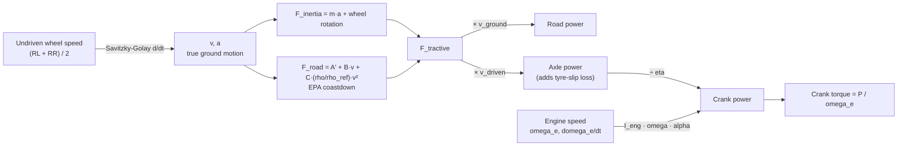

Horsepower and torque for the GTI derived from Newton's second law on the logged
wheel speeds — no ECU torque model, no `Calc HP`. **R14 makes 276 ± 1 hp and
418 ± 2 Nm (308 lb-ft) at the crank, 238 hp at the contact patch**, from three
3rd-gear WOT pulls. The whole lineage R01 → R14 is derived on the same footing.

> [!tip] The one-line version
> Differentiate the **undriven** wheel speed, multiply by mass, add back the
> aerodynamic and rolling losses the car was fighting at that speed, and convert
> to power. Everything else is bookkeeping about rotating parts and where in the
> driveline you want to quote the number.

Related: [[simostools-app-guide]] · [[ecu-tuning-basics]] ·
[[eqt-s2-baseline-log-review]] · script: `Logs/physics_power/physics_power.py`

---

## 1. The answer

Per revision, 3rd-gear WOT pulls that swept the whole engine range:

| Revision | Pulls | Road hp | Crank hp    | Crank torque            | Air temp | Air density |
|----------|-------|---------|-------------|-------------------------|----------|-------------|
| R01      | 3     | 234     | 264 ± 7     | 417 ± 8 Nm / 307 lb-ft  | 18.3 °C  | 1.208 kg/m³ |
| R04      | 2     | 243     | **280 ± 1** | 418 ± 2 Nm / 308 lb-ft  | 14.3 °C  | 1.227 kg/m³ |
| R07      | 2     | 227     | 261 ± 2     | 386 ± 3 Nm / 285 lb-ft  | 22.5 °C  | 1.200 kg/m³ |
| R08      | 3     | 227     | 261 ± 2     | 388 ± 13 Nm / 286 lb-ft | 21.8 °C  | 1.200 kg/m³ |
| R09      | 7     | 236     | 270 ± 7     | 409 ± 8 Nm / 302 lb-ft  | 16.2 °C  | 1.224 kg/m³ |
| R14      | 3     | 238     | **276 ± 1** | 418 ± 2 Nm / 308 lb-ft  | 17.3 °C  | 1.222 kg/m³ |

"Road hp" is power delivered at the contact patch — the number with the fewest
assumptions in it. "Crank hp" adds driveline efficiency and the power spent
spinning the crank and clutch pack up. Peak power lands at 4850–6050 rpm and peak
torque at 3500–4560 rpm; R14's torque plateau is noticeably later and flatter
than R07/R08's.

Per-pull detail, including the pulls excluded from the aggregates and why:
`physics_power_pulls.md`.

![[01_power_torque_headline.png]]

R11 produced no qualifying pull — both of its 4th-gear pulls stopped at ~5.2 krpm,
short of a full sweep.

---

## 2. The model



Force balance on the car in the ground frame:

$$F_\text{tractive} = m\,a \;+\; \tfrac{m_w}{2}\left(a + a_\text{driven}\right) \;+\; \underbrace{A' + Bv + C\frac{\rho}{\rho_\text{ref}}v^2}_{\text{road load}} \;+\; mg\sin\theta$$

and then

$$P_\text{road} = F_\text{tractive}\,v \qquad
P_\text{axle} = F_\text{tractive}\,v_\text{driven} \qquad
P_\text{crank} = \frac{P_\text{axle}}{\eta} + I_e\,\omega_e\,\dot{\omega}_e
\qquad T_\text{crank} = \frac{P_\text{crank}}{\omega_e}$$

Three details that turned out to matter more than the drag models:

**Use the undriven wheels for `v`.** `Vehicle Speed` is the *driven* (front) pair.
Under power the front tyres run 2–4 % ahead of the ground in 3rd gear and up to
15 % in 2nd. Feeding that to $a = \dot v$ inflates acceleration exactly while
boost is building. Measured cost of getting this wrong, on the logs that carry
both references: **+0.7 % in 3rd gear, +32 % in 2nd**.

**Then use the driven wheels for the power.** The driven tyre's contact surface
moves at $v_\text{driven}$ while transmitting $F_\text{tractive}$, so
$F\,v_\text{driven}$ is the power entering the tyre and $F(v_\text{driven} - v)$
is the slip loss — which falls out of the two channels for free instead of being
assumed.

**Take the engine's rotational term from the rpm channel.** $I_e \omega_e
\dot\omega_e$ needs no gear ratios and is automatically right in every gear. It
is worth 13 hp at peak power in 3rd and 31 hp in 2nd, and it is precisely that gear
dependence that lets the cross-gear check below *measure* $I_e$.

### Constants and where they came from

| Quantity | Value | Source |
|----------|-------|--------|
| Mass $m$ | 3400 lb / 1542 kg | Your figure, car + driver |
| Road load $A$, $B$, $C$ | 34.463 lbf, 0.19533 lbf/mph, 0.018508 lbf/mph² | EPA 2017 Test Car List, tested 2017 GTI 1.984 L DSG, axle 3.44 |
| $\eta$ driveline | 0.93 (band 0.90–0.95) | Geartrain only — see note below |
| $I_e$ engine side | 0.35 kg·m² (band 0.20–0.50) | **Fitted from the logs**, § 4 |
| $m_w$ wheel inertia | 50 kg equivalent | 4 × 1.25 kg·m² / (0.316 m)² |
| $\rho$ | 1.21–1.24 kg/m³ | Computed per pull from logged `Ambient Press` and `Ambient Temp` |

> [!warning] $\eta = 0.93$ is not "7 % drivetrain loss"
> The "12–15 % drivetrain loss" quoted for chassis-dyno numbers bundles tyre
> rolling resistance, bearing drag and rotational inertia together with the
> geartrain. All three are already accounted for separately here — rolling
> resistance and bearing drag inside the coastdown term, inertia in its own
> terms — so $\eta$ here is only gear mesh, bearings and oil churn. Double-counting
> them would be the mistake.

---

## 3. Do you need drag models? Yes — and here is how much

You asked whether simple aerodynamic-drag and rolling-resistance models were
needed. They are, and the answer is quantified rather than assumed:

- Over an R14 3rd-gear pull, inertia is **83–94 %** of tractive force, aero drag
  **3–12 %**, rolling resistance **3–6 %**.
- Dropping both entirely understates R14's peak crank power by **9.3 %** (276 → 251 hp);
  dropping aero alone costs 6.0 % and rolling alone 3.3 %. Because the aero error
  grows as $v^2$ it tilts the shape of the curve, not just its level.
- Aero overtakes rolling resistance at about 75 km/h and is the larger of the two
  for the whole upper half of every pull.

Rather than guessing $C_d$ and frontal area, the road load comes from the EPA's
published **coastdown** coefficients for the tested 2017 GTI DSG — an actual
measured track coastdown that folds tyre rolling resistance, bearing drag and
aerodynamics into one curve. As a cross-check its $C$ term implies
$C_dA = 0.673\ \text{m}^2$, against $0.31 \times 2.17 = 0.673\ \text{m}^2$ from
the published Mk7 Golf drag coefficient and frontal area, and against
$0.280 \times 2.40 = 0.672\ \text{m}^2$ configured in the SimosTools app. Three
independent routes to the same number.

The $A$ term is rescaled from EPA's 3500 lb test weight to 3400 lb (rolling
resistance goes with load) and the $C$ term by the air density actually logged.

![[02_pull_anatomy.png]]

---

## 4. Verification

![[03_verification.png]]

**Cross-gear agreement — the strongest check.** One engine must make one curve
regardless of which gear it is in, but the terms that build that curve scale very
differently between gears. Derived with the undriven wheels (top left), the
2nd-gear and 3rd-gear curves each land on the ECU's own modelled torque for that
gear. Derived with the driven wheels (top right), 2nd gear runs off the top of
the chart. That single comparison is what settled the choice of speed channel.

**The inertia is measured, not assumed.** The 3rd − 2nd gear torque gap falls
linearly as $I_e$ rises; matching the gap the ECU's own model shows between those
gears gives $I_e = 0.34\ \text{kg·m}^2$, and 0.35 is used. That is consistent with
a hand estimate for an EA888 crank assembly plus dual-mass flywheel plus the
DQ250's wet dual-clutch pack (0.30–0.35 kg·m²).

**Sensitivity.** Every assumption moved to the edge of its plausible range shifts
peak crank power by less than **9 hp (3 %)**, with $\eta$ and road grade the two
largest. Pull-to-pull scatter within a revision is ±1–7 hp, which independently
bounds the combined grade-plus-wind term at roughly ±1 % grade.

**Against the ECU.** Averaged over all 3rd-gear pulls, derived crank torque sits
**+1.4 %** against the ECU's internal torque model from 3500–5000 rpm and **−2.7 %**
from 5000–6000 rpm, and is never more than 4.1 % away anywhere in that range. Two
independent routes — one from the ECU's airmass and torque model, one from the car's
motion — agreeing inside 4 % is the result I would most want to see. `Calc HP` is
the odd one out at **+9.1 %** above the derived crank figure, which is expected: it
is computed from the driven-wheel `Vehicle Speed` and a different mass and $C_dA$.

**Signal handling.** The `Time` column is printed to ~0.25 s but sampling is a
uniform 25 Hz, so a uniform grid is reconstructed and checked back against the
printed stamps. Differentiation is a local quadratic (Savitzky-Golay) whose window
is sized in *rpm span* rather than seconds, so a 2 s 2nd-gear pull and a 7 s
3rd-gear pull get the same smoothing on the rpm axis and stay comparable.

**Rejected, not quietly used.** Pulls whose speed channel is too coarse to
differentiate (the R01 profile logs `Vehicle Speed` to 1 km/h) are dropped by a
quantisation-noise test. The last 0.40 s of every pull is trimmed because the DSG
requests a torque cut before it shifts. Partial sweeps and wheelspinning pulls
stay in the table but are flagged and excluded from aggregates.

![[04_revisions.png]]

---

## 5. What this is not

> [!note] Honest limits
> - **Road grade is now measured, and it is small.** See § 5.1 — the R14 pulls sit
>   between −0.41 % and +0.59 %, worth about ±3 hp rather than the ±6.6 hp a full
>   1 % would cost. It is still the largest single geometric unknown. To remove it
>   entirely: run two pulls back-to-back in opposite directions on the same stretch
>   and average — the grade term cancels exactly.
> - **Wind is unmeasured** and enters as $(v + v_\text{wind})^2$. A 10 km/h
>   headwind at 135 km/h costs about 4 hp.
> - **$\eta$ is the one genuinely assumed constant.** Road hp is free of it; use
>   that number when comparing revisions.
> - Ambient temperature comes from the car's bumper sensor, which reads high
>   after the car has been sitting. It affects only the density scaling of the
>   aero term.
> - These are **uncorrected** numbers — no SAE J1349 correction to standard
>   conditions has been applied, so cool-day revisions have a genuine advantage.
>   R14 and R09 were logged at 16–17 °C, R07/R08 at 22 °C — worth roughly 2 % on the
>   air-density term between the extremes.

### 5.1 The accelerometer channels — and what they are good for

`Accel. Lat` and `Accel. Long` are **real chassis sensors**, not app-computed
quantities: the PID list reads them straight out of ECU RAM (`0xd000ee2a` and
`0xd00141ba`) with byte scalings of $(x-127)/10$ and $(x-512)/32$, and the logged
floats are the app's EMA filter converging onto exactly those steps — e.g. a run
of 0.3339 → 0.3398 → 0.3422 → 0.3431 → 0.34375, and $0.34375 = 11/32$. They are
the ESP sensor-cluster values.

That makes two things possible and rules out a third.

**Grade, from steady cruise only.** Being body-mounted, the longitudinal sensor
reads $\dot v + g\sin(\text{grade}) + g\sin(\text{body pitch})$. The residual
$(\texttt{Accel. Long} - \dot v)$ measured *during* a WOT pull is **not** grade —
it comes out at a near-constant +0.9 % across every session and both revisions
checked, which is the car squatting under ~3.5 m/s² of acceleration, not a hill
that happens to be there every time. Restricted to steady, straight, low-pedal
cruise in the same log, the pitch and $\dot v$ terms both vanish and the residual
becomes usable. That is what the `Grade %` column reports:

| Revision | Pull | Grade   | Peak crank hp |
|----------|------|---------|---------------|
| R14      | 1    | −0.41 % | 276           |
| R14      | 3    | +0.06 % | 275           |
| R14      | 4    | +0.59 % | 278           |
| R08      | 1    | +0.41 % | 263           |
| R08      | 2    | −0.34 % | 260           |
| R08      | 3    | +0.56 % | 259           |

An unknown sensor zero-offset rides along, so read these as relative between pulls
rather than as absolute grades. The spread is what matters, and it is ±0.5 %.

**Cornering rejection.** `Accel. Lat` flags pulls taken in a bend, where tractive
effort bleeds into tyre slip angle and load shifts across the axle. Every 3rd-gear
pull in the set is essentially straight (0.03–0.13 g); the flagged ones are
2nd-gear pulls at 0.27 g, which is one more reason those numbers sit lower.

**What it cannot do:** replace the wheel-speed derivative. At 1/32 m/s² resolution
behind a heavy EMA filter, and carrying both gravity terms, it is far worse than
differentiating the undriven wheels — which is why it is used as a cross-check and
a rejection test, never as the acceleration input.

---

## 6. Re-running it

```bash
Code/.venv/bin/python Logs/physics_power/physics_power.py
```

Writes the four plots into `plots/`, plus `physics_power_pulls.md` and
`.json`. Every constant is a named module-level value with its provenance in the
comment above it; the sensitivity panel regenerates itself from whatever those
values are, so changing one shows its own consequence.

### Sources

- EPA, *Data on Cars used for Testing Fuel Economy* — 2017 Test Car List
  (`17tstcar-2018-05-30.xlsx`), rows for the tested Volkswagen GTI 1.984 L,
  6-speed automated manual, axle 3.44: target coastdown coefficients and
  equivalent test weight.
- Mk7 Golf GTI published drag coefficient 0.31 and frontal area ~2.17 m²
  (cross-check on the coastdown $C$ term only).
- SimosTools CAR tab configuration (curb weight 1500 kg, tyre diameter 0.632 m,
  $C_d$ 0.280, frontal area 2.40 m²) — used only to explain the offset between
  `Calc HP` and the derived figure, never as an input.
- Published Mk7 GTI IS20 stage-2 chassis-dyno results cluster at 300–325 whp /
  ~365 wtq on 91–93 octane, for context on where this tune sits.
