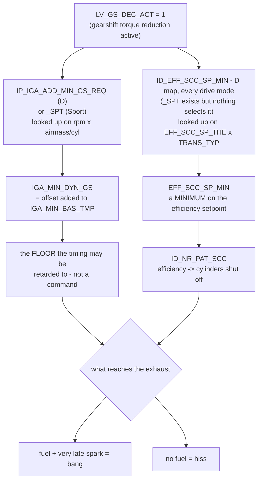

Baseline characterization of the DSG shift "fart" on this car, written before
any change is made. Everything below is read off the flashed bin or measured in
the logs — no value here is retyped from a tuning guide.

> [!important] The headline
> **The retard is already there. The fuel is what is missing.**
> On a wide-open-throttle upshift this car cuts the fuel outright — 59 of 79
> logged WOT interventions go to zero fuel flow with lambda off the top of the
> logged range — so the exhaust gets *air*, and air does not bang. On a
> part-throttle upshift the fuel keeps flowing (57 of 62) while the ignition
> goes to as low as **−35.6 °CRK**, and that is combustion arriving in the
> exhaust. The car is quiet exactly where you want noise and noisy where you
> do not.

## The five tables

All five are **base calibration, not per map slot** — the switch-patch XDF
lists them at the same addresses as the stock definition, so anything done here
lands on slots 1–5 at once, the bad-tank map included. All five are also
**byte-identical to stock on every bin this lineage has produced** — checked
across all 94 `.bin` files under `Tunes/*/*_out/`, R00 through R24, with zero
differences. The characterization script re-asserts it for the flashed bin on
every run and fails rather than pooling two calibrations.

| ID                          | Description                                                                                | Shape   | Current state on this car                             |
|-----------------------------|--------------------------------------------------------------------------------------------|---------|-------------------------------------------------------|
| `IP_IGA_ADD_MIN_GS_REQ`     | Correction map for IGA_MIN_BAS_TMP in case of external request — the D-mode shift retard     | 12 × 16 | 0 below 300 mg/stk; to **−12.0 °CRK** at high load     |
| `IP_IGA_ADD_MIN_GS_REQ_SPT` | …the same in Sport mode                                                                      | 12 × 16 | 0 below 300 mg/stk; to **−20.25 °CRK** from 3520 rpm   |
| `ID_EFF_SCC_SP_MIN`         | Minimum efficiency setpoint for single cylinder shut-off in case of gear shift — D mode      | 5 × 5   | **0.00** on the DCT row → up to **4 cylinders** cut    |
| `ID_EFF_SCC_SP_MIN_SPT`     | …the same in Sport mode                                                                      | 5 × 5   | 0.06 on the DCT row, but **unreachable** — see below   |
| `ID_NR_PAT_SCC`             | SCC pattern depending on SCC efficiency — turns that efficiency into a cylinder count         | 1 × 13  | 0.00 → 4 cyl, 0.05 → 3, 0.30 → 2, 0.55 → 1, 0.80 → 0   |

> [!note] Row 4 is our row, and the Funktionsrahmen says so outright
> The two SCC tables are indexed on `TRANS_TYP`, and the FR gives the mapping
> without ambiguity — *"Vehicle has DCT gearbox, TRANS_TYP = 4"*, with
> `LDP_TRANS_TYP` = DCT 4, MT_4x4 3, MT 2, CVT 1, AT 0. This car is a DQ250
> DSG, so **row 4** is live and the other four rows are dead weight. That also
> confirms the tuning guide's "row 4 references cylinder count" in
> [[ecu-tuning-basics]], which asserts it without saying why.

## How the intervention actually works



Two details in that flow are easy to get backwards, and both are load-bearing:

1. **The retard maps are a floor, not a command.** FR § *IGSP, TQM — Minimum
   ignition angle*, fig. 48.7.15: the map value is added to `IGA_MIN_BAS_TMP`
   to form `IGA_MIN_DYN_GS`, the lowest angle the intervention is *permitted*
   to reach. Making the number more negative removes a limit; it does not by
   itself ask for more retard. This is why the logged floors (−35.6 °CRK) are
   far deeper than either map's largest offset (−20.25).
2. **The SCC table is a *minimum efficiency*, so a bigger number cuts fewer
   cylinders.** FR § 70.19.2.3: during a shift the minimum efficiency setpoint
   is looked up and clamps `EFF_SCC_SP` from below. Efficiency 0 places no
   limit and permits a full four-cylinder cut; 0.55 would clamp the cut to a
   single cylinder. **D mode is currently the *more* aggressive cutter of the
   two** — 4 cylinders against Sport's 3.

## D and Sport differ — but only on the half that doesn't make noise

The two Sport tables are selected by **different conditions**, and on this bin
only one of them is reachable. Read off the flashed bin (`SC8S50.ALL.xdf`, which
defines these where the primary XDF does not):

| Constant                    | Value | Meaning                                                    |
|-----------------------------|-------|------------------------------------------------------------|
| `CLF_DRIV_MOD_CONF_SPT_ACT` | 8     | drive modes selecting `IP_IGA_ADD_MIN_GS_REQ_SPT` → **SPORT** |
| `LC_IGA_ADD_MIN_GS_ACT_SPT` | 1     | that Sport retard path is **enabled**                       |
| `CLF_EFF_SCC_SP_DRIV_MOD`   | **0** | drive modes selecting `ID_EFF_SCC_SP_MIN_SPT` → **none**    |
| `LC_EFF_SCC_SP_MIN_SPT_KD`  | **0** | kickdown does not select it either                          |

Bit layout from the XDF's own title for `CLF_STATE_N_MAX_CTL_DRIV_MOD`: bit0
NORMAL, bit1 EFFICIENCY, bit2 ICE, bit3 SPORT, bit4 OFFROAD, bit5 SPORT+. So
value 8 is bit3, Sport.

> [!warning] Selecting Sport changes the timing floor, not the cylinder cut
> The Sport SCC table's 0.06 — the one that would cut 3 cylinders instead of 4 —
> is **dead calibration**: FR § 70.19.2.3 selects it on
> `(LF_DRIV_MOD AND CLF_EFF_SCC_SP_DRIV_MOD) OR (LV_KD AND LC_EFF_SCC_SP_MIN_SPT_KD)`,
> and both constants are zero. The cut is governed by `ID_EFF_SCC_SP_MIN` = 0.00
> — a full four-cylinder cut — in **every** drive mode. Driving in Sport
> therefore cannot make a WOT upshift audible; it only deepens the permitted
> timing floor from −12.00 to −20.25 °CRK, on cylinders that at WOT have no fuel
> in them.
>
> `CLF_EFF_SCC_SP_DRIV_MOD` = 0 is a **mask**, so this holds no matter *how*
> sport is requested — no bit is set, so no drive-mode value can match it. The
> logs agree: WOT fuel ratios are either ~0 (a full cut) or ~1 (the sample
> missed the cut), with nothing clustered at the 0.25 a three-cylinder cut
> would produce.

### The lever and the button are two different requests

The ECU distinguishes them exactly the way the car does. FR § DRPD, *Driving
mode selection via switch*, builds a **gear-lever** sport flag,
`LV_DRIV_MOD_SEL_GLV_SPT` = (`SEL_PSN_MSK` AND `CLF_DRIV_MOD_SEL_PSN_MSK_SPT`)
≠ 0, and coordinates it with the **drive-mode switch** request into
`STATE_DRIV_MOD` / `LF_DRIV_MOD`. So "lever in S" and "Sport profile selected"
are separate inputs, and only the second is obviously the thing
`CLF_DRIV_MOD_CONF_SPT_ACT` (= 8, bit3 SPORT) tests.

Two things follow, and both are open:

1. **Whether the lever alone selects the Sport *retard* map is unresolved.**
   That depends on whether the lever's sport flag ends up setting bit 3 of
   `LF_DRIV_MOD`, which runs through `CLF_DRIV_MOD_SEL_PSN_MSK_SPT` — **not
   defined in either XDF for this box code**, so it cannot be read off the bin.
2. **There is a second, genuinely lever-gated sport path, and it sits upstream
   of the cut.** FR § 72.8.3.3 selects between `IP_TQI_THD_DYN_SCC_GS_DEC` and
   `IP_TQI_THD_DYN_SCC_GS_DEC_SPT` — the torque threshold that *authorizes* the
   dynamic fuel cut at a gearshift — on
   `(LF_DRIV_MOD AND CLF_TQ_DRIV_MOD_SCC_GS_PRMS_SPT) OR (SEL_PSN_MSK AND CLF_SEL_PSN_SCC_GS_PRMS_SPT) OR (LV_KD AND LC_KD_SCC_GS_PRMS_SPT)`.
   That middle term is the gear lever. **None of those tables or constants are
   defined in either XDF for this box code**, so whether S changes the
   authorization threshold — and therefore whether the cut happens at all —
   cannot be answered from the bin with the definitions we have.

> [!tip] The test that settles both, from one drive
> The two retard maps diverge by **8–12 °CRK** at 3520–4512 rpm and 600–1350
> mg/stk — a firm part-throttle upshift, roughly 40–60 % pedal — and are
> identical everywhere below 400 mg/stk. Log a few upshifts in that window
> three times: **lever in D**, **lever in S**, and **Sport profile selected**.
> `Ign Avg` at the shift reads out which map was live in each case, and the
> fuel-flow drop says whether the cut behaved differently.
>
> The existing logs already contain 12 part-throttle events in cells where the
> maps differ by ≥ 5 °CRK, spanning R11 to R22. They form **one tight cluster,
> −16.9 to −22.9 °CRK, with no 8–10 °CRK split** — consistent with a single map
> running throughout, but silent on which one, since no session recorded the
> lever position or the drive mode.

## What the logs measure

Every `Logs/*/simostools-*.csv` this car has produced — 121 sessions — scanned
for upshifts, keeping the 141 where `Ign Avg` drops at least 8 °CRK below its
pre-shift baseline.

![[shift-fart-characterization.png]]

| Measurement                          | WOT (pedal ≥ 90 %), n = 79 | Part throttle, n = 62      |
|--------------------------------------|-----------------------------|----------------------------|
| minimum `Ign Avg`, median            | −14.6 °CRK                  | −19.9 °CRK                 |
| minimum `Ign Avg`, deepest           | −22.9 °CRK                  | **−35.6 °CRK**             |
| fuel kept at the deepest sample      | **0 %** in 59 of 79         | ~103 %, only 4 below half  |
| peak lambda through the intervention | 2.00 (top of the range)     | 1.02                       |

The time domain makes the mechanism unmissable — the same ignition dip, with
and without fuel underneath it:

![[shift-fart-two-regimes.png]]

> [!tip] The lever is the cut, not the timing
> Adding retard to `IP_IGA_ADD_MIN_GS_REQ` on a WOT shift changes the timing of
> cylinders that have no fuel in them. To make a WOT upshift audible, the
> change that has to happen is **raising `ID_EFF_SCC_SP_MIN` on the DCT row**
> so fewer cylinders are cut — 0.55 for a one-cylinder cut, 0.30 for two — and
> only then does the existing −12 °CRK floor start producing noise. The guide's
> "Spark Adder −18 to −30, cut 1 cylinder" is really one instruction, and the
> cut is the half that matters here.

## What a log cannot tell us

Recorded so the next session does not re-derive them:

- **Which drive mode, or which lever position, was selected.** Neither is a
  logged channel, and the two retard maps are identical below 400 mg/stk where
  many of the part-throttle shifts land. Every number above pools all of them.
  **Record the lever position and drive mode per session from now on** — it is
  the one piece of metadata that would make these events separable, and it
  costs nothing but a note.
- **The absolute floor.** `IGA_MIN_BAS_TMP` is not logged, so the map offset
  cannot be turned into a predicted floor — only compared in shape.
- **How many cylinders were cut, directly.** The cut is inferred from the drop
  in `Fuel Flow` against its pre-shift level. A ratio of exactly zero is a
  clean read; the intermediate values are one 40 ms sample and should not be
  read as "2.7 cylinders".
- **Whether any of it is audible.** Nothing here is a measurement of sound.

## Before changing anything

- These tables are shared by all five map slots. There is no per-slot version,
  so this cannot be put on one slot and tested against another the way boost
  and lambda changes in this lineage have been.
- **Cutting fewer cylinders puts more torque through the clutch pack during the
  shift.** The cut exists to reduce torque for the shift, not to be quiet; a
  higher `ID_EFF_SCC_SP_MIN` un-does part of that. Shift quality and DQ250
  clutch wear are the cost, and neither is visible in the exhaust note.
- The downpipe on this car is **catted aftermarket**. Late combustion in the
  exhaust is heat where the cat is; `Exh Pres Desired`, oil and coolant temps
  and the cat-protection limiters all deserve a look before the first drive on
  a changed map, and short interventions are safer than long ones.
- FR: if the VVL system is faulty, cylinder deactivation during gearshift must
  be disabled, or emissions rise at the new operating points.
- **Pops & bangs / impulse combustion is a different feature set entirely**
  (`Poops n Craps`, category `0xD` in [[sc8s50-switchpatch-xdf]]) and is not
  what any of this touches.

## Reproduce

```
Code/.venv/bin/python Logs/shift_fart_characterization/characterize_shift_fart.py
```

Writes `Logs/shift_fart_characterization/shift_events.csv` — one row per
intervened upshift — and regenerates both figures above. It reads the
calibration off the flashed bin via `CalFile` and asserts it against the stock
bin, so if a future revision does move one of these tables the run fails rather
than quietly pooling two calibrations.

Related: [[ecu-tuning-basics]], [[sc8s50-switchpatch-xdf]],
[[simostools-app-guide]]
