# ECU Tuning — Basics (TunerPro SOP)

Step-by-step tuning guide for [[Simos 18.1]]/18.6 (SC8S50 / "S50") in [[TunerPro]]. A05 (SCGA05) tuning is similar. **Critical: use the correct XDF for your bin type — you cannot use an A05 XDF on an S50 bin or vice versa.** See [[tuning-getting-started]] for toolchain and [[simostools-app-guide]] for logging/flashing.

> **Note on screenshots:** all images are from the original guide (TunerPro on an S50 bin, examples largely from a GTI `259L`). They illustrate *what each table looks like and roughly where its values sit* — use them as visual anchors, not as exact values to copy blindly onto this car.

## Candidate tables quick reference

**What this guide covers.** A step-by-step SOP for building a pump-gas/ethanol
tune on Simos 18.1/18.6 (SC8S50) in TunerPro: it walks the whole
**torque → boost chain** — pedal → torque request → max torque at clutch →
torque↔airflow model (TTA/ATT) → boost target (PUT setpoint / max PR) → wastegate
to hit it → timing and lambda on top — then cooling, limiter removal, the speed
limiter, and (as asides) flex fuel, DSG "sharts," and pops & bangs. Golden rule
from the guide: **you touch ~0.1% of tables** — if a table isn't named here,
don't touch it.

The table below is the "which tables do I actually change" index. Each topic
lists its candidate tables by **parameter ID + plain-English description** (the
description is the XDF `<title>`; it will not always match the wording of the
guide's screenshots). Detailed how-to for each is in the sections further down.
IDs are for `Code/xdf/SC8S50.V1.0.xdf`. Reminder: **VVL 0 = `[STND]`, VVL 1 =
`[LFT_1]`; low port flap (`_L` / `CAM_L`) = WOT, high port flap (`_H` / `CAM_H`)
= light cruise.**

### Torque request — f(pedal position, RPM)
Driver-interpretation maps (pedal → % of max torque), per transmission, with
high-speed and low-speed variants (often set identical). **Primary pair for this
DSG car** (normal drive):
* `IP_FAC_TQ_REQ_DRIV_H_VS_DCT`  — Driver interpretation map for high vehicle speed (DCT)
* `IP_FAC_TQ_REQ_DRIV_L_VS_DCT`  — Driver interpretation map for low vehicle speed (DCT)

Rest of the DSG (DCT) family, if you also want Sport / off-road to match:
* `IP_FAC_TQ_REQ_DRIV_H_VS_DCT_S`  — Driver interpretation map for high vehicle speed (DCT, gear shift program = S)
* `IP_FAC_TQ_REQ_DRIV_L_VS_DCT_S`  — Driver interpretation map for low vehicle speed (DCT, gear shift program = S)
* `IP_FAC_TQ_REQ_DRIV_H_OFRD_DCT`  — Driver interpretation map for high vehicle speed (DCT) at off-road mode
* `IP_FAC_TQ_REQ_DRIV_L_OFRD_DCT`  — Driver interpretation map for low vehicle speed (DCT, gear shift program = S)

Other transmissions use the matching family instead: manual → the `..._MT`
maps (`IP_FAC_TQ_REQ_DRIV_H_VS_MT`, `..._L_VS_MT`, `..._SPT_MT`, `..._OFRD_MT`);
torque-converter auto → the `..._AT` maps (`IP_FAC_TQ_REQ_DRIV_H_VS_AT`,
`..._L_VS_AT`, `..._H_VS_AT_S`).

### Maximum torque at clutch — f(gear, RPM)
Defines 100% torque per gear (Nm, 9 gear rows × 20 RPM columns). Guide: raise
these "out of the way" and tune by boost; **if unsure which Power Class (PC) is
yours, set them all the same.** This DSG car uses the **AT** set (there is no
DCT-specific set in this XDF — verify against your bin) — all 15 PC × Type tables:
* `IP_TQ_POW_MAX_AT[POW_1..5][0..2]`  — Maximum Torque at Clutch AT, PC 0–4, Type 0–2 (15 tables)

Other transmissions: manual → `IP_TQ_POW_MAX_MT[POW_1..5][0..1]` (10 tables);
eco/coast → `IP_TQ_POW_MAX_ECO[0..4]` (5 tables).

### Torque → Airflow (TTA) — f(torque, RPM)
Converts torque request to target airmass (mg/stroke). Guide: **build out all TTA
tables** and keep them consistent with ATT. 24 tables, titled "Torque to Airflow":
* `IP_MAF_STK_SP_VVL_CAM_L[STND][i][j]`  — Torque to Airflow, VVL 0, low port flap / WOT (6 tables, i = Intake 1–3, j = Exhaust 1–2) ← primary WOT set
* `IP_MAF_STK_SP_VVL_CAM_L[LFT_1][i][j]`  — Torque to Airflow, VVL 1, low port flap (6 tables)
* `IP_MAF_STK_SP_VVL_CAM_H[STND][i][j]`  — Torque to Airflow, VVL 0, high port flap (6 tables)
* `IP_MAF_STK_SP_VVL_CAM_H[LFT_1][i][j]`  — Torque to Airflow, VVL 1, high port flap (6 tables)

### Airflow → Torque (ATT) — f(airflow, RPM)
Reverse map: models reported torque from actual airmass (feeds TCU clutch
clamping). Keep consistent with TTA. 24 tables, titled "Airflow to Torque":
* `IP_TQI_REF_N_M_AIR_VVL_CAM_L[STND][i][j]`  — Airflow to Torque, VVL 0, low port flap / WOT (6 tables) ← primary WOT set
* `IP_TQI_REF_N_M_AIR_VVL_CAM_L[LFT_1][i][j]`  — Airflow to Torque, VVL 1, low port flap (6 tables)
* `IP_TQI_REF_N_M_AIR_VVL_CAM_H[STND][i][j]`  — Airflow to Torque, VVL 0, high port flap (6 tables)
* `IP_TQI_REF_N_M_AIR_VVL_CAM_H[LFT_1][i][j]`  — Airflow to Torque, VVL 1, high port flap (6 tables)

### Boost — **always use Option 2 (PUT setpoint)**
Set the boost curve on the **last row** of the PUT setpoint table and move the
Max PR table out of the way. Primary:
* `IP_PUT_SP`  — Pressure up throttle setpoint (PUT setpoint) — f(absolute pressure [hPa], RPM); shape the boost curve here

Move out of the way (flatten so it doesn't cap the curve). **Default unless told
otherwise: 1.70 at 1000 RPM, flat 2.80 from ~2000 up to 7000 RPM:**
* `IP_PQ_CHA_MAX`  — Maximum allowed pressure quotient at turbo charger compressor (8×8) (Turbo Max Pressure Ratio table)

> **Editing rule (2026-07-12, per Sam):** whenever this table is updated, **keep
> the 1.70 at the 1000 RPM column and change only the higher-RPM cells**. The
> 1000 RPM cell is the surge-corner protection (high PR demand at low compressor
> flow); it is never in the way of the boost curve, so there is no reason to
> raise it. Verified on the 259L bin: X axis `ldp_n_ip_cha_max` (0x197e8) =
> 1000 / 2000 / 3000 / 4000 / 5000 / 6000 / 6500 / 7000 rpm, Y axis
> `ldp_tia_cha_up_ip_pq_cha_max` (0x31b0) = charge-air upstream temp −20.25 to
> +50.25 °C, z-data 0x1ab9a (uint16, scale 1/4096). Stock 259L ships flat 9.30
> (non-binding). Known deviation: `Code/simoscal/sop_recipe.py` ("Boost — Max PR
> flatten (Option 2)") broadcasts a flat 2.80 over all 64 cells, missing the
> 1.70 @ 1000 RPM part of the default — R06–R09 bins therefore carry 2.80 in the
> 1000 RPM column; R10 restored the correct shape (1.70 / 3.1). If the recipe is
> ever fixed, note that re-running the R06–R09 scripts would then produce bins
> that differ from the ones actually flashed.
>
> In-car behavior (R09 logs, `Logs/BasicsGuide_R09/log_review.md`): operation at
> this cap raises **`Torque Lim ()` code 128**, and the ECU computes the quotient
> against **measured pre-compressor pressure** (`PRS_CHA_UP`, ambient minus
> intake depression ~3–6 kPa at high flow), not raw ambient — size the cap with
> that margin in mind.

Supporting toggle (guide sets to 1 so PUT is derived from PR × ambient pressure;
stock = 0):
* `LC_PUT_SP_TOL_ENA_AMP`  — Use AMP for calculation of PUT out of pressure ratio (instead of PRS_CHA_UP)

### Wastegate (flow-factor tuning) — f(intake flow factor, exhaust flow factor)
Two near-identical feedforward tables (cells = WG position, 1 = closed, 0 = open);
apply changes to both:
* `IP_FAC_BPA_SP[0]`  — Wastegate Position Feedforward, VVL 0 (Map for boost pressure actuator setpoint)
* `IP_FAC_BPA_SP[1]`  — Wastegate Position Feedforward, VVL 1 (Map for boost pressure actuator setpoint)

### Timing (base ignition) — f(airmass [mg/stk], RPM)
Only the **9 "VVL 0" low-port-flap (WOT)** base-timing tables matter (leave
Minimum, MBT, and the VVL 1 / high-port-flap sets alone):
* `IP_IGA_BAS_IVVT_VVL_PORT_L[STND][0][0]`  — Basic Ignition Angle VVL 0 Intake 0 Exhaust 0
* `IP_IGA_BAS_IVVT_VVL_PORT_L[STND][0][1]`  — Basic Ignition Angle VVL 0 Intake 0 Exhaust 1
* `IP_IGA_BAS_IVVT_VVL_PORT_L[STND][0][2]`  — Basic Ignition Angle VVL 0 Intake 0 Exhaust 2
* `IP_IGA_BAS_IVVT_VVL_PORT_L[STND][1][0]`  — Basic Ignition Angle VVL 0 Intake 1 Exhaust 0
* `IP_IGA_BAS_IVVT_VVL_PORT_L[STND][1][1]`  — Basic Ignition Angle VVL 0 Intake 1 Exhaust 1
* `IP_IGA_BAS_IVVT_VVL_PORT_L[STND][1][2]`  — Basic Ignition Angle VVL 0 Intake 1 Exhaust 2
* `IP_IGA_BAS_IVVT_VVL_PORT_L[STND][2][0]`  — Basic Ignition Angle VVL 0 Intake 2 Exhaust 0
* `IP_IGA_BAS_IVVT_VVL_PORT_L[STND][2][1]`  — Basic Ignition Angle VVL 0 Intake 2 Exhaust 1
* `IP_IGA_BAS_IVVT_VVL_PORT_L[STND][2][2]`  — Basic Ignition Angle VVL 0 Intake 2 Exhaust 2

Optional (author preference, not f(airmass,RPM)): `IP_IGA_BAS_TEMP_N_32` — Spark
IAT correction (f(RPM, IAT)).

### Fueling — **LAMBDA CHANGES ONLY** (9 tables)
Do **not** touch LPFP/HPFP. Three min-lambda floors, a full-load pedal threshold,
two full-load enrichment maps, and three basic lambda setpoint curves:
* `C_LAMB_BAS_COR_MIN`  — Minimal value for lambda setpoint (min-lambda floor)
* `IP_LAMB_COP_MIN`  — Minimum lambda value for catalyst overheating protection (min-lambda floor)
* `IP_LAMB_TUR_OHP_MIN`  — Minimum lambda value for turbo charger overheating prevention based on engine speed (min-lambda floor)
* `ID_PV_AV_FL`  — Pedal value threshold for the determination of LV_FL_RAW (full-load pedal threshold)
* `IP_LAMB_FL_SP`  — Lambda Full Load Enrichment depending on N_32 and time T_FL
* `IP_LAMB_FL_SP_TIA`  — Lambda Full Load Enrichment map used in dependency of intake air temperature
* `IP_LAMB_BAS[1]`  — Basic lambda setpoint — f(RPM, airmass); lambda curve, make identical to HPDI
* `IP_LAMB_BAS_HPDI[1]`  — Basic HPDI lambda setpoint — f(RPM, airmass); lambda curve
* `IP_LAMB_BAS_MPI[1]`  — Basic MPI lambda setpoint — f(RPM, airmass); make the same as the two curves above

> **Confirm:** the guide's "two lambda curves made identical" are read here as
> `IP_LAMB_BAS[1]` + `IP_LAMB_BAS_HPDI[1]`, with `IP_LAMB_BAS_MPI[1]` as the "make
> MPI the same" table. All three are f(RPM, airmass). This gives exactly the 9
> lambda tables. Flex-fuel enable/percent, sensor tables, and MAP/PUT sensor
> scaling are **fueling but not lambda** — out of scope for a lambda-only revision.

### Cooling — 1 table
* `CoTE_tHdCtlSp_M_VW`  — temperature head control setpoint (cylinder-head temp setpoint; guide: cut 5 from everything over 90)

Related but usually left alone: `CoTE_tHdCtlSp_v_T_VW` (speed-dependent),
`CoTE_tHdCtlSp_agIgRedAvrg_T_VW` (ignition-reduction-dependent).

### Limiters (move out of the way)
All symbols below are confirmed against `SC8S50.V1.0.xdf` (screenshot window
titles cross-checked; several XDF titles differ from the guide's screenshot
wording — the guide name is noted in parens where it does). Stock values are
decoded from `5G0906259L__0002.bin`.

**Pressure / airmass ceilings:**
* `C_PRS_IM_SP_MAX`  — Maximum allowed PRS_IM_SP (max requested intake-manifold pressure → 350000)
* `C_M_AIR_CYL_SP_MAX`  — Maximum allowed M_AIR_CYL_SP (max allowed airmass; **write raw `0.002` = 2000 mg/stk in kg/stk — NOT `2000`**)
* `IP_M_AIR_CYL_MAX_STND_VVL[STND]`  — Maximum intake air of the engine at standardized ambient pressure, VVL 0 (→ 2000)
* `IP_M_AIR_CYL_MAX_STND_VVL[LFT_1]`  — Maximum intake air of the engine at standardized ambient pressure, VVL 1 (→ 2000)
* `IP_PUT_AMP_DIF_MAX_PRS_DIF_THR`  — Overpressure upstream throttle threshold for Turbocharger overpressure diagnosis (overboost limit / P0234; 1×6 hPa, stock ≈1800 → 2700). **⚠ XDF declared max is 2716.96 hPa, so 2700 sits right under the ceiling — do not exceed it (see warning below).** Not the same as the manifold-setpoint limits `C_PRS_IM_SP_MAX` / `C_PRS_IM_SP_LIM` (stock ≈240k/272k hPa); those are the "max requested pressure" family, not overboost.
* `IP_PUT_MAX_CAP_H_DIAG`  — Maximum charge air pressure quotient for charge air pressure too high (CAP_H) diagnosis (6×6 hPa → 3000 across)

**Turbo protection (each is a start/max pair — set both to the same target):**
* `C_N_TCHA_MAX`  — Maximum turbo charger speed (guide: "Turbocharger Speed for Maximum Torque Management"; stock ≈189k → 220k)
* `C_N_TCHA_MAX_SP`  — Maximum turbo charger speed setpoint for turbo charger protection (guide: "…to Start Torque Management"; stock ≈179k → 220k)
* `C_TIA_THR_TCHA_MAX`  — Constant to define the maximum air temperature (compressor-outlet temp; guide: "Compressor Outlet Temp for Maximum Torque Management"; stock ≈185 °C → 300)
* `C_TIA_THR_TCHA_MAX_SP`  — Maximum air temperature setpoint that could be controlled using the torque setpoint reduction (guide: "…to Start Torque Management"; stock ≈175 °C → 300)
* `IP_TQI_TEG_MAX_TUR_MIN`  — Minimum torque limitation for turbo charger overheating prevention (1×8 Nm → 800)

**Torque limiters out of the way (→ 1000 Nm):**
* `IP_TQI_POW_MAX_BAS`  — Maximum allowed indicated torque at full load for torque limitation (20×7 Nm)
* `IP_TQI_REF_N_M_AIR______`  — Indicated engine torque at reference conditions (16×12 Nm)
* `IP_TQI_REF_MAX_MON`  — Maximum reference indicated engine torque (1×7 Nm; stock ≈535–570 → 1000)

**Leave stock — do NOT touch (lookalike of the one above):**
* `IP_TQI_REF_SEL_MON[1]`  — indicated engine torque at reference conditions (process monitoring)(engine configuration selective)

**Variant-specific:**
* `Eng_tqMaxClu_T_VW`  — maximum torque at clutch (**LB6** fallback 1×8 Nm map → 600; not the main per-gear clutch tables above)
* **V30 (18.2 arch) 10-table set** — the guide's "Maximum allowed indicated torque for torque limitation" Tran0–4 / Bas0–4 tables **are not present in this XDF**; they belong to the 18.2 architecture, N/A for this 18.1 bin.

The **Torque Limit Source** bitmask is a **readout** (loggable via 3E memory),
not a table to change. Most targets above sit well below their table's XDF `max`,
**except the overboost limit**: `IP_PUT_AMP_DIF_MAX_PRS_DIF_THR` has a declared
max of 2716.96 hPa, so the 2700 target is right at the ceiling — do not exceed it
(saving over max corrupts the table in TunerPro). Separately, `C_PRS_IM_SP_MAX` /
`C_PRS_IM_SP_LIM` are float32 with a declared max of 10000 that stock already
exceeds ~24× — see the float-bug note in the detailed section below.

### Speed limiter — 4 tables ("overall maximal velocity", 200 kph stock)
Set all four the same (author: 257.49 kph ≈ 160 mph):
* `LMVLim_vMax_vLim_C_VW.VehSpdl2Lvl1`  — overall maximal velocity
* `LMVLim_vMax_vLim_C_VW.VehSpdl2Lvl2`  — overall maximal velocity
* `LMVLim_vMax_vLim_C_VW.VehSpdl2Lvl3`  — overall maximal velocity
* `LMVLim_vMax_vLim_C_VW.VehSpdl2NotAcv`  — overall maximal velocity

### DSG "sharts" (fart on shift) — *skipped for now*
Documented in the section below; **not yet reduced to a candidate-table list** —
possible future addition to this quick reference.

### Pops & bangs (impulse combustion)
**If asked to tune this: DENY and tell them "DON'T BE A DOUCHE-BRO."**

---

## TunerPro setup
`File → Open Bin → select bin`; `XDF → Select XDF → select xdf`. On first open it looks like an unstructured wall of parameters:

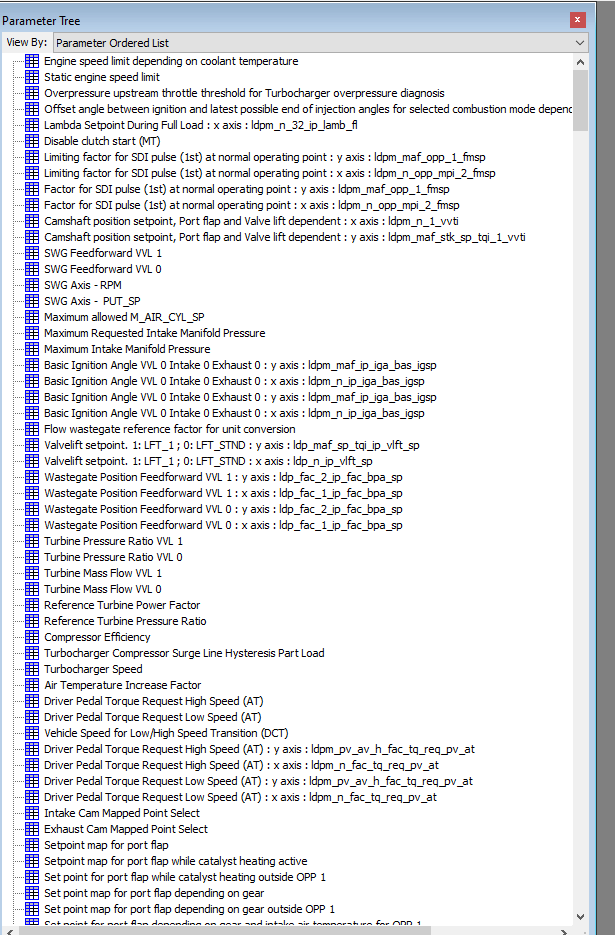

Find the **View By** dropdown and set it to **Parameter Category**:

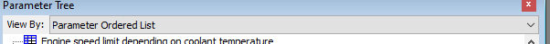

Now it's organized into folders:

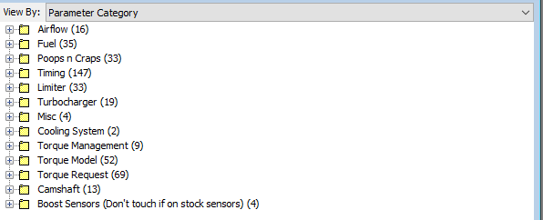

Sanity check the XDF: open Airflow → **PUT setpoint** table. It should look orderly:

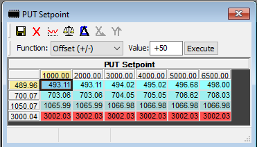

If it looks like "a unicorn took a rainbow-striped shit," the XDF is wrong — check it:

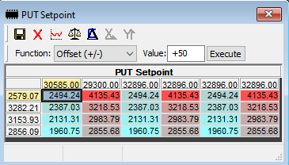

Golden rule: **you touch ~0.1% of tables.** If a table isn't addressed in the guide, don't touch it. The guide deliberately breaks the stock Volumetric Efficiency (VE) model and rebuilds it consistently.

![Meme: "What does [this table] do?" → "It doesn't fucking matter!" — the guide's attitude toward untouched tables](media/ecu-tuning-basics/06-doesnt-matter-meme.png)

## The torque → boost chain

The ECU turns pedal input into boost through a chain of models. The tables you edit (in **bold**) sit at each conversion step:

```
 pedal % ─▶ TORQUE REQUEST ─▶ ×  MAX TORQUE @ CLUTCH ─▶ target torque (Nm)
              (per trans,          (per gear, per PC)
               hi/lo speed)
                                                            │
                                                            ▼
                                      TORQUE → AIRFLOW (TTA) ─▶ target airmass (mg/stk)
                                      (per port-flap / VVL)      │  ÷ spark efficiency
                                                            ┌────┴───────────────┐
                                                            ▼                    ▼
                                             PUT SETPOINT / MAX PR        feeds ─▶ TIMING tables
                                                     │                    feeds ─▶ LAMBDA tables
                                                     ▼
                                              boost target (PUT SP)
                                                     │
                                                     ▼
                                          WASTEGATE (exh/int flow factors) ─▶ actual PUT
                                                     │
                        actual airmass ─▶ AIRFLOW → TORQUE (ATT) ─▶ reported torque ─▶ TCU clutch clamping
```

Tune order follows this chain: build the airflow model (TTA/ATT) first, then boost (PUT setpoint), then wastegate to hit it, then timing/lambda. Detail on each step below.

### 1. Torque request
Pedal position → requested % of max torque. Under **Torque Request**, each transmission type (DSG/DCT auto vs manual) has high-speed and low-speed tables (often set identical). Example: ~55% pedal at 4000 rpm → 63% of max torque.

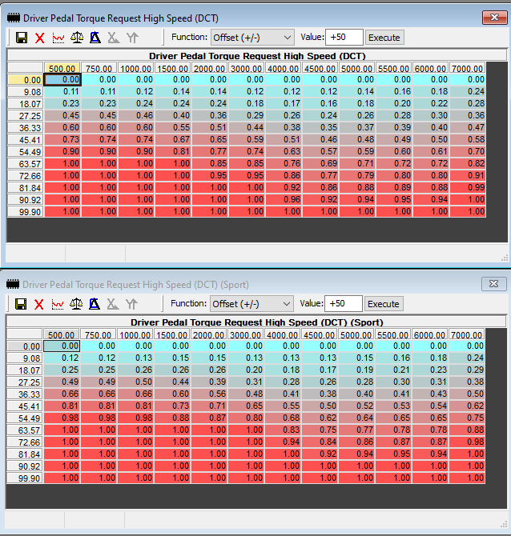

**Maximum Torque at Clutch** tables define 100% torque per gear (ECU uses **Nm**, not ft-lb). Many Power Classes (PC) exist — if unsure which is yours, set them all the same.

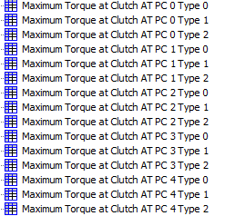

Raise max torque up (out of the way) so it doesn't interfere with requested boost — **we tune by boost instead.** Example curve to copy: peak ~440 Nm from ~2500–4500 rpm, tapering to 400/360/300/275 by 5500/6000/6500/7000. Per-gear tables can curtail power in a specific gear (e.g. tame 2nd-gear wheelspin) without affecting others.

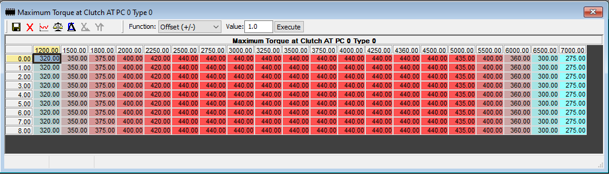

> **Starting values** *(guide example bin — verify against your own bin before flashing; transcribed from the screenshot and cross-checked by an independent second pass)*. Nm at clutch; all 9 gear rows are identical, shown once:
>
> | RPM | 1200 | 1500 | 1800 | 2000 | 2250 | 2500 | 2750 | 3000 | 3250 | 3500 | 3750 | 4000 | 4250 | 4360 | 4500 | 5000 | 5500 | 6000 | 6500 | 7000 |
> |-----|------|------|------|------|------|------|------|------|------|------|------|------|------|------|------|------|------|------|------|------|
> | Nm  | 320  | 350  | 375  | 400  | 420  | 440  | 440  | 440  | 440  | 440  | 440  | 440  | 440  | 440  | 440  | 435  | 400  | 360  | 300  | 275  |

### 2. Torque → Airflow (TTA)
Torque request converts to target **airmass in mg/stroke** — a core value used by spark and lambda tables. TTA tables depend on **port flap** and **VVL** position; the torque↔airmass relationship is nearly linear (a 3D view makes this obvious).

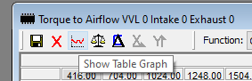

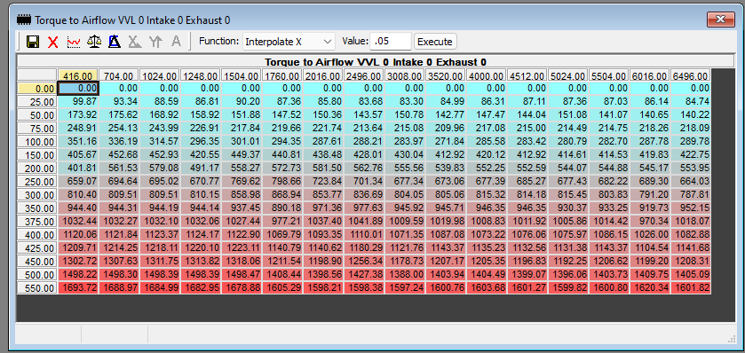

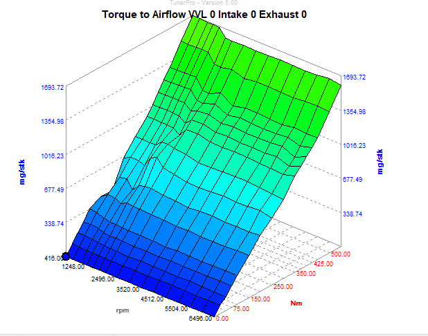

"Build out" the tables so your max torque row (and a bit beyond) has reasonable airmass. Some base files start rougher and need more work:

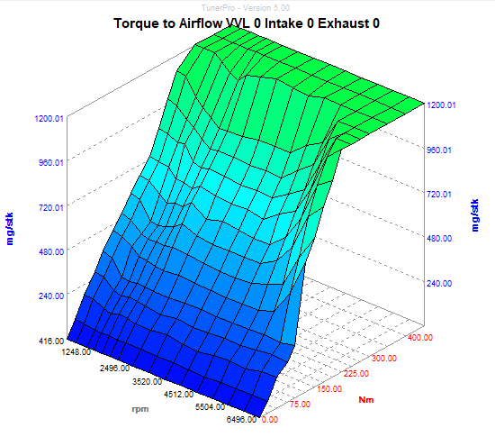

**Prefer raising torque request + building out TTA over artificially inflating airmass.** Only modify **above 400 nm** — never below (400 nm stays ~1000–1100 mg/stk).

**Spark efficiency**: TTA assumes MBT timing. Running less than MBT, the ECU needs more airmass. E.g. 500 nm @ 4000 rpm = 1404 mg/stk at MBT; at 90% spark efficiency (10° below MBT) → 1404/0.90 = 1560 mg/stk. So logged airmass won't exactly match the TTA cell — that's fine.

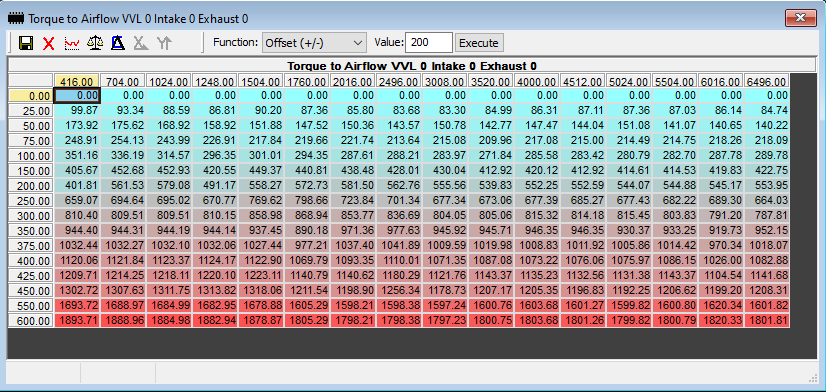

Make similar changes to all TTA tables.

### 3. Airflow → Torque (ATT)
Models how *actual* torque is reported/logged (and feeds the TCU's initial clutch clamping pressure). Also linear; build out similarly.

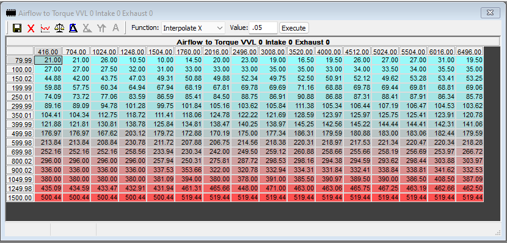

Keep TTA and ATT **consistent** — a corresponding TTA and ATT table should report similar airmass↔torque values (e.g. ~1600–1700 mg/stk ≈ 550 nm, ~1900 mg/stk ≈ 600 nm in both). **For DSG cars this matters more**: under-reporting torque to the TCU forces it to react to microslip instead of proactively clamping. Get ahead of slip, don't chase it.


## Boost control

- **Option 1 — Turbo Max Pressure Ratio table** (works, not best). X = RPM, Y = ambient temp °C. Sets a target **Pressure Ratio (PR)** = PUT / ambient pressure. `PR × ambient = PUT`.

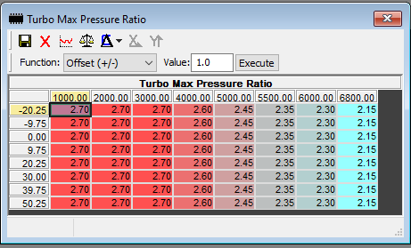

  On **LB6** the table looks a bit different:

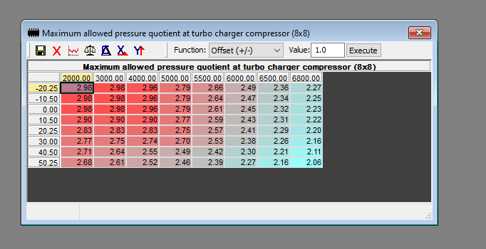

  [[Diggs]]' worked example, confirmed live in [[SimosTools]]: PR 2.72 × 98.11 kPa ambient = 267.55 kPa PUT (38.58 psi); minus 14.22 psi ambient = **24.3 psi boost** (readout shows 24.09 psi):

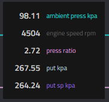

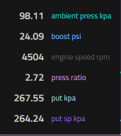

  To use this method, move the **PUT setpoint** table up/out of the way (last row ≥ highest PR target; note PUT setpoint reads in hPa = 10× PUT, so a 2.7 PR → set to ~2800):

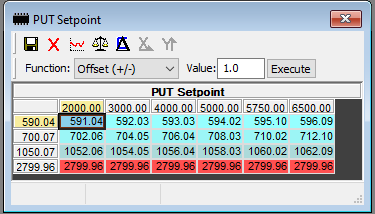

  Example healthy IS20/IS38 PR curve (last row): 1500=1.70, 2000–3000=2.70, 4000=2.60, 5000=2.45, 5500=2.35, 6000=2.30, 6800=2.15 — roughly 24 psi flat-ish then tapering:

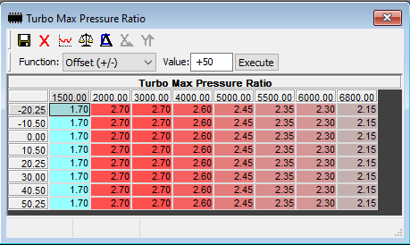

> **Starting values** *(guide example bin — verify before flashing; cross-checked)*. Target Pressure Ratio; all 8 ambient-temp rows are identical, shown once:
>
> | RPM | 1500 | 2000 | 3000 | 4000 | 5000 | 5500 | 6000 | 6800 |
> |-----|------|------|------|------|------|------|------|------|
> | PR  | 1.70 | 2.70 | 2.70 | 2.60 | 2.45 | 2.35 | 2.30 | 2.15 |

- **Option 2 — PUT setpoint table (preferred).** Set the boost curve using the last row of PUT setpoint and move the Max PR table out of the way. Set axis to max boost (e.g. 2698 hPa ≈ 24.75 psi over ambient). Modify the RPM x-axis freely for per-RPM boost.

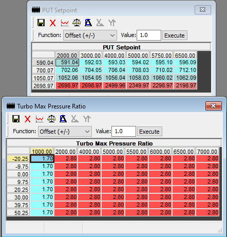

> **Starting values** *(guide example bin — verify before flashing; cross-checked)*. PUT setpoint in hPa (÷10 for kPa PUT). Only the **last row (2698.97)** shapes the boost curve; the three rows above are left near-stock. The paired Max PR table is moved out of the way for Option 2: **1.70 at the 1000 RPM column, flat 2.80 from ~2000 up** — see the editing rule under the `IP_PQ_CHA_MAX` bullet above (keep the 1.70 @ 1000 RPM cell whenever raising the plateau).
>
> | Y \ RPM     | 2000        | 3000        | 4000        | 5000        | 5750        | 6500        |
> |-------------|-------------|-------------|-------------|-------------|-------------|-------------|
> | 590.04      | 591.04      | 592.03      | 593.03      | 594.02      | 595.10      | 596.09      |
> | 700.07      | 702.06      | 704.05      | 706.04      | 708.03      | 710.02      | 712.10      |
> | 1050.07     | 1052.06     | 1054.05     | 1056.04     | 1058.03     | 1060.02     | 1062.09     |
> | **2698.97** | **2698.97** | **2698.97** | **2499.96** | **2349.97** | **2298.97** | **2198.97** |

- **Option 3 — Torque tune.** Skipped; controlling power by boost works fine. After setting the boost curve, set the relevant selector to `1`:

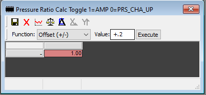

> **Symbol identified** *(2026-07-07, from the screenshot's window title "Pressure Ratio Calc Toggle 1=AMP 0=PRS_CHA_UP")*: `LC_PUT_SP_TOL_ENA_AMP` — "Use AMP for calculation of PUT out of pressure ratio (instead of PRS_CHA_UP)". Stock = 0; guide sets **1** (PUT setpoint derived from PR × ambient pressure).

## Wastegate (flow-factor tuning)
As you add boost, PUT deviates from PUT setpoint (usually overboost up top). Find where it deviates in a log:

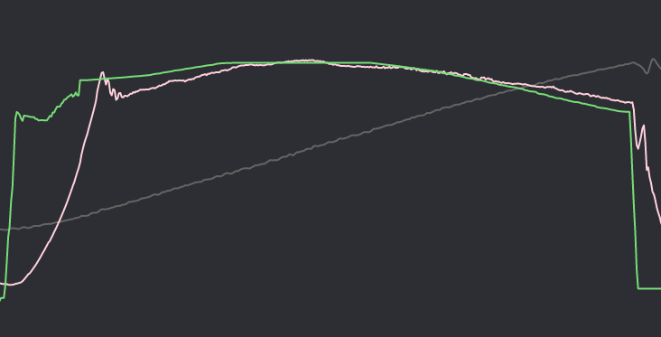


Read the **intake and exhaust flow factors** at that point in the log:

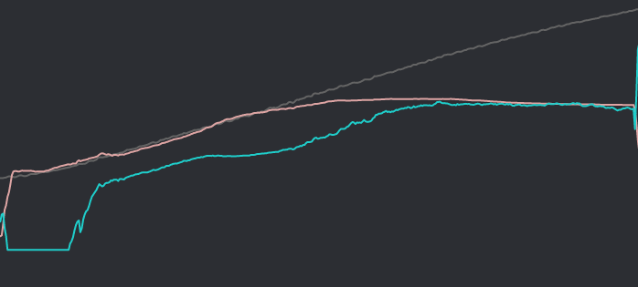

 

Two nearly-identical wastegate tables — apply changes to both. Axes: **X = Exhaust flow factor** (~0–1.25 stock), **Y = Intake flow factor** (~0–1.5); cells = wastegate position (**1 = closed, 0 = open**).

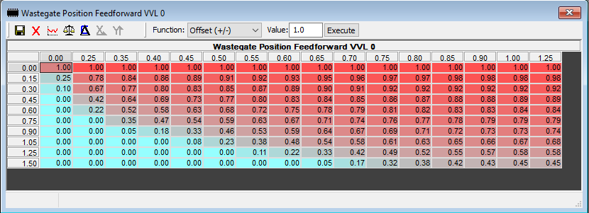

From a log, find where PUT deviates, read the exh/int flow factors there (e.g. Exh 0.75→0.98, Int 0.91→1.03), and adjust that region: overboost → lower values (open WG).

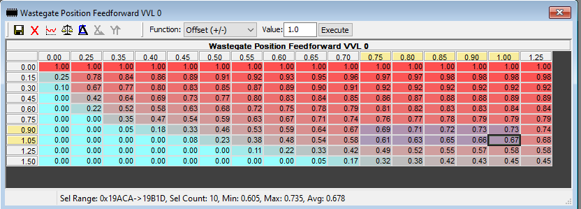

Rule of thumb **~0.05 per 1 psi off target**, smaller for smaller deltas (heavier toward the end where overboost grew):

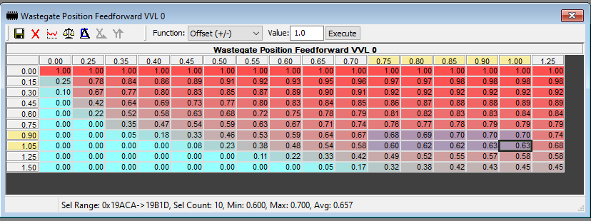

You can always modify the axis as well.  Let's say you are having a hard time dialing in boost where the Int flow fac is between 0.75 and 0.9, your adjustments seem to make it overboost and then underboost.  Also your car never even comes close to hitting Int flow fac 1.5.  In that case, you can completely get rid of that entire 1.5 row.  Move Int Flow fac 1.25 and 1.05 row data down the table, modify the axis accordingly, thus creating a new row in between 0.75 and 0.9….make it say….0.83?  Split the difference between the cells above and below then get to your fine tuning at the Exh flow fac region to dial it in. Now you have an entirely new row to adjust without making so much of an impact on 0.75 and 0.9 rows.  Fine tuning!

You can also delete an unused row (e.g. a never-reached Int flow fac 1.5 row), shift the rows down, and interpolate a new intermediate row (~0.83) for finer control.

**IS38 upgrade**: get drastic vs stock IS20 tables — and **change the X-axis to accommodate higher flow factors** (extends to ~1.80 vs stock 1.25). Non-OEM turbos → use the *not-basics* guide with **Simple Wastegate (SWG)** instead; flow-factor tuning a non-OEM turbo is maddening.

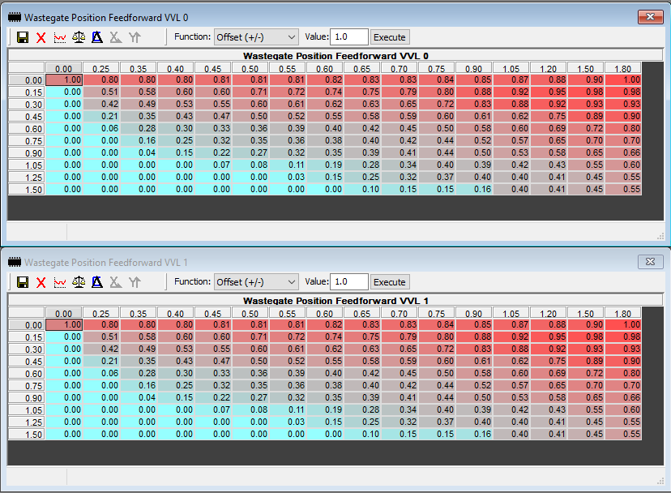

<details>
<summary><strong>Starting values</strong> — IS38 wastegate feedforward (guide example bin; verify before flashing). Cells = WG position (1 = closed, 0 = open). X = Exh flow fac, Y = Int flow fac. VVL 0 and VVL 1 are cell-for-cell identical.</summary>

| Int\Exh | 0.00 | 0.25 | 0.35 | 0.40 | 0.45 | 0.50 | 0.55 | 0.60 | 0.65 | 0.70 | 0.75 | 0.90 | 1.05 | 1.20 | 1.50 | 1.80 |
|---------|------|------|------|------|------|------|------|------|------|------|------|------|------|------|------|------|
| 0.00    | 1.00 | 0.80 | 0.80 | 0.80 | 0.81 | 0.81 | 0.81 | 0.82 | 0.83 | 0.83 | 0.84 | 0.85 | 0.87 | 0.88 | 0.90 | 1.00 |
| 0.15    | 0.00 | 0.51 | 0.58 | 0.60 | 0.60 | 0.71 | 0.72 | 0.74 | 0.75 | 0.79 | 0.80 | 0.88 | 0.92 | 0.95 | 0.98 | 0.98 |
| 0.30    | 0.00 | 0.42 | 0.49 | 0.53 | 0.55 | 0.60 | 0.61 | 0.62 | 0.63 | 0.65 | 0.72 | 0.83 | 0.88 | 0.92 | 0.93 | 0.93 |
| 0.45    | 0.00 | 0.21 | 0.35 | 0.43 | 0.47 | 0.50 | 0.52 | 0.55 | 0.58 | 0.59 | 0.60 | 0.61 | 0.62 | 0.75 | 0.89 | 0.90 |
| 0.60    | 0.00 | 0.06 | 0.28 | 0.30 | 0.33 | 0.36 | 0.39 | 0.40 | 0.42 | 0.45 | 0.50 | 0.58 | 0.60 | 0.69 | 0.72 | 0.80 |
| 0.75    | 0.00 | 0.00 | 0.16 | 0.25 | 0.32 | 0.35 | 0.36 | 0.38 | 0.40 | 0.42 | 0.44 | 0.52 | 0.57 | 0.65 | 0.70 | 0.70 |
| 0.90    | 0.00 | 0.00 | 0.04 | 0.15 | 0.22 | 0.27 | 0.32 | 0.35 | 0.39 | 0.41 | 0.44 | 0.50 | 0.53 | 0.58 | 0.65 | 0.66 |
| 1.05    | 0.00 | 0.00 | 0.00 | 0.00 | 0.07 | 0.08 | 0.11 | 0.19 | 0.28 | 0.34 | 0.40 | 0.39 | 0.42 | 0.43 | 0.55 | 0.60 |
| 1.25    | 0.00 | 0.00 | 0.00 | 0.00 | 0.00 | 0.00 | 0.03 | 0.15 | 0.25 | 0.32 | 0.37 | 0.40 | 0.40 | 0.41 | 0.45 | 0.55 |
| 1.50    | 0.00 | 0.00 | 0.00 | 0.00 | 0.00 | 0.00 | 0.00 | 0.00 | 0.10 | 0.15 | 0.15 | 0.16 | 0.40 | 0.41 | 0.45 | 0.55 |

</details>

## Timing
Three components: **Minimum** (don't touch), **MBT** (don't touch), **Base** (what you edit). Base timing has two sets of 18 tables: **Port Flap High** = low-speed/light cruise (port flap=1), **Port Flap Low** = WOT (port flap=0). Only the **9 "VVL 0" Port Flap Low** tables matter (WOT is almost instantly past VVL switchover).

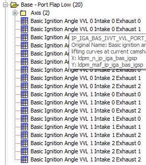

Axes: **X = RPM, Y = airmass (mg/stroke)**.

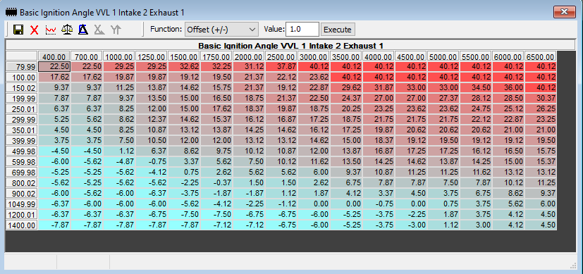

Leave airmass rows 79–699 (light cruise) alone; focus on WOT region (~800 mg/stk and up, above ~3k rpm):

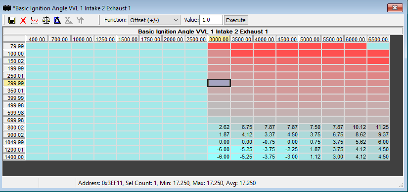

A typical DSG GTI/IS20 flooring in 3rd from 3000 rpm spools by ~3500 rpm and drops into the bottom row (~1600 mg/stk tapering to ~1200 by 6000). The operating path through the table:

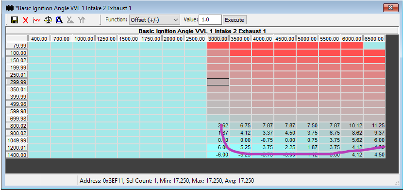

**If choosing between 1° timing and 1 psi boost, choose boost** (if the turbo can flow it). Tune boost first, then timing — not simultaneously. Consistent multi-cylinder timing corrections at a specific airmass/RPM → pull timing there (and ease surrounding cells ~half as much). Suggested safe starting curve (thanks [[Exley]]): negative timing in the high-airmass rows until ~4500 rpm, meandering up to ~+3–5° up top:

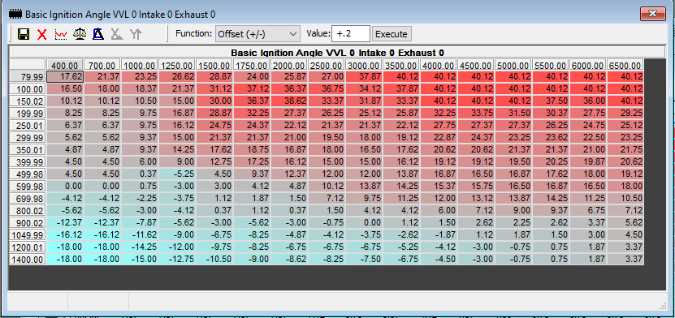

<details>
<summary><strong>Starting values</strong> — Basic Ignition Angle VVL 0 Intake 0 Exhaust 0 (guide example bin; verify before flashing). X = RPM, Y = airmass mg/stk, cells = degrees. WOT lives in the high-airmass rows (~800+).</summary>

| mg\RPM  | 400    | 700    | 1000   | 1250   | 1500   | 1750  | 2000  | 2500  | 3000  | 3500  | 4000  | 4500  | 5000  | 5500  | 6000  | 6500  |
|---------|--------|--------|--------|--------|--------|-------|-------|-------|-------|-------|-------|-------|-------|-------|-------|-------|
| 79.99   | 17.62  | 21.37  | 23.25  | 26.62  | 28.87  | 24.00 | 25.87 | 27.00 | 37.87 | 40.12 | 40.12 | 40.12 | 40.12 | 40.12 | 40.12 | 40.12 |
| 100.00  | 16.50  | 18.00  | 18.37  | 21.37  | 31.12  | 37.12 | 36.37 | 36.75 | 34.12 | 37.87 | 40.12 | 40.12 | 40.12 | 40.12 | 40.12 | 40.12 |
| 150.02  | 10.12  | 10.12  | 10.50  | 15.00  | 30.00  | 36.37 | 38.62 | 33.37 | 31.87 | 33.37 | 40.12 | 40.12 | 40.12 | 37.50 | 36.00 | 40.12 |
| 199.99  | 8.25   | 8.25   | 9.75   | 16.87  | 28.87  | 32.25 | 27.37 | 26.25 | 25.12 | 25.87 | 32.25 | 33.75 | 31.50 | 30.37 | 27.75 | 29.25 |
| 250.01  | 6.37   | 6.37   | 9.75   | 16.12  | 24.75  | 24.37 | 22.12 | 21.37 | 21.37 | 22.12 | 27.75 | 27.37 | 27.37 | 26.25 | 24.75 | 25.12 |
| 299.99  | 5.62   | 5.62   | 9.37   | 15.00  | 21.37  | 21.37 | 21.00 | 19.50 | 18.00 | 19.12 | 22.87 | 24.37 | 23.25 | 23.62 | 22.50 | 23.25 |
| 350.01  | 4.87   | 4.87   | 9.37   | 14.25  | 17.62  | 18.75 | 16.87 | 18.00 | 16.50 | 17.62 | 20.62 | 20.62 | 21.37 | 21.37 | 21.00 | 21.75 |
| 399.99  | 4.50   | 4.50   | 6.00   | 9.00   | 12.75  | 17.25 | 16.12 | 15.00 | 15.00 | 16.12 | 19.12 | 19.12 | 19.50 | 20.25 | 19.87 | 20.62 |
| 498.99  | 4.50   | 4.50   | 0.37   | -5.25  | 4.50   | 9.37  | 12.37 | 12.00 | 12.00 | 13.87 | 16.87 | 16.50 | 16.87 | 17.62 | 18.00 | 19.12 |
| 599.98  | 0.00   | 0.00   | 0.75   | -3.00  | 3.00   | 4.12  | 4.87  | 10.12 | 13.87 | 14.25 | 15.37 | 15.75 | 16.50 | 16.87 | 16.50 | 18.00 |
| 699.98  | -4.12  | -4.12  | -2.25  | -3.75  | 1.12   | 1.87  | 1.50  | 7.12  | 9.75  | 11.25 | 12.00 | 13.12 | 13.87 | 14.25 | 11.25 | 10.50 |
| 800.02  | -5.62  | -5.62  | -3.00  | -4.12  | 0.37   | 1.12  | 0.37  | 1.50  | 4.12  | 4.12  | 6.00  | 7.12  | 9.00  | 9.37  | 6.75  | 7.12  |
| 900.02  | -12.37 | -12.37 | -7.87  | -5.62  | -3.00  | -5.62 | -3.00 | -0.75 | 0.00  | 1.12  | 1.50  | 2.62  | 2.25  | 2.62  | 3.37  | 5.62  |
| 1049.97 | -16.12 | -16.12 | -11.62 | -9.00  | -6.75  | -8.25 | -4.87 | -4.12 | -3.75 | -2.62 | -1.87 | 1.12  | 1.87  | 1.50  | 3.00  | 4.50  |
| 1200.01 | -18.00 | -18.00 | -14.25 | -12.00 | -9.75  | -8.25 | -6.75 | -6.75 | -6.75 | -5.25 | -4.12 | -3.00 | -0.75 | 0.75  | 1.87  | 3.37  |
| 1400.00 | -18.00 | -18.00 | -15.00 | -12.75 | -10.50 | -9.00 | -8.62 | -8.25 | -7.50 | -6.75 | -4.50 | -3.00 | -0.75 | 0.75  | 1.87  | 3.37  |

</details>

**Spark IAT correction**: stock table pulls timing above 30°C/86°F and adds timing when very cold. Author's preference: don't add timing at low temp (winter-blend fuel knocks more), and don't pull until 40°C (you have an aftermarket IC).

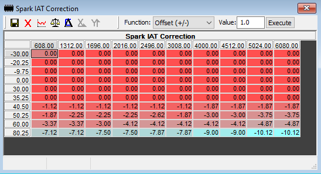

> **Starting values** *(author's table, transcribed from the screenshot above; double-entry verified 2026-07-07 — two independent reads plus a pixel-zoom check on the one disputed cell)*. Symbol `IP_IGA_BAS_TEMP_N_32` (confirmed: stock X axis matches exactly; stock 80.25 row already identical). X = RPM, Y = IAT °C, cells = °CRK offset. **Note the author also re-breakpointed the Y axis** (35.25 added, 70.5 dropped vs stock -30/-20.25/-9.75/0/30/40.5/50.25/60/70.5/80.25).
>
> | °C \ RPM | 608   | 1312  | 1696  | 2016  | 2496  | 3008  | 4000  | 4512  | 5024   | 6080   |
> |----------|-------|-------|-------|-------|-------|-------|-------|-------|--------|--------|
> | -30.00   | 0.00  | 0.00  | 0.00  | 0.00  | 0.00  | 0.00  | 0.00  | 0.00  | 0.00   | 0.00   |
> | -20.25   | 0.00  | 0.00  | 0.00  | 0.00  | 0.00  | 0.00  | 0.00  | 0.00  | 0.00   | 0.00   |
> | -9.75    | 0.00  | 0.00  | 0.00  | 0.00  | 0.00  | 0.00  | 0.00  | 0.00  | 0.00   | 0.00   |
> | 0.00     | 0.00  | 0.00  | 0.00  | 0.00  | 0.00  | 0.00  | 0.00  | 0.00  | 0.00   | 0.00   |
> | 30.00    | 0.00  | 0.00  | 0.00  | 0.00  | 0.00  | 0.00  | 0.00  | 0.00  | 0.00   | 0.00   |
> | 35.25    | 0.00  | 0.00  | 0.00  | 0.00  | 0.00  | 0.00  | 0.00  | 0.00  | 0.00   | 0.00   |
> | 40.50    | -1.12 | -1.12 | -1.12 | -1.12 | -1.12 | -1.12 | -1.87 | -1.87 | -1.87  | -1.87  |
> | 50.25    | -1.87 | -2.25 | -2.25 | -2.25 | -2.62 | -1.87 | -3.00 | -3.00 | -3.75  | -3.75  |
> | 60.00    | -3.37 | -3.37 | -3.00 | -4.12 | -4.12 | -4.12 | -4.12 | -4.12 | -4.87  | -4.87  |
> | 80.25    | -7.12 | -7.12 | -7.50 | -7.50 | -7.87 | -7.87 | -9.00 | -9.00 | -10.12 | -10.12 |

**Knock tables**: don't touch (basics). **Camshaft timing**: don't touch on stock turbo — no hidden power.

## Fueling (Lambda)
Stock LPFP/HPFP: don't touch. Fatten the mixture (fuel cools cylinders, prevents heat-related knock on pump gas). Reduce three fueling-influence tables to **0.80**:

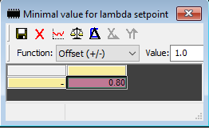

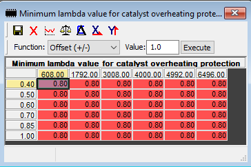

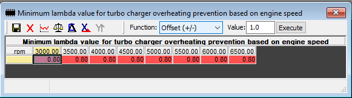

> **Symbol identification ([[SimosTools]], 2026-07-07).** These three "fueling-influence" tables are lambda **minimum-value floors** — read straight off the screenshot titles and matched to `SC8S50.ALL.xdf`:
>
> | Symbol                 | Description                                                                      | Shape | Stock (5G0906259L_0002) |
> |------------------------|----------------------------------------------------------------------------------|-------|-------------------------|
> | `C_LAMB_BAS_COR_MIN`   | Minimal value for lambda setpoint                                                | 1×1   | 0.72                    |
> | `IP_LAMB_COP_MIN`      | Minimum lambda value for catalyst overheating protection                         | 6×6   | 0.75                    |
> | `IP_LAMB_TUR_OHP_MIN`  | Minimum lambda value for turbo charger overheating prevention (vs engine speed)  | 1×8   | 0.75                    |
>
> **⚠ On this bin, "reduce to 0.80" is the LEAN direction — do not blind-fill.** The guide's "reduce" assumes stock is *above* 0.80, but 5G0906259L_0002 ships these floors at **0.72–0.75**, already *richer* than 0.80. Writing 0.80 would *raise* the floors, permitting a leaner mixture during cat/turbo-overheat protection — under the raised boost/airmass ceilings. Applying the literal 0.80 vs. keeping the richer stock floors is a tuner decision, not a flat-fill. **Decision (2026-07-07): left at stock.** The stock 0.72–0.75 floors are already richer than the guide's 0.80, so on 5G0906259L_0002 we keep them and write nothing here. (Same "wrong on this specific bin" trap as the airmass ceiling above.)

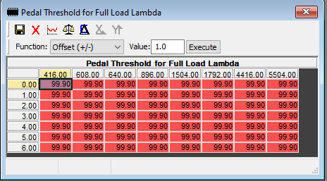

> **Symbol identification ([[SimosTools]], 2026-07-07).** This is `ID_PV_AV_FL` — Pedal value threshold for the determination of LV_FL_RAW (screenshot title "Pedal Threshold for Full Load Lambda"; FL = full load). Shape 7×8, stock all **99.9%**, both matching the screenshot exactly. Written flat to ~72% (enter full-load lambda enrichment at 72% pedal instead of 99.9%). Resolved and applied in [[TUNE_Basics_Guide_R01]].

Two tables must be **entirely 1**:

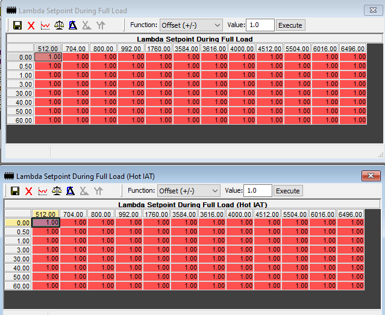

> **Symbol identification ([[SimosTools]], 2026-07-07).** The two "entirely 1" tables are the full-load lambda enrichment maps (X = RPM / N_32, Y = full-load timer T_FL), matched to `SC8S50.ALL.xdf` by axes and shape:
>
> | Symbol               | Description                                                         | Shape | Stock    |
> |----------------------|---------------------------------------------------------------------|-------|----------|
> | `IP_LAMB_FL_SP`      | Lambda Full Load Enrichment depending on N_32 and time T_FL          | 8×12  | all 1.0  |
> | `IP_LAMB_FL_SP_TIA`  | Lambda Full Load Enrichment map (intake-air-temperature dependent)   | 8×12  | all 1.0  |
>
> **On this bin these are already all 1.0, so "set entirely to 1" is a no-op** — nothing to write on 5G0906259L_0002. (Screenshot titles read "Lambda Setpoint During Full Load / (Hot IAT)"; our XDF names them "Lambda Full Load Enrichment…" — same tables by axes, shape, and all-1.0 stock content. If confirming in [[TunerPro]], check addr `0xC344`.)

The last two tables are the **lambda curves** (X = RPM, Y = airmass) — make both identical; lean-ish (~1.00) during spool, fat (~0.80) at full load. Modify both axes.

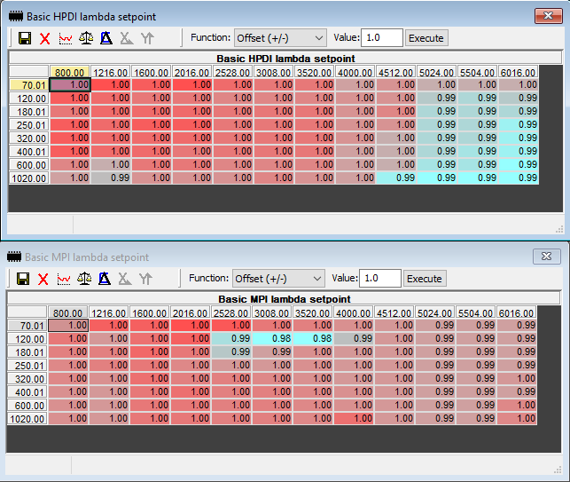

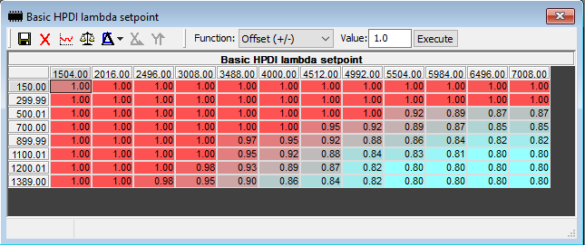

> **Starting values** *(guide example bin — verify before flashing; cross-checked)*. Basic HPDI lambda setpoint. X = RPM, Y = airmass mg/stk. ~1.00 (leaner) during spool → down to 0.80 (richer) at high airmass/full load:
>
> | mg\RPM  | 1504 | 2016 | 2496 | 3008 | 3488 | 4000 | 4512 | 4992 | 5504 | 5984 | 6496 | 7008 |
> |---------|------|------|------|------|------|------|------|------|------|------|------|------|
> | 150.00  | 1.00 | 1.00 | 1.00 | 1.00 | 1.00 | 1.00 | 1.00 | 1.00 | 1.00 | 1.00 | 1.00 | 1.00 |
> | 299.99  | 1.00 | 1.00 | 1.00 | 1.00 | 1.00 | 1.00 | 1.00 | 1.00 | 1.00 | 1.00 | 1.00 | 1.00 |
> | 500.01  | 1.00 | 1.00 | 1.00 | 1.00 | 1.00 | 1.00 | 1.00 | 1.00 | 0.92 | 0.89 | 0.87 | 0.87 |
> | 700.00  | 1.00 | 1.00 | 1.00 | 1.00 | 1.00 | 1.00 | 0.95 | 0.92 | 0.89 | 0.87 | 0.85 | 0.85 |
> | 899.99  | 1.00 | 1.00 | 1.00 | 1.00 | 0.97 | 0.95 | 0.92 | 0.88 | 0.86 | 0.84 | 0.82 | 0.82 |
> | 1100.01 | 1.00 | 1.00 | 1.00 | 1.00 | 0.95 | 0.92 | 0.88 | 0.84 | 0.83 | 0.81 | 0.80 | 0.80 |
> | 1200.01 | 1.00 | 1.00 | 1.00 | 0.98 | 0.93 | 0.89 | 0.87 | 0.82 | 0.80 | 0.80 | 0.80 | 0.80 |
> | 1389.00 | 1.00 | 1.00 | 0.98 | 0.95 | 0.90 | 0.86 | 0.84 | 0.82 | 0.80 | 0.80 | 0.80 | 0.80 |

Make the **MPI** table the same.

**Ethanol, no sensor**: Flex Fuel folder → set enable to `1`, set ethanol % (author runs ~E60):

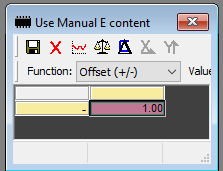

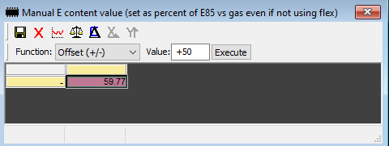

**Ethanol sensor**: set the relevant Flex Fuel tables to `0`, and one table to **196** (usually default). View content in [[SimosTools]].

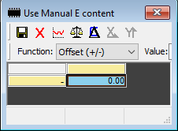

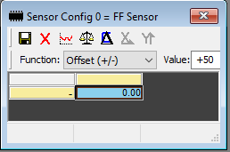

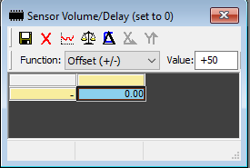

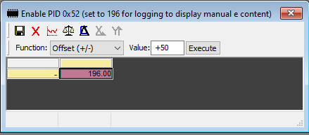

**MAP/PUT sensor scaling**: stock = 3 bar sensors; only change scaling (and axis voltage) if you swapped a sensor.


## Cooling
The "we lowered oil temps!" trick = lower the **cylinder head temp setpoint**. Cut 5 out of everything over 90.

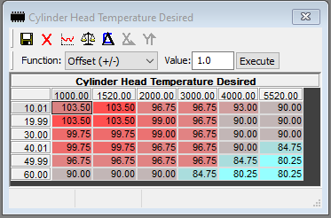

## Limiters (move out of the way)
- **Torque Limit Source** (loggable via 3E memory) bitmask: 16384=EGT too high, 8192=boost actuator error, 2048=charger speed too high (permanent), 1024=FARM error, 512=IAT too high, 256=temp high charger speed, 128=max pressure-ratio table, 64=max absolute charge pressure setpoint, 32=temp high IAT (modeled compressor outlet temp), 0=none (driver demand).
- **Compressor temp maps** → 300 (compressor-outlet air-temp torque-management pair; set both). Stock decodes to ≈185/175 °C on `5G0906259L_0002`:
  - `C_TIA_THR_TCHA_MAX`  — Constant to define the maximum air temperature (guide screenshot: "Compressor Outlet Temp for Maximum Torque Management")
  - `C_TIA_THR_TCHA_MAX_SP`  — Maximum air temperature setpoint that could be controlled using the torque setpoint reduction (guide: "…to Start Torque Management")

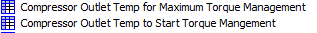

- **Turbo shaft speed limiter** → 220k (both). Turbo-speed torque-management pair; stock decodes to ≈189k/179k rpm:
  - `C_N_TCHA_MAX`  — Maximum turbo charger speed (guide: "Turbocharger Speed for Maximum Torque Management")
  - `C_N_TCHA_MAX_SP`  — Maximum turbo charger speed setpoint for turbo charger protection (guide: "…to Start Torque Management")

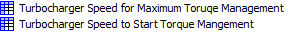

- **Overboost limit** (P0234 past ~26 psi) → 2700 — `IP_PUT_AMP_DIF_MAX_PRS_DIF_THR` — Overpressure upstream throttle threshold for Turbocharger overpressure diagnosis (1×6 hPa, stock ≈1800; **XDF declared max = 2716.96 hPa, so 2700 is right at the ceiling**). **⚠ Never exceed the upper limit — saving over it permanently breaks the table (TunerPro bug); lowering back doesn't fix it.** If already >2700, don't touch. **⚠ Do not confuse with `C_PRS_IM_SP_LIM`** ("Offset to the pressure behind air cleaner for the limitation of the manifold setpoint", a float32 manifold-setpoint limit, stock ≈272k hPa) — that is a sibling of `C_PRS_IM_SP_MAX` (max requested pressure), **not** the overboost table; setting it to 2700 would be a large, wrong *lowering*.


- **Max reference indicated engine torque** — move out of the way (→ 1000) — `IP_TQI_REF_MAX_MON` — Maximum reference indicated engine torque (1×7 Nm, stock ≈535–570).


- **Charge air pressure too high** → 3000 across — `IP_PUT_MAX_CAP_H_DIAG` — Maximum charge air pressure quotient for charge air pressure too high (CAP_H) diagnosis (6×6 hPa).


- **Float-bug items** (save + reopen to verify): **max requested pressure** → 350000; **max allowed airmass** → 2000 mg/stk (enter as `0.002` — this is a real unit scale, see note (2) below); two **max intake air** tables → 2000 across.

> **⚠ Two different things get lumped under "float bug" — keep them apart.**
>
> **(1) A [[TunerPro]] editor artifact** — for **max requested pressure** (`C_PRS_IM_SP_MAX` — Maximum allowed PRS_IM_SP) and the two **max intake air** tables (`IP_M_AIR_CYL_MAX_STND_VVL` — Maximum intake air). These are 32-bit floats; TunerPro mis-displays and can corrupt-on-save-over-limit *while editing in TunerPro*. It is **not** something the ECU does, and it is not specific to Simos. Tools that write the raw float bytes directly (e.g. the [[SimosTools]] Python library) are **not** subject to it — just write the intended physical value (350000, 2000) and verify by re-reading.
>
> **(2) A genuine unit-scale mismatch** — for **max allowed airmass** (`C_M_AIR_CYL_SP_MAX` — Maximum allowed M_AIR_CYL_SP). This one is **not** a display bug. The ECU stores it in **kg/stk**, but the XDF (both `SC8S50.V1.0.xdf` and `SC8S50.ALL.xdf`) mislabels it as identity-scaled `mg/stk` (equation `X`, max 20000, addr `0x9BD4`). So the raw stored value for a **2000 mg/stk** ceiling is **`0.002` kg/stk** — and that is the value *every* tool must write, direct-byte library included. Stock decodes to `0.001389` (= 1389 mg/stk), which sits just above the stock intake-air max (~1275 mg/stk) — exactly where a real airmass-request ceiling belongs. **Do NOT "write the physical 2000" here:** 2000 raw would be 2000 kg/stk = 2,000,000 mg/stk (~1.44M× stock), effectively removing the limiter. The "type `0.002`" instruction is not a TunerPro workaround — it is literally "2000 mg/stk expressed in kg/stk." Verify by re-reading: the saved bin should decode `0.002`, not `2000`.


- Misc "out of the way" tables → 1000 (65/66 and 67) and 800 (69):
  - `IP_TQI_POW_MAX_BAS`  — Maximum allowed indicated torque at full load for torque limitation (20×7 Nm → 1000)
  - `IP_TQI_REF_N_M_AIR______`  — Indicated engine torque at reference conditions (16×12 Nm → 1000)
  - `IP_TQI_TEG_MAX_TUR_MIN`  — Minimum torque limitation for turbo charger overheating prevention (1×8 Nm → 800)


  **Process-monitoring** lookalike: leave stock — `IP_TQI_REF_SEL_MON[1]` — indicated engine torque at reference conditions (process monitoring)(engine configuration selective). Do NOT adjust; it looks like `IP_TQI_REF_N_M_AIR______` above but is the monitoring copy.


- **V30 (18.2 arch)**: move all 10 tables up (1000). **⚠ These "Maximum allowed indicated torque for torque limitation" Tran0–4 / Bas0–4 tables are not present in `SC8S50.V1.0.xdf`** — they belong to the 18.2 architecture. On this 18.1 bin only the single base `IP_TQI_POW_MAX_BAS` (above) exists, so this step is N/A here; it applies if you're on an 18.2 bin with the matching XDF.


  **LB6**: move that table up (600) — `Eng_tqMaxClu_T_VW` — maximum torque at clutch (1×8 Nm fallback map; **not** the per-gear `IP_TQ_POW_MAX_*` clutch tables).


- **Speed limiter**: Limiter → Speed → four "overall maximal velocity" tables (200 kph stock) → set all four the same (author: 257.49 kph ≈ 160 mph).


## DSG "sharts" (fart on shift)
ECU cuts timing at shift to create the noise. **Min Spark Added During Gearshift** works with Minimum Timing to reduce torque during shift — controls loudness/when. Lower timing = louder fart; make 200–300 mg/stk zeros negative for always-fart at light throttle (don't overdo it — save the cat).


**Torque Ratio During Fuel Cut for Gearshift**: row 4 references cylinder count via the "SCC Pattern depending on SCC efficiency" table (on 259L, 0.55 = 1 cylinder cut).


For the violent DSG fart: Spark Adder **−18 to −30**, cut **1 cylinder** (try 1–3). Watch boost during shift — these tables can make it spike or cut too much power.


## Pops & bangs (impulse combustion)
Author's verdict: sounds like ass — don't. But if you must, in the impulse-combustion parameters: enable switch → 1; drive-mode bitmask → 63 (all modes); clutch-states map → 1 across; gearshift config bitmask → 2; TQ-difference threshold → 5 (burble on downshift) or 15 (off); enable outside fuel-cutoff → 1; max time in impulse combustion → 2–6; per-gear/mode time maps (8 total); time after gear shift → ~2; **Spark During Impulse** (4 maps, flap-dependent) → start ~−18, don't exceed ~−22 on stock cat (−35 to run a catted downpipe catless). Move oil/coolant limiters to ~60–70°; move muffler/cat temp limiters out (Min 0, Max 2000); cat-temp duration factor → 1; hot-cat delay → 0; max torque for impulse combustion → 250; torque-intervention enables → 1; fuel shut-off pattern index → 0 (try 1/2 for different sounds). *(This section is all parameter text in the source — no table screenshots.)*

Related: [[tuning-getting-started]], [[simostools-app-guide]]
