# ECU Tuning — Not the Basics (hybrid turbo, fueling, and MPI)

Advanced follow-on to [[ecu-tuning-basics]] for [[Simos 18.1]]/18.6 calibration in [[TunerPro]]. The source assumes a hybrid or larger turbo and may also assume upgraded sensors, LPFP, HPFP, and MPI. It covers the extra calibration work those changes can require.

> [!danger] Source reference, not a ready-to-flash recipe
> This note preserves the guide’s claims and examples; it does not adopt them as recommendations for this car. Several subjects here are safety-critical or intentionally aggressive: removing torque/protection intervention, reducing knock correction, changing knock-sensor gain, widening the injection window, rescaling sensors, and recalibrating fuel hardware. Resolve every calibration against the exact XDF and bin, validate units and axes, make minimal changes, and require logged evidence. Programmatic work must never flash the ECU; patch installation and the final flash/review gate remain human-only.

> [!warning] Parameter identity
> The source often names tables only through screenshot titles and does not provide A2L symbols. Where a symbol is not stated or corroborated, its parameter ID is **not identified in the source**; do not select a table by fuzzy title. Known families carried forward from [[ecu-tuning-basics]] include `IP_TQ_POW_MAX_AT[POW_1..5][0..2]` — Maximum torque at clutch AT, `IP_MAF_STK_SP_VVL_CAM_*` — Torque to airflow, `IP_TQI_REF_N_M_AIR_VVL_CAM_*` — Airflow to torque, `IP_PUT_SP` — Pressure up throttle setpoint, and `IP_PQ_CHA_MAX` — Maximum allowed pressure quotient at turbo charger compressor. SWG and map-switching/BBG tables are patch-added and have no A2L IDs; refer to them by their exact XDF titles.

## What this guide adds

- Extends the torque↔airflow model to roughly 650 Nm / 2200 mg/stk for a hybrid-turbo setup, while stressing that TTA and ATT must remain mutually consistent.
- Recommends starting with a modest flat boost target, then moving from stock flow-factor wastegate control to patch-added Simple Wastegate and dialing it from logs.
- Adds map-switching boost-by-gear, with the base `IP_PUT_SP` — Pressure up throttle setpoint and `IP_PQ_CHA_MAX` — Maximum allowed pressure quotient at turbo charger compressor moved high enough not to bind the per-gear curves.
- Discusses base timing, knock correction/recovery, knock-sensor noise and gain, and the risk of sensor saturation.
- Covers MAP/PUT sensor scaling, injection-window changes, LPFP and HPFP characterization, ethanol cold starts, MPI enablement and DI/MPI split, injector data, and closed-loop fuel trimming.
- Uses repeated logging as the feedback loop: boost target versus actual, wastegate response, knock channels, sensor thresholds, LPFP/HPFP tracking, injector pulse widths, lambda, and combined fuel trim.

## Project-specific guardrails

- Preserve `Code/bin/5G0906259L__0002.bin` as the untouched recovery image.
- `C_M_AIR_CYL_SP_MAX` — Maximum allowed airmass setpoint stores kg/stk despite the XDF’s mg/stk label: 2000 mg/stk is written as `0.002`, never `2000`.
- `IP_PUT_AMP_DIF_MAX_PRS_DIF_THR` — Overboost pressure-difference threshold is the project’s P0234 routing calibration; do not confuse it with manifold-pressure ceilings or the source’s charge-air-pressure-high example.
- Do not weaken knock detection or correction merely to make a log look clean. Treat any gain change as cylinder-specific instrumentation calibration supported by repeatable noise/threshold evidence.
- A BinToolz code patch requires a human-reviewed FULL flash. A CAL flash cannot install code patches.
- The current tune lineage and logged limits in `Tunes/REV_LOG.md` and the latest `Logs/*/log_review.md` take precedence over generic example values in this guide.

## Source walkthrough

The wording below is a lightly normalized transcription of the source. Screenshots are extracted from the DOCX and retained in source order; repeated figures reuse the same media file.

So, you got that fancy new hybrid going in along with all the other goodies, (MPI, LPFP, sensors, yadda yadda). Hopefully you’ve already been tuning your car using TunerPro and understand everything that was covered in the Basics guide, yes? Good, put on your big boy pants and let’s get started.

## Torque model

For SC8S50, the relevant families are `IP_TQ_POW_MAX_AT[POW_1..5][0..2]` — Maximum torque at clutch AT and `IP_TQ_POW_MAX_MT[POW_1..5][0..1]` — Maximum torque at clutch MT. This DSG car uses the AT family in the current XDF.

We don’t want this to intervene at all. Move all the tables out of the way. We control power with boost and timing, there will be no torque intervention. Find the relevant transmission for your car (AT or MT) tables and move them up, 650 should be plenty.

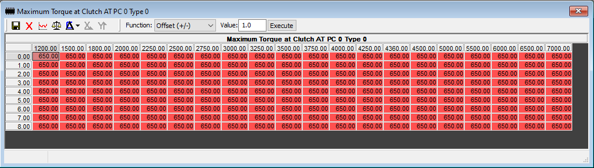

### Linear pedal maps

The normal-drive pair for this DSG car is `IP_FAC_TQ_REQ_DRIV_H_VS_DCT` — Driver interpretation map for high vehicle speed (DCT) and `IP_FAC_TQ_REQ_DRIV_L_VS_DCT` — Driver interpretation map for low vehicle speed (DCT).

Since we are running a flat torque request let’s go ahead and make our pedal tables linear. Grab the two appropriate tables for your transmission type. Do both low and high speed.

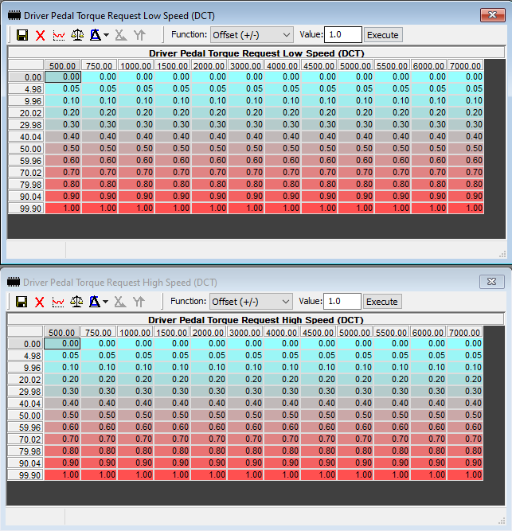

### Torque to airflow (TTA)

The SC8S50 table families are `IP_MAF_STK_SP_VVL_CAM_L[*][i][j]` — Torque to airflow, low port flap and `IP_MAF_STK_SP_VVL_CAM_H[*][i][j]` — Torque to airflow, high port flap.

Our max torque is now 650. You want the last row to be a bit above that, like 600 to 620. Airmass at 600 should probably be close to 2,000. If you updated your tables using the Basic guide it might look something similar to this:

That’s 99% of the way there. Increase the last row (600nm) to 650nm and about 2,200 across the row. Done. Make same change to all TTA tables.

### Airflow to torque (ATT)

The inverse SC8S50 families are `IP_TQI_REF_N_M_AIR_VVL_CAM_L[*][i][j]` — Airflow to torque, low port flap and `IP_TQI_REF_N_M_AIR_VVL_CAM_H[*][i][j]` — Airflow to torque, high port flap.

I’ll just leave this here again so it sinks in.

***Between the TTA and ATT tables, it’s important to keep a consistent and relatively accurate or realistic airflow – torque model. For a DSG car, it’s even more important to send the TCU reasonable information so it’s able to proactively set appropriate clutch clamping pressure. You often see tunes that under-report torque to the TCU and then the TCU is relying on its real-time microslip detection functionality to instead increase clamping pressure so it doesn’t slip or to catch a slip. It’s much better to get ahead of the issue than trying to bring back a clutch that’s already slipping.***

This is even more important now, especially if you are running E85 and gobs of timing pushing north of 420ftlbs in the 4k RPM range. DSGs are expensive, let’s not ruin your clutchpacks. Grab one of your port flap low tables:

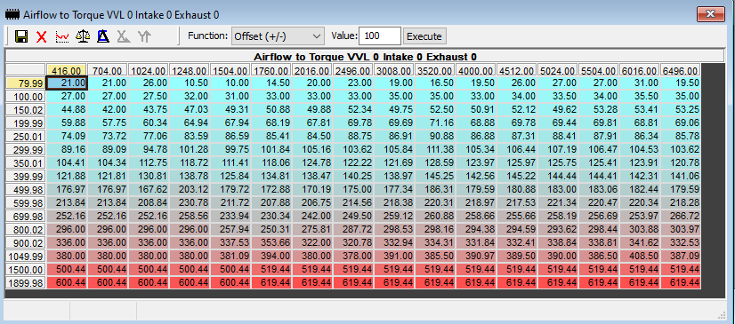

Change the last row to 2200mg/stk on the axis. Make the entire row 700nm all the way across. Make same change to all ATT tables.

## Boost for hybrid turbos

Set boost with `IP_PUT_SP` — Pressure up throttle setpoint. I can’t tell you how much boost your turbo can make before shitting it’s turbine into your downpipe. If you just swapped on the turbo I’d suggest keeping it low to start, like 24–26 psi flat and making sure it runs properly before adding boost. This is probably a decent starting point:

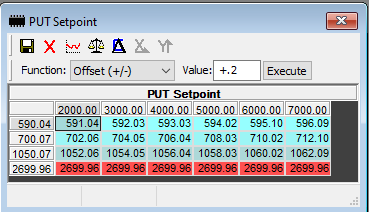

Move `IP_PQ_CHA_MAX` — Maximum allowed pressure quotient at turbo charger compressor out of the way. The source suggests 3.5 while tuning.

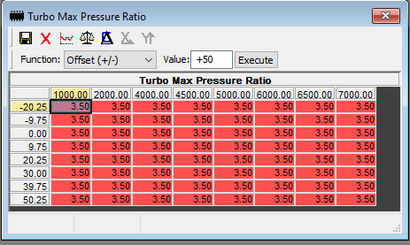

Your log should have Pressure Ratio data so I would probably cap it at like 0.2 above where you typically run your tune at your ambient pressure after you have finalized your boost curve. As an example let’s say this ends up being your final boost curve:

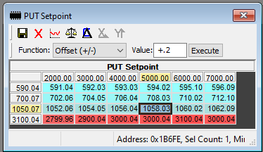

Your Max PR table should look something like this:

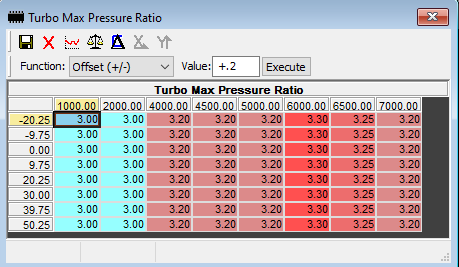

### Simple Wastegate (SWG)

Flow Factor wastegate tuning is fine for stock turbos but for hybrids and other aftermarket turbos it sucks. Time to go to Simple Wastegate (SWG). SWG can be added using BinToolz. Please see BinToolz guide on how to patch your bin for SWG.

Step 1: *Start slow!* You did read above where I said to keep boost reasonable, right? You need to dial in your wastegate properly so it will actually hit your boost target without overboosting or underboosting massively.

Step 2: Apply the patch to enable SWG using Bintoolz. Good idea to also use the Check feature to ensure the patch was applied.

Step 3: Download appropriate XDF that contains SWG tables. Going forward you will only be modifying the two SWG tables. The original flow-factor tables will no longer be used, do not modify them.

Step 4: Adjust PUT SP (Y-axis) and RPM (X-axis) to your liking. If you plan on using flat boost then setting RPM won’t matter much but if you want to taper up or down at a specific RPM then make changes to the RPM axis accordingly. Set a nice spread along the PUT SP axis going from 1000hpa up to a bit above your max boost you plan to run.

Step 5: Adjust the cells. Every turbo is different. Every setup is different. If it were me I’d probably not make any cell over 0.7 out past 4000rpm to start. This isn’t a bad starting point:

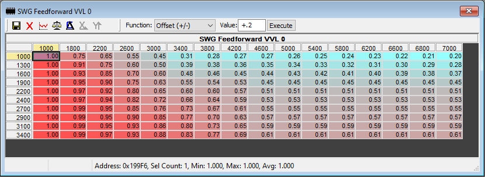

Using original starting boost example:

Go out for a spin and go WOT from 2500rpm. How does WG look? Did it underboost or overboost (compare PUT vs PUT SP in your log)? Adjust 2700 row on your SWG tables accordingly where it is underboosting and overboosting. Increase values to tighten WG to increase boost or lower to loosen WG to reduce boost. Example:

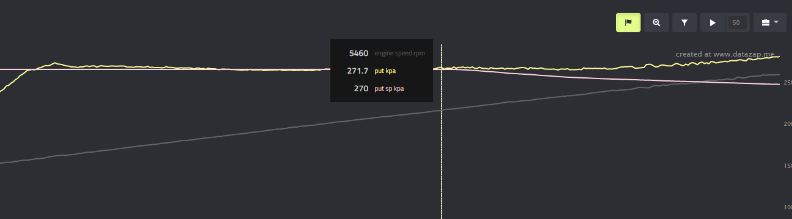

Looks good (perfect!) up to 5500. But after that it is overboosting. Not looking so great at 6500. WG needs loosening, more as rpms rise.

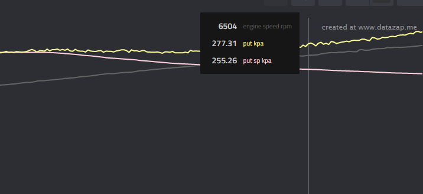

From our example above we need to work on the 2700 row:

Recall everything was set at 0.55 from 5400 up. I would lower everything above that by 0.03 increments along the 2700 row:

5800 to 0.52

6000 to 0.49

6200 to 0.46

6600 to 0.43

6800 to 0.40

7000 to 0.37

Remember, you can always change the axis. Having a hard time getting boost to stay on target between 6200 and 6600? Need more control at 6400? Change 6600 to 6400 on the axis. Change 6800 to 6600 and keep 7000 as is.

Eventually 2700 will get dialed in. When you are happy with it increase boost on your PUT SP table to next row corresponding to your SWG table (in this case 2900). More logging; lather, rinse, repeat. Easy peasy.

### Boost by gear (BBG)

So, we’ve moved torque out of the way. Tune is rocking, got the boost curve all sorted but it sure would be nice to be able to run less boost in lower gears (FWD problems, yeah?). BBG can sort that out. If you are controlling boost using the Max PR table you must abandon it now. You cannot use BBG and control boost using that table.

If you recall the original boost curve we settled on :

We need to recreate this under Map1.

Pull up your Mapswitching folder in your XDF.. Under the Map1 folder you will find a table for PUT Setpoint. The x-axis is RPM and the Y-axis is gear. Set Gear 0 to minimal boost, 1400 is fine. Set the rest of the gears however you would like. If the tires blow off then lower boost. Pretty straight forward. I run less boost in my GTI in 1st and 2nd. 3rd gear and up are running our finalized boost curve:

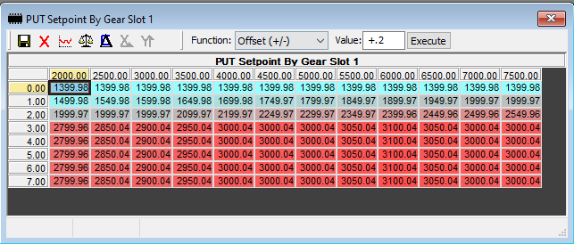

Go ahead and set your remaining maps 2-5 as you see fit.

To use effectively use BBG we need to move PUT setpoint above the max boost you plan to run. Using our previous example all we need to do is move the PUT setpoint table up to match the Max PR table. Now neither will interfere and boost is now controlled entirely by BBG:

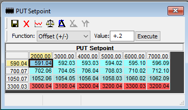

## Timing and knock control

I believe this should be pretty straight forward, but it should be pointed out that if you were running pump gas before on a stock turbo you probably won’t be able to run the same timing when pushing out towards upper 20s psi on your new turbo. High combustion chamber pressure=more heat. More heat=more propensity to knock. As you are working on your boost keep an eye on knock and if you start seeing consistent knock at a certain rpm range you might want to start pulling timing back in that range. If knock seems sporadic and only affecting a single cylinder once in a while with no rhyme or reason it’s probably dialed in well. If you want to clean up that knock let’s look into how to do so.

### Knock behavior and calibration

Ahhh, knock. First there is knock detection, AKA sensitivity of the knock sensors. Then there is the knock correction factor, AKA how much timing to pull during a knock event. Lastly, there is how quickly should the timing pull be decayed to get back to the standard timing. Ever the argument, how much knock is ok?

On the current SC8S50 XDF, the directly relevant identified calibrations include `IP_IGA_DEC_KNK` — Spark retard at recognised knocking, `IP_IGA_INC_KNK` — Increasing value of knock integrated correction when knock is detected, and `IP_KNKS_GAIN_PRE[0..3]` — Gain value for each cylinder for the knock pre-window. Confirm that each screenshot’s axes and live values match before associating it with one of these symbols.

Here are your cylinder sensitivity tables. I’d just suggest leaving them alone; let the knock sensors do their job.

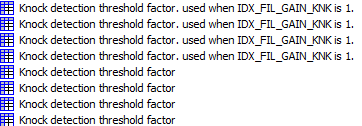

Moving on, the knock corrections table is just that, how much correction (KR) to apply to a cylinder that detects knock. The stock tune settings are really aggressive at cutting timing. Again, this table is the same as the timing tables, RPM vs. airmass.

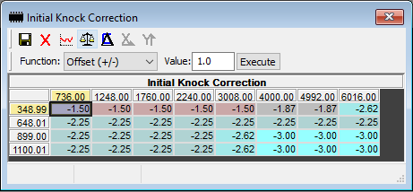

As you can see, a single knock event at any reasonable airmass is going to pull between 2-3 degrees of timing. That is a hefty chunk of power. I feel that this table can be toned down somewhat. If you wanted to cut every value in half that wouldn’t be a bad start, perhaps leave the last row at -1.5 all the way across. That will still give it a lot of flexibility to cut decent timing for knock events at WOT as needed. Something like this:

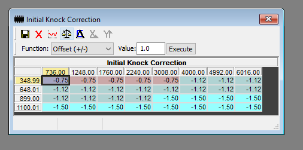

Knock decay is another table that you might want to have a look into.

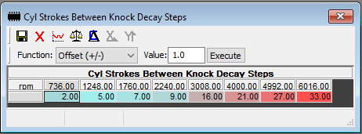

This table defines how quickly the timing recovers after a knock event. The stock tune is pretty aggressive at low rpm (no one should be having knock events sub 2000rpm anyways…if you are then you’ve got problems). As rpms climb it is less forgiving. If you have a knock event at say 4000 to 4500 with that table above it would carry that timing cut halfway into the next gear. MAJOR KILLJOY. Once you get comfortable with your tune and your timing curve I would look to reduce the numbers at 3000rpm and above. This is still a decent decay rate that isn’t too aggressive that I would feel comfortable running:

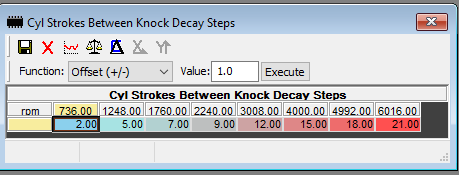

You could get even more aggressive if you wanted (i.e. a dragstrip ethanol mix kill tune) increase each step by 2-3. That will get the knock event corrected really fast.

Lastly we have the knock recovery amount. We have defined how quickly it will recover, now we will define how much each recovery step will decay the knock event:

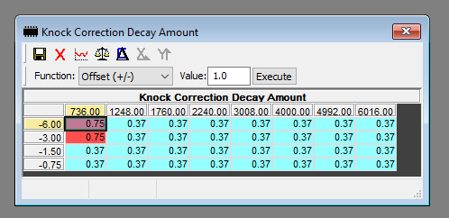

0.75 will give a decent recovery rate. You could get even more aggressive if you wanted (i.e. a dragstrip ethanol mix kill tune) by running 1 or so in each cell. That will get the knock event corrected even faster.

The last piece of the puzzle is tuning the knock sensor gain so that it can effectively detect knock. As RPM increases a motor will naturally get noisier. The sensors are most efficient with a noise level (nl) of 0.5V at idle rising to 1v by 6000rpm. We can log the noise level at each cylinder:

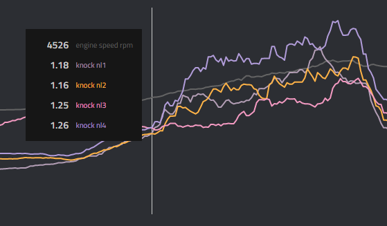

As the noise level rises beyond the 0.5-1V curve the sensors begin to get saturated and become fully saturated when noise reaches ~2V. The noise value is used to calculate the threshold value (thd). This is also loggable at each cylinder:

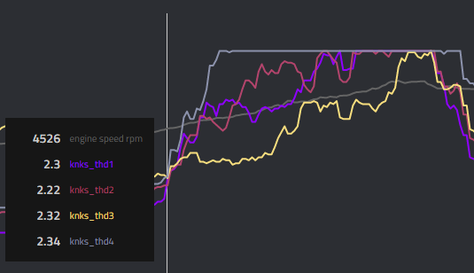

*Dirk’s note: THD is calculated as (NL × global knock-threshold factor) + knock-sum adder.*

The actual sensor feedback can be logged as well for each cylinder (RNG). Once RNG > THD, a knock event is recorded. Here are two recorded knock events in cylinder 4:

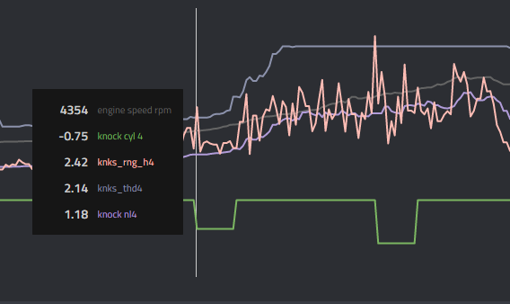

Once the threshold (thd) reaches 4V the sensor has been fully saturated and its ability to detect knock is compromised. Take our example above. The noise level has reached 2.26V, way past the 1V target at 6000 rpm (shit, let’s be honest we’re only at 5366 and it’s been past 2V and thd has been flatlined at 4 for awhile…). The raised noise level has made thd flatline, limiting the effective knock threshold. The sensor heard something here, probably not knock but it couldn’t adapt because the sensor was saturated due to the noise:

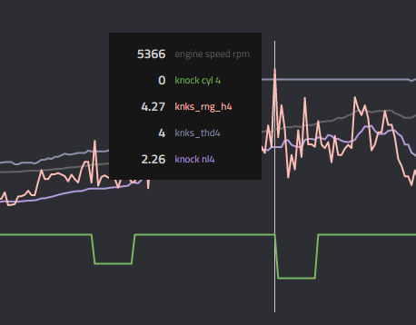

Contrast this vs CYL3 that isn’t saturated (elevated, yes but that’s ok):

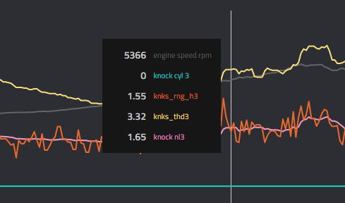

So how do we solve this? We lower the gain for each cylinder with the gain tables so that the noise floor is lowered and keeps the sensor from being saturated. Let’s take a look at 2 logs, first the one we’ve been looking at:

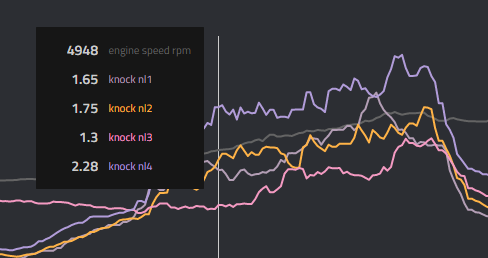

Number 4 is really having a difficult time. This might possibly be due to my BFI Stage 1 tranny mount? Inherent to my motor? Who knows. It needs to come down, they all do, but it does the most. CYL3 probably doesn’t need much modification, if any at all. Let’s not make conclusions on one log though, here is another. Look who’s off to the races again…..

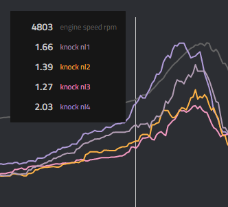

So, let’s look at the tables for gain and see what we should do. There are 4 tables

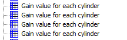

And this is CYL1 (259L for clarity, yours may differ)

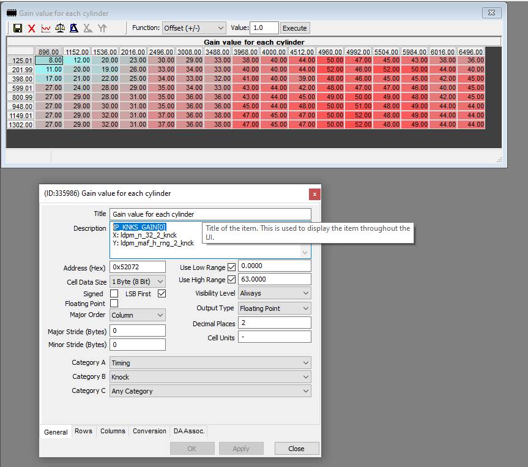

The axis are rpm and airmass mg/stk. I wouldn’t touch anything outside the last 2 rows if not only just the last row. To lower the gain we ADD to these values. A good starting point is 10% or so. In my case CYL4 needs the most work (and on my big turbo I am well past 1300mg/stk so would only modify the last row) so I would probably take this purple area in the 4500+ rpm range and move it into the low 50s:

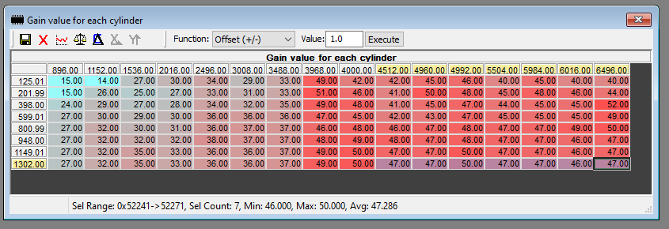

What you want to ultimately see is thd not hitting 4 so the sensor can perform its job effectively. Assuming you have a good handle on your timing curve this will help reduce any “ghost knock” you may be having. DO NOT reduce the gain just to eliminate real knock. That’s a horrible idea. You’ve been warned.

Here’s an example of noise reduction implemented well. thd is elevated but not saturated. Just enough gain removed to keep it off 4V outside of this one fraction of a second…perfect:

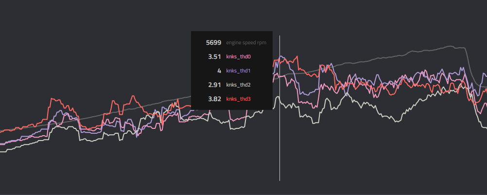

## MAP and PUT sensor scaling

If you have upgraded either sensor here is the scaling to use. Your xdf should also have the axis defined to change the voltage as well, so make sure you change the axis as well.

The parameter IDs for the screenshot-only MAP and PUT scaling tables are not identified in the source.

S50

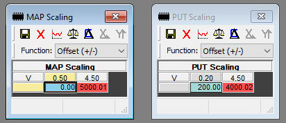

A05

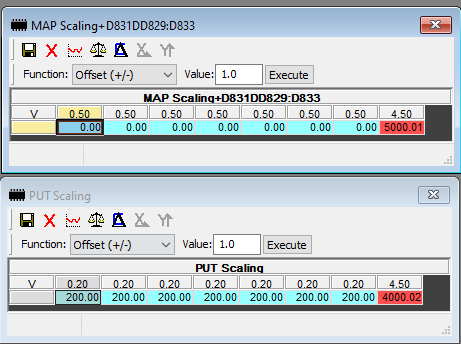

## Limiters

The source moves `IP_PUT_MAX_CAP_H_DIAG` — Maximum charge-air pressure quotient for charge-air-pressure-too-high diagnosis out of the way by setting the table to 3500:

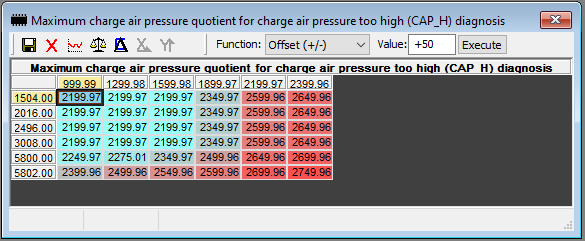

Under the Torque Management folder are 5 more torque tables. Move them out of the way. Just make every cell in all of these 1000.

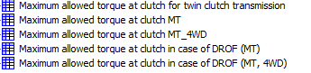

## Injection window

Go ahead and widen your DI injection window. Set this table to something like 500 or so (max 540).

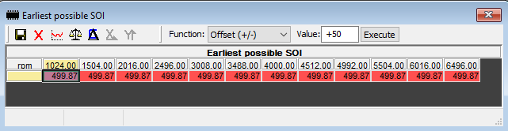

And push the SOI table up at the higher airmass (900-1200 area), like this (the red area):

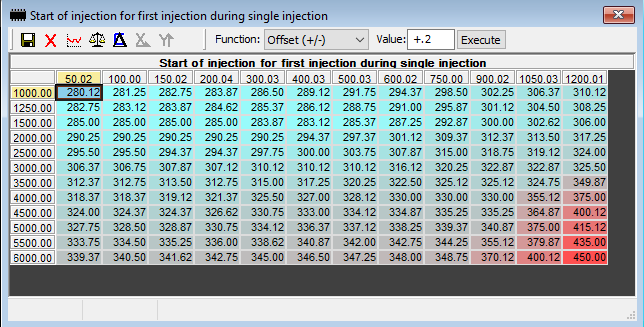

## Fueling

### Upgraded LPFP

The stock fuel pump controller will only allow a set amount of current before it starts to overheat and melt. The stock PWM for Pressure vs Flow settings will easily overheat the controller and must be modified. Set maximum PWM by Voltage to 82. You *might* be able to get by with 85, but really if you are at this point you should be looking more at a brushless pump.

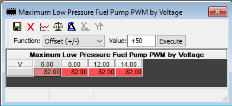

There are two tables for the fuel pump, one has 4WD for…4WD vehicles, duh. Pick the correct table to modify or just do both. Doesn’t matter if you adjust both.

The x-axis is modeled fuel flow (g/min) and the y-axis is fuel pressure.

Bump the first row up to between 10-15. This is your starting pressure. You need to give it a little bump or it will start poorly, especially if you are running ethanol.

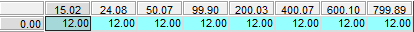

Adjust the fueling pressure target for RPM and fuel temperature. Typically, where the turbo fully spools, you want it to be at maximum pressure. Most hybrids are in the 3000–4000 rpm range for full spool, so set the 3000-rpm-and-up range to full fuel flow. The source suggests 650 kPa (6.5 bar) as a target.

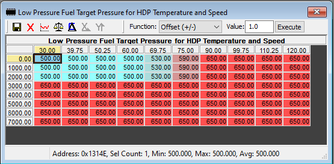

Set the Fuel Pressure Setpoint by Fuel Flow as your max fuel pressure.

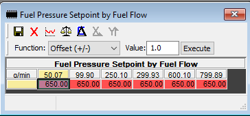

### Brushed LPFPs

There are two fuel pump tables, one has AWD in the title. Select the one appropriate for your car to modify (or modify both if you want).

Anywhere that it is at or over 80 in the table, adjust to 82. That’s it. You just “tuned” for your new LPFP. Should look similar to this:

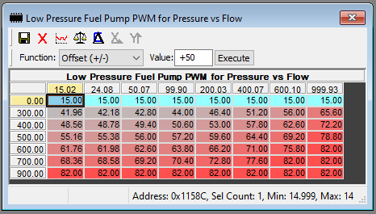

If you have installed a PM4 you can increase those values well above 82. If you are needing to run your LPFP out past 90% with your PM4 consider upgrading to a brushless RS3 pump.

### Brushless LPFPs

A brushed pump you are typically just going to run them for all they are worth. But with a brushless pump you should be in the 50-60 range for pump duty, 82+ is just way too much.. You’ll need to modify the axis to push the g/min (x-axis) out. Most hybrid setups on ethanol will run in the 2000+g/min fuel flow range and we want the pump duty to fall in the 50-60 range. This table below should be a good starting point.

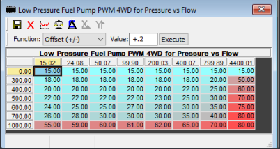

Now that you have your baseline you need to do some logging to see how your fuel pressure looks. Compare LPFP vs LPFP setpoint. If fuel pressure is above setpoint then pull up modeled fuel flow to see where along the x-axis you are. Triangulate your position in the table using fuel pressure and fuel flow. Increase duty to increase fuel pressure or lower duty to lower fuel pressure. Just make sure you don’t go above your maximum table.

### E85 cold starts

If you find your car is hard to start on ethanol when the engine is cold, bump this table up to 6%. This will help starting by holding the throttle body open a crack.

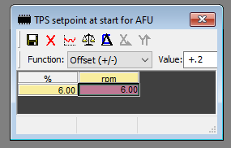

You need to set the Y axis to 6% as well so it looks like the image above:

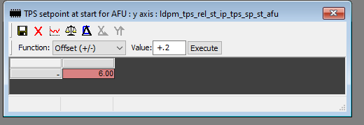

In addition, you can manipulate timing at startup if the above change didn’t help as much as you’d like. Everyone’s box code has different values in these 2 tables but the strategy is to increase timing aggressive up to around 600-700 rpm and then retard it pretty significantly out past 800rpm. The more timing you pull out the more it will gurgle and fart. 10 degrees retard should be plenty for starting purposes. Example below:

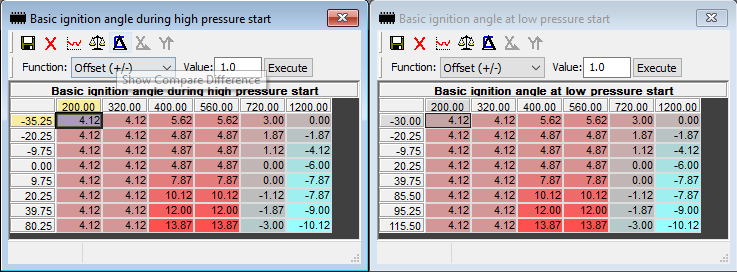

Lastly we need to push the cranking deactivation farther out. The X-axis is time (s) and the Y-axis is temperature (°C). In this example bin, deactivation starts at 7 s and the guide pushes it to at least 10 s.

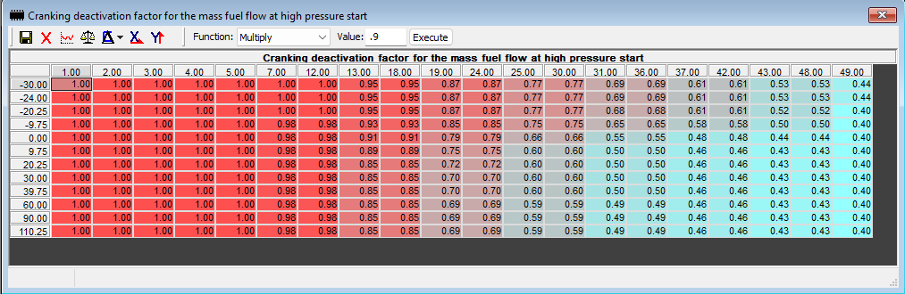

Something like this will help as the deactivation factor doesn’t start until 13s.

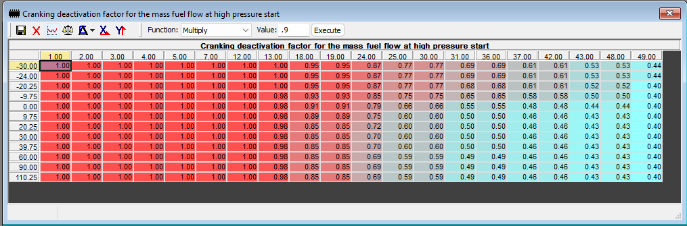

### Upgraded HPFP

After upgrading to a higher displacement high pressure fuel pump a few things need to be done to let the ecu know that more fuel will be pumped per pump stroke.

Upgraded internals increase pump displacement by approximately 30%. By setting `C_MFP_MAX` — Maximum fuel flow delivered by the pump within one pump stroke to approximately 300, the guide tells the ECU about the increased displacement so it can better control the spill valve (232 stock × 1.3 ≈ 300).

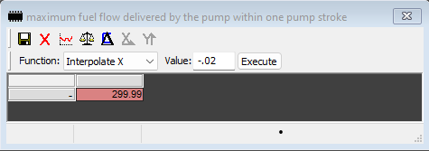

Adding a hpfp upgrade and doing just this 1 change will allow you to flow much more fuel. However, because the injectors can only fire for a defined period of time during the intake and compression stroke, raising the fuel pressure at the rail is typically done to increase the fuel flow per injection time. A common raised pressure is about 240 bar or 3500 psi. To increase the high pressure DI set point several tables need to be changed as well as making sure that the mass fuel flow by injector pulse width and fuel pressure is scaled out to your new pressure.

To start, raise this table to your highest wanted set point. 240000 works. This table is a global limit and without this the pressure set point will not rise.
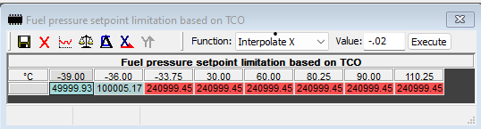

There are 13 tables that define the pressure target in each combustion mode. The guide raises all of them in the area where higher pressure is wanted, typically from 3000 rpm to redline with a smooth transition.

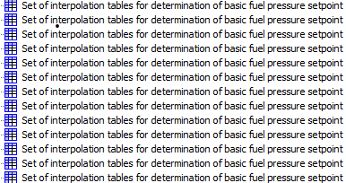

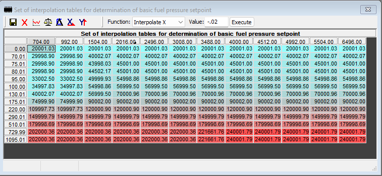

Do not copy this table above as every box code is different! The area you will be working in is the lower right.

*Note for Brian: Only copy and paste the 12 cells you modified into each of the tables. Leave the other cells alone.*

If you are finding that fuel pressure at the rail is dipping and you aren’t at the 240000 setpoint you can try moving 240000 further down in the rpm range.

If you are working with a Simos 18.10 car (A05) the majority of those calibrations already have the mass fuel flow tables scaled out to accept 240bar. Eg. 5g0906259Q - 0002. If you are tuning a Simos 18.1 car (S50) those calibrations do not have the mass fuel flow table scaled out past 200bar so you must do this to increase pressure.

Last, the guide adjusts `IP_TI_EFF_MFF_TEMP_H` — Effective injection time map (80 °C), `IP_TI_EFF_MFF_TEMP_MID_1` — Effective injection time map (20 °C), and `IP_TI_EFF_MFF_TEMP_L` — Effective injection time map (−20 °C). Raise the last pressure-axis row to 250 bar.

*Enhance.*

*Enhance again.*

For the fuel-mass column, you might need to extend the scale. The last two columns show the relationship between fuel mass (mg/stk) and injector pulse width. Many files, such as 259L, stop at 140:

Some files are already scaled out on this axis well (like 8V0906259Q) so may not need to be touched. If yours is low like 259L then read on.

You will more than likely exceed 140 mg/stk once you start cranking up the boost (and especially if you have a bigger turbo).

First we need to calculate our new 249999 row. Note how each row is an additional 30000, If you calculate the percent decrease from 209999 to 239999 (30,000 more) you’ll come up with the following:

The percent change from 239999 to 249999 is 4%. The guide therefore takes another 4% off the values to determine the 249999 row:

Calculate the new values for the entire 249999 row.

Now we need to calculate our new X-axis mg/stk.

If you calculate the percent increase of 2 adjacent cells you’d see that up top (1809 to 20800) is about 1150% increase and the bottom 2 cells (831 to 7727) is 930% increase.

 

So we need to increase the last column. We need to match our max fuel flow of 299 so our target will be 299mg/stk, more than enough. Go ahead and replace the 140 with 299 in the axis. Now we need to calculate new values that are 114% more. So take our percentages and multiply them by 2.14. This is our new percent increase for our new column.

Calculate the new values by multiplying the percent increase by the values in the 13 column. Here is our new 299 column:

Apply this column to all 3 tables:

### Lambda — pump gas

Assuming you applied all the changes from the Basics guide you should be fine here.

### Lambda — E85 and blends

Assuming you applied all the changes from the Basics guide you should be fine here. Some people like to run it a touch leaner, like 0.02 leaner and keep things around 0.80 at WOT. It’s up to you and it’s your car. Some have found richer or leaner tends to result in less knock on their cars. If you’ve compared your car to others with similar mods and fuel and are finding yours seems more knocky you can try to adjust lambda up or down and see how it reacts. At the end of the day consensus is high 0.7s to low 0.8s at WOT will be safest and yield best performance.

## Multi-port injection (MPI)

### Step 1 — Apply the MPI patch

Apply the patch to the bin using BinToolz. Enabling MPI affects several tables and varies by box code. None of the remaining steps work unless the bin is patched. Installing the patch requires a human-reviewed FULL flash; a CAL flash cannot install it.

### Step 2 — Set the S50 MPI enable limits

For S50, set the torque (Nm) at which MPI starts and stops firing. The guide suggests 300 Nm for the lower limit and an upper limit safely beyond the maximum-torque tables, such as 800 Nm. If tip-in is rich, move the lower limit upward in 25-Nm increments or reduce the MPI share in step 4. The Y-axis is temperature in °C.

NOTE: The 2 tables above are CASE 6. You can hit F2 to confirm. Do not modify any tables other than the two CASE 6 tables.

### Step 2 — Set the A05 MPI enable limits

For A05, set the airmass (mg/stk) at which MPI starts and stops firing. The guide suggests 800 mg/stk for the lower limit and an upper limit safely beyond the airflow tables, such as 2000 mg/stk. If tip-in is rich, move the lower limit upward in 25-mg/stk increments or reduce the MPI share in step 4. The Y-axis is temperature in °C.

NOTE: Similar to the Maximum Allowed M_AIR_CYL_SP table the formula is wrong, so if you enter 800 it will save as 8 bajillion. Type 0.0008 for 800. Same for the upper, 0.002 for 2000.

NOTE: The 2 tables above are CASE 6. You can hit F2 to confirm. Do not modify any tables other than the two CASE 6 tables.

### Step 3 — Match start of injection

Increase the single-injection-plus-MPI start-of-injection table. For A05, the source example is a grid of 220s:

For S50 it will have similar values as the DI only table. If you’ve been following this guide you will have already increased your DI start of injection table as follows:

Copy all of these values and paste them into the single injection plus MPI start of injection table so they are the same.

### Step 4 — Choose the DI/MPI split

Decide how much fuel each system supplies. The two tables are `IP_FAC_OPP_MPI_2_PLS_1` — Factor for SDI pulse (1st) at normal operating point and `IP_FAC_OPP_MPI_2_PLS_1_MAX` — Limiting factor for SDI pulse (1st) at normal operating point. The source makes both tables identical. The X-axis is RPM and the Y-axis is mg/stk. The guide rolls MPI in gradually with rising airmass, aims for roughly 5–6 ms DI pulse width at full load, and warns against letting DI pulse width fall below 4 ms because the in-cylinder injectors depend on fuel for cooling.

[https://datazap.me/u/diggs24/60-130-847?log=0&data=17-34-35](https://datazap.me/u/diggs24/60-130-847?log=0&data=17-34-35)

Here is an example of the split tables that should be a good starting point (S50 shown):

### Step 5 — Confirm low-side pressure scaling

Confirm the lowside fuel pressure sensor scaling is accurate. Should look like this:

### Step 6 — Apply 030/LB6-only limits

Set Maximum allowed fuel mass to 150:

Set Map for allowed MFF_DIF threshold to 350:

Set this table entirely to 800

Set this table to 1000:

### Step 7 — Set the injector constant

If using aftermarket injectors, adjust injector constant. Most people are running either 925cc or 1300cc injectors. For 925cc adjust this table to 0.06 or 0.065:

As you log keep an eye on STFT. +/-10% is good, don’t need perfection here. If it is too high or low then adjust the constant in 0.005 increments.

1300cc injectors will probably end up being in the 0.050 range, but every car varies and LPFP pressure seems to have an impact on what the final constant ends up being. Start in these ranges and adjust as you are adding boost, if needed.

### Step 8 — Set injector dead-time correction

Confirm and adjust `IP_TI_ADD_DLY_MPI[0]` — Injector dead time correction as necessary. The injector or MPI vendor should publish the required data.

### Step 9 — Enable closed-loop fueling

Set fueling to closed loop. Set this table to 235:

### Step 10 — Verify DI and MPI pulse widths

Watch both DI and MPI injector pulse width in boost. The source keeps DI pulse width above 4 ms once the turbo reaches full boost and personally aims above 6 ms by adjusting the split in step 4. It treats roughly 20 ms as the practical MPI upper limit; approaching it points to larger injectors, more low-side fuel pressure, or less ethanol demand.

## Fuel trims

Once your tune is dialed in you will highly likely have some fuel trims adjustments to make.

Go out and get some 3rd or 4th gear WOT logs. The PID you want to monitor is Fuel Trim % as this will do LTFT + STFT.

Let’s take this for example:

Terrible! This means the ECU injected more than 11% more fuel than expected in that area.

We will use the MAF correction tables for this example, but note that you can also use Fuel Mass to solve your trims.

First, open the `.ALL` XDF and find `ID_IDX_SEL_FAC_MAF_CMB_MOD` — Index selecting the valid MAF-correction map by combustion mode:

This map allocates the different combustion modes to the available MAF correction tables. Comb mode 0 is single pulse DI-only, which is what we are working with at WOT, except if your car has MPI, in that case it’ll be Comb Mode 9 (you can see this on your PID list).

You can see that Comb Mode 0 (x-axis) is allocated to map 2 (cell value), so let’s find it.

There are four available `IP_FAC_MAF_COR[0..3]` — Global standardized-airmass correction factor maps. Hit F2 to confirm the selected index:

This is map `[2]`, so the example continues with it.

This table will use MAP and RPM. I use flags to set the axis correctly.

Positive trim values mean that the ECU expects less air, so we need to put a positive value in the MAF Correction table to tell the ECU that more air will enter the cylinder in that area.

Now go ahead and get some logs. MUCH BETTER. Rinse and Repeat, anything between -3 and 3% is good.

Related: [[ecu-tuning-basics]], [[tuning-getting-started]], [[simostools-app-guide]], [[bintoolz-btp-patching]], [[sc8s50-switchpatch-xdf]]
