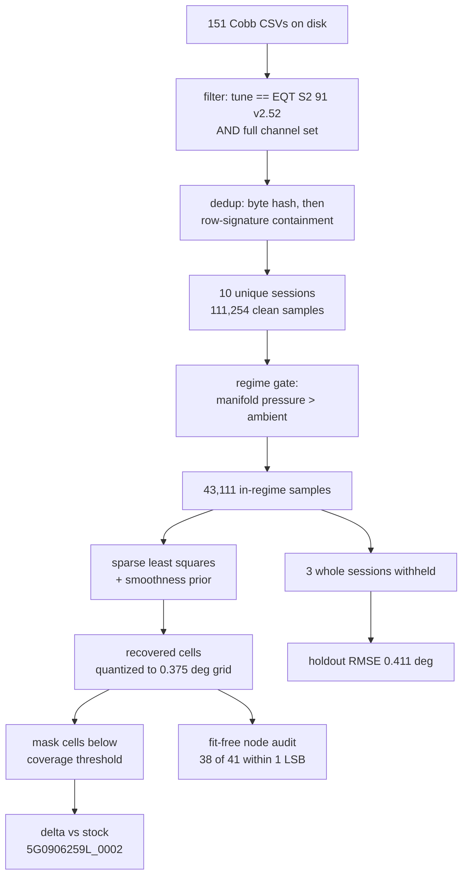

# Reverse-engineering the EQT Stage 2 base-timing maps

**What EQT actually did to the ignition maps, recovered from 111,254 Cobb datalog
samples without ever seeing their calibration file.** The short version: EQT left
stock base timing alone through the mid-load rows and **added up to +6.75 °CRK at
high load and high rpm** — exactly where the [dyno curve](#matching-the-dyno-graph)
separates from stock. The reconstruction reproduces the ECU's own logged
`Ignition Table Output` channel on **three entirely withheld sessions** to
**0.411 °CRK RMSE**, which is inside the calibration store's own 0.375 ° resolution.

> [!warning] This is EQT's calibration for a **different box code**
> These logs come from the Cobb Accessport running `EQT - Stage 2 91 v2.52 - LC TC`
> on `CXCA 5G09C0BB01`. Sam's car is `5G0906259L_0002`. The map *structure* is the
> same SC8S50 family, so the delta-vs-stock is transferable as intent — but the
> absolute cell values are not a drop-in for [[ecu-tuning-basics]]-style edits, and
> nothing here has been flashed or validated on this car.

> [!note] Scope: the boosted region only
> 22.7 % of the 16×16 VVL 0 grid is recovered — everything the logs actually visit
> under boost. Cells the logs never constrain are written **empty**, never guessed.
> See [[#Why only the boosted region]] for why part-throttle is unrecoverable from
> this channel set.

---

## The target

The channel `Ignition Table Output (Degrees)` is the ECU's blended output of the
base ignition angle maps, read *before* knock control subtracts anything. In the
SC8S50 structure those are 36 tables — `{PORT_H, PORT_L} × {STND, LFT_1} ×
intake{0,1,2} × exhaust{0,1,2}` — of which the ones that matter at load are:

- `IP_IGA_BAS_IVVT_VVL_PORT_L[STND][i][e]` — Basic Ignition Angle, low port-flap
  position, valve-lift state **VVL 0**, intake cam index `i`, exhaust cam index `e`
- `IP_IGA_BAS_IVVT_VVL_PORT_L[LFT_1][i][e]` — the same for valve-lift state **VVL 1**

Each is 16×16 over `ldpm_n_ip_iga_bas_igsp` — Basic Ignition Angle x axis (RPM) and
`ldpm_maf_ip_iga_bas_igsp` — Basic Ignition Angle y axis (airmass, mg/stk), stored
as **uint8**:

$$\text{angle}_{^\circ\mathrm{CRK}} = \frac{\text{raw} - 95}{8/3}
\qquad\Longrightarrow\qquad 1\ \text{LSB} = 0.375\ ^\circ\mathrm{CRK}$$

That 0.375 ° step is the noise floor for the whole exercise: the logged channel
lands exactly on this grid (120 distinct values spanning −4.5 … +40.125 °CRK), so
**no reconstruction can beat ±0.375 °**, and anything at or under it is exact.

The ECU model being inverted is

$$\hat{y} = \sum_{i=0}^{2}\sum_{e=0}^{2} w^{\text{in}}_i(\theta_{\text{in}})\;
w^{\text{ex}}_e(\theta_{\text{ex}})\;\;
\mathrm{bilin}\!\left(M[\text{vls}][i][e],\; n,\; m_{\text{air}}\right)$$

where the $w$ are 3-node piecewise-linear partitions of unity over cam phaser
position. Given the cam support points, **this is linear in the map cells** — so
the inversion is a large sparse least-squares problem, not a general nonlinear fit.

### What the XDF and the stock bin actually say

Read directly out of `Code/xdf/SC8S50.V1.0.xdf` and `Code/bin/5G0906259L__0002.bin`:

| Property              | Value read from the definition                                         |
|-----------------------|------------------------------------------------------------------------|
| Table count           | 36 (`PORT_H`/`PORT_L` × `STND`/`LFT_1` × intake 0–2 × exhaust 0–2)     |
| Shape / store         | 16 × 16, **uint8**, one table per 0x100 bytes                          |
| Cell scaling          | `((1.0*X) - 95.0) / 2.666666…` → 0.375 °CRK per LSB                    |
| Declared cell range   | −35.625 … +60.0 °CRK                                                   |
| X axis                | `ldpm_n_ip_iga_bas_igsp` @ `0x3ce5a`, 16 × uint16, rpm                 |
| Y axis                | `ldpm_maf_ip_iga_bas_igsp` @ `0x3cdbc`, 16 × uint16, ÷23.5907 → mg/stk |
| First operative table | `IP_IGA_BAS_IVVT_VVL_PORT_L[STND][0][0]` @ `0x426ec`                   |

X-axis breakpoints (rpm): 400, 700, 1000, 1250, 1500, 1750, 2000, 2500, 3000,
3500, 4000, 4500, 5000, 5500, 6000, 6500.
Y-axis breakpoints (mg/stk): 80, 100, 150, 200, 250, 300, 350, 400, 500, 600,
700, 800, 900, 1050, 1200, 1400.

> [!warning] The cam-index breakpoints are **not exposed by the XDF**
> The 3×3 intake/exhaust indices are the map-blend's support points, but the XDF
> defines no axis, constant or table giving the cam phaser positions at which
> indices 0/1/2 are exact — the tables carry only the RPM and airmass axes. So
> the blend rule's breakpoints cannot be *read*; they have to be **fitted from
> the logs alongside the cells**, which is what the outer search over
> `SUP_IN_GRID` / `SUP_EX_GRID` in `solve_maps.py` does (8 intake × 6 exhaust
> candidate triples). It made almost no difference — see the ladder below.

What the **stock bin** does settle is that the blend is inert as delivered: all
nine cam-indexed maps inside a given (port, valve-lift) group are **byte-identical**,
so the double sum collapses to a single `bilin(M[vls], n, m_air)`. `PORT_H` and
`PORT_L` are genuinely different (max 13.125 °CRK apart at VVL 0; 9.75 ° at VVL 1).



---

## What EQT changed

### VVL 0, low port flap — the wide-open-throttle map

`IP_IGA_BAS_IVVT_VVL_PORT_L[STND]` — Basic Ignition Angle, VVL 0, low port flap.
Blank = the logs never constrain that cell.

**Recovered EQT values (°CRK):**

| mg/stk \ rpm | 3500  | 4000  | 4500  | 5000  | 5500  | 6000  | 6500  |
|--------------|-------|-------|-------|-------|-------|-------|-------|
| 400          | 18.00 | 23.25 | 22.88 | 21.75 | 20.25 |       |       |
| 500          | 18.00 | 22.50 | 18.75 | 17.62 | 17.62 | 18.00 |       |
| 600          | 13.88 | 17.62 | 16.50 | 16.50 | 16.88 | 16.50 |       |
| 700          | 11.25 | 12.00 | 13.12 | 13.88 | 14.25 | 14.62 | 15.38 |
| 800          | 7.88  | 9.00  | 9.75  | 10.88 | 11.62 | 12.38 | 13.50 |
| 900          | 5.25  | 6.38  | 7.50  | 8.25  | 9.00  | 10.12 | 11.62 |
| 1050         | 1.88  | 3.38  | 4.50  | 5.25  | 6.38  | 7.88  | 9.38  |
| 1200         | -0.38 | 1.50  | 2.62  | 3.38  | 4.50  | 6.00  | 7.50  |
| 1400         | -1.88 | -0.75 | 0.75  | 1.88  | 3.75  | 4.88  |       |

**Delta vs stock `5G0906259L_0002` (°CRK) — the actual finding:**

| mg/stk \ rpm | 3500  | 4000  | 4500  | 5000  | 5500  | 6000  | 6500  |
|--------------|-------|-------|-------|-------|-------|-------|-------|
| 400          | -3.75 | -2.63 | -0.75 | -0.75 | -0.00 |       |       |
| 500          | +0.75 | +0.75 | -0.00 | -0.00 | -0.00 | -0.00 |       |
| 600          | -0.00 | -0.00 | -0.00 | -0.00 | -0.00 | -0.00 |       |
| 700          | -0.00 | -0.00 | -0.00 | -0.00 | -0.00 | +0.37 | +3.37 |
| 800          | -0.38 | -0.38 | +0.37 | -0.38 | +1.12 | +1.87 | +3.00 |
| 900          | -0.38 | -0.75 | +1.12 | +0.75 | +1.87 | +3.75 | +1.50 |
| 1050         | -0.38 | -0.38 | +3.37 | +1.50 | +0.75 | +1.50 | +3.75 |
| 1200         | +1.12 | +2.62 | +4.50 | +2.25 | +1.87 | +4.50 | +6.75 |
| 1400         | -0.00 | +0.75 | +3.37 | +2.62 | +2.62 | +4.87 |       |

Three things jump out:

1. **The 500–700 mg/stk rows are stock to the LSB.** Every cell reads `-0.00`
   (a sub-LSB residual, i.e. the same byte). EQT did not touch mid-load timing.
2. **Timing is added on a diagonal**, growing with *both* airmass and rpm. It
   starts around 4500 rpm / 1050 mg/stk and peaks at **+6.75 ° at 6500 rpm /
   1200 mg/stk**. This is the power.
3. **The 400 mg/stk row shows a pull** (−0.75 to −3.75 °), but this is the one
   region the [fit-free audit](#validation) disputes — treat it as unresolved,
   not as a finding.

![[eqt-timing-01_recovered_vs_stock.png]]

![[eqt-timing-04_wot_timing_curve.png]]

### VVL 1 — the low-lift / part-load cam profile

`IP_IGA_BAS_IVVT_VVL_PORT_L[LFT_1]` — Basic Ignition Angle, VVL 1, low port flap.
Only 9.4 % of this grid is constrained (VVL 1 is rare under boost), and it lives
in a different rpm band.

**Delta vs stock (°CRK):**

| mg/stk \ rpm | 2500  | 3000  | 3500  | 4000  |
|--------------|-------|-------|-------|-------|
| 400          | -0.75 | +2.62 | +3.75 |       |
| 500          | +2.62 | +3.00 | +4.87 |       |
| 600          | +2.25 | +2.62 | +3.00 |       |
| 700          | +3.00 | +2.62 | +2.25 |       |
| 800          | +5.25 | +4.87 | +3.00 |       |
| 900          |       | +4.50 | +2.62 |       |
| 1050         |       | +2.62 | +3.00 |       |
| 1200         |       | +2.62 | +3.75 |       |
| 1400         |       | +0.75 | +0.75 | +1.50 |

Unlike VVL 0, this map is advanced **almost everywhere** — a fairly uniform
+2.5 to +5 ° across the covered band. Recovered absolute values are in
`Docs/eqt-timing-re/maps/recovered_VVL1_LFT_1.csv`.

### Matching the dyno graph

EQT's published Stage 2 dyno shows the 91-octane curve pulling away from stock
from roughly 4000 rpm and holding the gap to redline. The recovered delta has the
same shape: nothing below 4500 rpm at moderate load, then a widening advance that
peaks at the top of the rev range. The timing map alone does not produce the whole
gain — boost target does most of it — but the timing change is aimed at exactly
the region the dyno gap occupies.

---

## Why only the boosted region

Fitting **all** 111,254 samples plateaus at **~2.0 °CRK** held out and will not go
lower for any model tried. Restricting to boosted samples collapses it to
**0.41 °**. The ladder (every rung scored on withheld sessions):

| Regime                    | Model                   | Held-out RMSE | VVL 0 coverage |
|---------------------------|-------------------------|---------------|----------------|
| all samples               | one surface per VVL     | 1.986         | 36 %           |
| all samples               | + 3×3 cam blend         | 2.003         | 31 %           |
| relmap > −2 psi           | one surface per VVL     | 0.773         | 24 %           |
| **in boost (relmap > 0)** | **one surface per VVL** | **0.478**     | **21 %**       |
| airmass > 450 mg/stk      | one surface per VVL     | 0.426         | 21 %           |
| airmass > 600 mg/stk      | one surface per VVL     | 0.370         | 18 %           |
| pedal > 90 % (WOT)        | one surface per VVL     | 0.355         | 5 %            |

Coverage here is per-cam-map at the weight-40 threshold; the delivered VVL 0
surface reaches **22.7 %** because it pools every sample into one map. The
selection rule — fixed before the fits ran — is *among configurations clearing
0.75 °CRK held out, take the one constraining the most VVL 0 cells*, which
selects the boosted regime with a single surface per valve-lift state.

Things that were tried and **did not** rescue the part-throttle fit:

- the full 3×3 intake/exhaust cam-indexed map stack, over 8 candidate support-point
  triples — moved held-out RMSE by **< 3 %**;
- an additive $f(\text{RPM}, \text{IAT})$ correction term standing in for
  `IP_IGA_BAS_TEMP_N_32` — Basis for temperature correction of Basic IGA versus
  N_32, TIA — made it **worse** (1.96 → 2.02);
- a port-flap latent state (a fitted threshold on manifold pressure, airmass or
  pedal, splitting into 4 map groups) — **no effect at all**, flat at ~1.98 across
  every threshold tried.

The conclusion is that at part throttle the logged channel carries contributions
this channel set cannot observe — `IP_IGA_BAS_CMB_MOD_COR` — Basic ignition angle
correction for different combustion modes, and the torque-intervention paths.
Under boost the engine sits in one combustion mode and the base map is the whole
story. That is also the only regime the tune's power depends on, so the
restriction costs nothing that matters.

![[eqt-timing-05_model_selection.png]]

> [!tip] The cam blend is a no-op in stock, and the logs don't contradict that
> In the stock `5G0906259L_0002` bin, **all 9 cam-indexed maps within a
> (port, VVL) group are byte-identical** — the 3×3 interpolation collapses to a
> single surface. `PORT_H` and `PORT_L` *are* distinct (max 13.125 ° apart at
> VVL 0). The logs give no evidence EQT differentiated the 9 either: adding the
> cam stack costs 9× the parameters and buys < 3 % accuracy.

---

## Validation

Three independent checks, none of which the fit can flatter itself on.

### 1. Held-out sessions

Three whole recordings — one track session, one street session, one single-pull
log — were withheld from every fit. **Never a random row split**: consecutive log
rows are 30–45 Hz samples of the same operating point, so a random split leaks and
flatters the score by roughly an order of magnitude.

| Metric                                 | Value          |
|----------------------------------------|----------------|
| Held-out samples                       | 14,319         |
| RMSE, all held-out samples             | 0.478 °CRK     |
| **RMSE, samples on constrained cells** | **0.411 °CRK** |
| MAE                                    | 0.287 °CRK     |
| Store quantization (1 LSB)             | 0.375 °CRK     |

The reconstruction is accurate to **1.1 LSB of the calibration store itself**.

![[eqt-timing-03_holdout_validation.png]]

### 2. Fit-free node audit

Bilinear interpolation *at a grid node* is the identity — a sample landing on a
node must read that cell's own value. So the median logged `Ignition Table Output`
at each node can be compared to the recovered cell **without going through the
least-squares model at all**.

- **VVL 0: 38 of 41 nodes agree within 1 LSB.**
- VVL 1: 12 of 15 nodes agree within 1 LSB.

The three VVL 0 disagreements, all in the thin low-airmass corner:

| RPM  | mg/stk | n   | Logged median | Recovered | Error |
|------|--------|-----|---------------|-----------|-------|
| 4000 | 400    | 26  | 19.12         | 23.25     | −4.13 |
| 4000 | 500    | 110 | 21.38         | 22.50     | −1.12 |
| 4000 | 1400   | 56  | 0.00          | −0.75     | +0.75 |

> [!warning] The 400 mg/stk row is not trustworthy
> This is the single material failure. 400 mg/stk *while in boost* is a transient
> tip-in condition, not a steady operating point, and the row above it (350 mg/stk)
> is under-covered enough that the smoothness prior — not the logs — sets its
> value, which then bleeds downward. **Do not read the −3.75 ° pull at
> 3500 rpm / 400 mg/stk as something EQT did.** Everything at 500 mg/stk and above
> stands.

![[eqt-timing-07_node_cross_check.png]]

### 3. Coverage, stated honestly

A cell counts as constrained only once the logs put a total interpolation weight
of **40** on it. That threshold is set from data, not taste: below roughly 40 the
node audit starts disagreeing by more than 1 LSB.

| Map                                         | Cells constrained | Coverage |
|---------------------------------------------|-------------------|----------|
| `IP_IGA_BAS_IVVT_VVL_PORT_L[STND]` (VVL 0)  | 58 / 256          | 22.7 %   |
| `IP_IGA_BAS_IVVT_VVL_PORT_L[LFT_1]` (VVL 1) | 24 / 256          | 9.4 %    |

![[eqt-timing-02_coverage.png]]

![[eqt-timing-06_sample_grid_coverage.png]]

> [!note] One thing that was tried and is worse
> Fitting *only* the well-covered columns and discarding the rest sounds cleaner,
> but degrades the node audit from 0.73 → 1.51 °CRK RMSE. The under-covered cells
> are not merely noise to excise — they carry the smoothness prior that holds the
> **edge** of the covered region in place. Fit every cell; report only the covered
> ones.

---

## The data

151 CSVs were scanned across `~/Documents/Cars/GTI/Cobb/Logs` and `References/`.
Of the 143 on the EQT tune, only 21 files carry the full channel set, and those
21 files are **10 genuinely distinct recordings** — the rest are byte-identical
copies or `_PartN` splits of the same session, caught by a row-signature
containment pass after byte hashing.

| Requirement                               | Files   |
|-------------------------------------------|---------|
| CSVs scanned                              | 151     |
| On `EQT - Stage 2 91 v2.52 - LC TC`       | 143     |
| Also carrying airmass + cams + valve lift | 21      |
| **Unique recordings after dedup**         | **10**  |
| Clean samples                             | 111,254 |
| In-regime (boosted) samples               | 43,111  |

The 122 excluded EQT logs are excluded for one reason: **no `Air Mass IM Per
Stroke` channel**. Without it there is no y-axis input to the map and the sample
is unusable. If more coverage is wanted, that is the channel a new log must carry.

Full per-file disposition with reasons: `Docs/eqt-timing-re/log_inventory.csv`.

---

## Reproducing

```bash
Code/.venv/bin/python Docs/eqt-timing-re/extract_samples.py   # inventory + samples
Code/.venv/bin/python Docs/eqt-timing-re/solve_maps.py        # regime + model selection
Code/.venv/bin/python Docs/eqt-timing-re/export_maps.py       # maps, deltas, audit, plots
Code/.venv/bin/python Docs/eqt-timing-re/compare_r22.py       # EQT vs every R22 map slot
Code/.venv/bin/python Docs/eqt-timing-re/knock_evidence.py    # knock + fuelling evidence
```

| Artifact                       | What it is                                        |
|--------------------------------|---------------------------------------------------|
| `log_inventory.csv`            | every candidate CSV, INCLUDED/EXCLUDED + reason   |
| `model_selection.json`         | the full regime × model ladder                    |
| `validation.json`              | holdout + node-audit numbers                      |
| `maps/recovered_*.csv`         | recovered cells, empty = UNCONSTRAINED            |
| `maps/coverage_*.csv`          | per-cell interpolation weight                     |
| `maps/delta_vs_stock_*.csv`    | recovered − stock `5G0906259L_0002`               |
| `maps/node_check_*.csv`        | the fit-free per-node audit                       |
| `maps/gap_*.csv`               | EQT − R22, per map slot                           |
| `knock_by_tune.csv`            | WOT knock rate per flashed tune, whole Cobb corpus |
| `knock_retard_histogram.csv`   | EQT knock-retard depth distribution               |
| `fuelling_eqt_vs_r22.csv`      | lambda and knock by rpm bin, EQT vs R22           |
| `plots/`                       | the seven evidence figures                        |

All source logs and `Code/bin/5G0906259L__0002.bin` are opened read-only; nothing
here writes a bin or touches [[ecu-tuning-basics]]'s safety-critical tables.

---

## What this is good for

- **A reference point, not a recipe.** It shows where a professional Stage 2
  calibration for this engine spends its timing: nothing below ~4500 rpm at
  moderate load, then a diagonal advance to +6.75 ° at the top. Compare against
  the slot ladder in [[octane-booster-and-slot-5]] and the current
  `MainTune` revisions in `Tunes/REV_LOG.md`.
- **Context for [[eqt-s2-baseline-log-review]] and [[eqt-s2-track-log-p2563]]**,
  which review the driving behaviour of this same tune. This note supplies the
  calibration side of it.
- **Not a source for cell values to flash.** Different box code, 22.7 % coverage,
  and a documented bad row. Timing that is safe on EQT's boost target and fuelling
  is not automatically safe on another.

## Against R22 — where this car's own tune sits

Compared with `Tunes/MainTune/MainTune_out/R22_20260901-060746/Patched_259L_R22.bin`,
read cell-for-cell, on the same 58 constrained cells, against the same stock
reference. R22 delivers timing in two layers that must be summed: the nine shared
`IP_IGA_BAS_IVVT_VVL_PORT_L[STND][i][e]` — Basic Ignition Angle maps (identical to
each other, and common to **all five slots**), plus the switch patch's per-slot
additive `Spark modifier` — map slot ignition offset. Slots 1–3 carry a neutral
modifier; slots 4 and 5 are the octane slots.

| Calibration             | Mean Δ vs stock | Min   | Max   | Cells advanced | Cells at stock | Cells retarded |
|-------------------------|-----------------|-------|-------|----------------|----------------|----------------|
| **EQT S2 91 v2.52**     | **+1.01**       | −3.75 | +6.75 | 30             | 17             | 11             |
| R22 slots 1–3 (base)    | −2.25           | −6.75 | +2.62 | 4              | 12             | 42             |
| R22 slot 4 (mid-boost)  | −1.74           | −6.75 | +3.75 | 10             | 12             | 36             |
| R22 slot 5 (aggressive) | −1.82           | −6.75 | +3.75 | 9              | 12             | 37             |

**R22 runs materially less timing than the tune this car already ran for years.**
EQT is ahead on 46 of 58 cells and behind on 1; the mean gap is +3.26 ° against
the base slots and +2.83 ° against slot 5.

### The confound, checked: it is not paid for in boost

The obvious objection is that R22 simply runs more boost and buys the retard with
it. Reading the per-slot `PUT setpoint` — map slot boost cap curves off the R22
bin and comparing against what the EQT tune *actually logged* at WOT says
otherwise — R22's aggressive slots run **less** boost, not more:

| rpm                         | 3800 | 4400 | 4700 | 5000 | 5400 | 6000 | 6500 |
|-----------------------------|------|------|------|------|------|------|------|
| EQT logged (p90, psi gauge) | 28.0 | 27.4 | 26.9 | 25.7 | 23.4 | 20.7 | 18.7 |
| R22 slot 3 / 5 cap          | 26.0 | 26.0 | 25.3 | 24.6 | 23.1 | 20.5 | 17.8 |
| R22 slot 4 cap              | 24.4 | 24.4 | 23.7 | 22.9 | 21.6 | 19.4 | 17.5 |

So R22 is **1–2 psi below EQT on slots 3/5 and 1.2–3.6 psi below on slot 4, while
also pulling ~3 ° of timing**. Both levers are set more conservatively at once.

### Along the real WOT operating line

Evaluated at the median airmass the EQT logs actually ran at each rpm, so this is
delivered angle rather than a cell reading:

| rpm  | Logged mg/stk | R22 base | R22 slot 4 | R22 slot 5 | EQT   | EQT − slot 5 |
|------|---------------|----------|------------|------------|-------|--------------|
| 4000 | 1566          | −4.50    | −2.25      | −3.00      | −0.75 | +2.25        |
| 4500 | 1518          | −3.75    | −0.75      | −2.25      | +0.75 | +3.00        |
| 5000 | 1475          | −2.25    | +1.50      | +1.50      | +1.88 | +0.37        |
| 5500 | 1327          | +0.75    | +3.00      | +3.00      | +4.02 | +1.02        |
| 6000 | 1194          | +1.92    | +3.36      | +3.36      | +6.08 | +2.72        |
| 6500 | 1129          | +3.91    | +4.50      | +4.50      | +8.39 | +3.89        |

At 5000 rpm the octane slots very nearly catch EQT (+0.37 ° apart). The gap
reopens above it, reaching **+3.89 ° at 6500 rpm**.

> [!warning] The octane slots miss the top-end operating point
> Both `Spark modifier` grids write offsets into the **1200 and 1400 mg/stk rows
> only**. But top-end WOT airmass falls as boost tapers — 1194 mg/stk at 6000 rpm
> and **1129 mg/stk at 6500** — which straddles the 1050 row (offset **zero**) and
> the 1200 row. The ECU interpolates between them, so at 6500 rpm slot 5 delivers
> **+0.59 ° of the +1.125 ° written — 53 %**. The 900 and 1050 mg/stk rows get
> nothing from either octane slot at any rpm, and 900 mg/stk is where R22 sits
> furthest behind EQT (+4.1 to +6.75 °).
>
> If the octane slots are meant to reach the top end, the offset has to be written
> into the **1050 row** as well — otherwise half of it is interpolated away
> exactly where the timing headroom was identified.

![[eqt-timing-08_eqt_vs_r22_delta.png]]

![[eqt-timing-09_eqt_vs_r22_rows.png]]

> [!note] What this does and does not license
> It is evidence that ~3 ° more timing at 6000–6500 rpm was survivable **on this
> car, on 91 pump, at equal-or-higher boost** — the EQT logs are Sam's own car,
> not a generic reference. It is not evidence that adding it to R22 is safe:
> EQT's knock thresholds and cam scheduling are different and were not recovered
> here. Its **fuelling is logged**, though, and is the likelier explanation for
> most of the gap — see [[#How EQT bought the timing]] below.

Reproduce with `Code/.venv/bin/python Docs/eqt-timing-re/compare_r22.py`; outputs
`r22_comparison_summary.csv`, `r22_gap_summary.csv`, `maps/gap_*.csv`.

## How EQT bought the timing

> [!warning] Correction — an earlier version of this note was wrong here
> This note previously stated that `Knock Retard Cylinder N` read "identically
> zero across all 111 k EQT samples". **That is false.** It was measured on the
> 10 sessions the map reconstruction used, which are the only ones carrying
> `Air Mass IM Per Stroke`. Knock retard is logged far more widely than airmass
> is, so the reconstruction's channel filter had silently discarded most of the
> knock evidence — including every deep event. Across the full Cobb corpus
> (272,647 deduplicated WOT in-boost samples) EQT's knock control **fires on
> 5.3 % of samples and reaches −7.88 °CRK**.

The obvious hypothesis for how EQT carried ~3 °CRK more timing than R22 on the
same car and the same pump fuel is that it desensitised knock detection. The logs
do not support the strong forms of that, and offer a simpler explanation.

### The controlled comparison

Two calibrations were flashed to this car and logged through the same Accessport
channel, so the knock numbers are directly comparable. `Stage0 v302` is Cobb's
stock-power map — **Sam identifies it as the stock map that shipped with his
Accessport**. (The Accessport also carries a separate `Simulated Stock v103.ptm`;
no log on disk was recorded on that one, and the tune name here is read from each
log's own `AP Info` field, so these 13,558 samples are `Stage0 v302` as flashed.
Whether the two files are the same calibration under different names has not been
checked — the `.ptm` encryption prevents it.)

| Tune flashed on this car    | WOT samples | median λ | WOT knock rate | Deepest retard | Samples deeper than −3 ° |
|-----------------------------|-------------|----------|----------------|----------------|--------------------------|
| `Stage0 v302` (stock power) | 13,558      | 0.920    | 12.5 %         | −5.25 °CRK     | 524 — **3.87 %**         |
| `EQT - Stage 2 91 v2.52`    | 272,647     | 0.790    | 5.3 %          | −7.88 °CRK     | 241 — **0.09 %**         |

Sample counts are deduplicated by SHA-256 of file contents — the backup folders
and the gzipped `tmp/` copies hold byte-identical repeats of the same
recordings. The raw deep-event counts (524 vs 241) understate the difference
badly, because the denominators differ 20-fold. As a **rate**, the stock-power
map goes past −3 °CRK **44× more often** than EQT does.

**EQT knocks less than half as often as the stock-power map** — while running far
more boost and up to +6.75 °CRK more base timing — and it runs 0.13 lambda richer.

That kills the two strong forms of the desensitisation hypothesis:

1. **Detection was not blunted into silence.** It fires on 5.3 % of WOT samples.
2. **Retard authority was not clamped.** EQT reaches −7.88 °CRK, which is
   **2.6 ° deeper than the near-stock map ever goes**. An earlier reading of a
   "floor" at −2.62 ° (7 LSB) was the same 10-session sampling artifact.

A *moderately* raised detection threshold is still not strictly excludable —
detection sensitivity and retard authority are separate calibrations, and EQT's
tables are unreadable because the `.ptm` is encrypted (7.995 bits/byte, all 256
byte values present). But it is no longer **needed** to explain anything, and it
would have to coexist with a loop that detects less often yet responds harder
than stock.

> [!note] Confound, stated
> The `Stage0 v302` logs are from 2024 (DSG testing plus a Pacific track day);
> the EQT logs are 2021–22. Different era and conditions, though both corpora
> include track sessions.

### Fuelling is the lever

EQT ran richer than R22 at **every** rpm bin at WOT in boost. R22's `Lambda SP`
is tracked to within 0.008, so its values are commanded, not a delivery shortfall.

| rpm bin     | EQT λ | R22 λ | R22 λ SP | EQT knock | R22 knock | EQT deepest | R22 deepest |
|-------------|-------|-------|----------|-----------|-----------|-------------|-------------|
| 3000 – 3500 | 0.870 | 0.930 | 0.922    | 6.8 %     | 33.8 %    | −1.88 °     | −4.50 °     |
| 3500 – 4000 | 0.820 | 0.886 | 0.880    | 6.0 %     | 12.4 %    | −2.62 °     | −3.75 °     |
| 4000 – 4500 | 0.800 | 0.853 | 0.850    | 6.1 %     | 7.7 %     | −7.88 °     | −1.88 °     |
| 4500 – 5000 | 0.790 | 0.828 | 0.827    | 11.3 %    | 26.3 %    | −6.00 °     | −3.00 °     |
| 5000 – 5500 | 0.780 | 0.804 | 0.809    | 1.9 %     | 23.8 %    | −4.12 °     | −2.25 °     |
| 5500 – 6000 | 0.790 | 0.803 | 0.800    | 0.8 %     | 16.0 %    | −3.00 °     | −1.50 °     |
| 6000 – 6600 | 0.780 | 0.799 | 0.800    | 1.9 %     | 9.6 %     | −3.38 °     | −1.50 °     |

> [!warning] Knock *rates* are not comparable across the two logging systems
> EQT is Cobb Accessport; R22 is SimosTools, and R22's knock control was itself
> modified from R19 onward, so detection sensitivity differs. The **lambda**
> comparison is clean — it is commanded fuelling, read off each system's own
> setpoint channel. Sample counts also differ by two orders of magnitude
> (EQT 272,647 WOT samples vs R22 3,715).

Enrichment suppresses knock through three mechanisms, all of which are strongest
on a direct-injection engine — and `Fuel Split MPI` is **0.000** at WOT on R22, so
all fuel evaporates in-cylinder:

1. **Charge cooling.** Fuel's latent heat of vaporisation lands on the trapped
   charge. λ 0.82 → 0.78 at ~1500 mg/stk is roughly 7 mg/stroke of extra cooling.
2. **Lower peak flame temperature.** Excess fuel absorbs energy without releasing
   it. End-gas autoignition is Arrhenius, so a modest temperature drop buys a
   disproportionate delay in ignition delay. Probably the dominant term.
3. **Autoignition chemistry.** Gasoline's knock tendency peaks *slightly rich of
   stoichiometric*, near λ 0.90 — richer **or** leaner is more knock-resistant.

That third point is the actionable one. **R22 sits at λ 0.930 at 3000–3500 rpm and
1398 mg/stk — essentially on the worst-case knock lambda**, and that is the bin
where it knocks on a third of samples and reaches the −4.50 °CRK that
`Tunes/REV_LOG.md` calls the deepest cut in the lineage. EQT ran 0.870 there,
clear of the peak. `Stage0 v302` at λ 0.920 is the same story from the other
direction: near-stock output, sitting on the peak-knock lambda, knocking 12.5 %.

> [!tip] Enrichment is the conservative direction
> Every queued R23 item adds timing, which adds knock risk. A fuelling change at
> 3000–3500 rpm runs the other way — richer is safer for both knock and EGT — and
> it attacks the zone flagged as the largest open safety item. It is also
> orthogonal to the valve-lift-transition mechanism suspected there, so it tests
> that theory rather than muddying it.
>
> The constraint to check first is pump capacity: `HPFP Eff Vol` already runs
> 89.1 % at 3000–3500 rpm (87.5 % median across WOT, 95 % at p95, touching
> 100 %). Going 0.930 → 0.870 needs ~7 % more fuel, which puts the pump near
> 95 %. Feasible, not comfortable, and the pump is cam-driven so low rpm is where
> absolute capacity is worst.

Reproduce with `Code/.venv/bin/python Docs/eqt-timing-re/knock_evidence.py`;
outputs `knock_by_tune.csv`, `knock_retard_histogram.csv`,
`fuelling_eqt_vs_r22.csv`.

## Open threads

- The 400 mg/stk row needs steady-state part-throttle-in-boost data to resolve,
  which no existing log provides.
- The `PORT_H` (high port-flap) maps are entirely unrecovered — no logged channel
  reports port-flap position, and the regime restriction keeps the fit in
  `PORT_L` territory by construction.
- Whether EQT differentiated the 9 cam-indexed maps is **unresolved**, not
  disproved: the logs simply do not have the resolving power to tell.
- **The gzipped logs were checked and add nothing to the map fit — closed.**
  `extract_samples.py` globs `*.csv`, so the 19 compressed track logs in
  `Cobb/Logs/Track/tmp/*.csv.gz` were never scanned. They have now been: all 19
  are 41-column recordings and **none carries `Air Mass IM Per Stroke`**, so the
  22.7 % grid coverage cannot improve from them. 13 are byte-exact duplicates of
  plain CSVs already on disk; 6 are genuinely new recordings (`datalog9`–`14`,
  ~182 k rows) and contribute knock and fuelling evidence only.
  `knock_evidence.py` reads them and deduplicates by content hash.
- **EQT's own knock thresholds remain unreadable.** The calibration is on disk
  (`~/Documents/Cars/GTI/Cobb/AP Backup 20240612/EQT - Stage 2 91 v2.52 - LC TC.ptm`)
  but Cobb encrypts `.ptm`, so a moderately raised detection threshold cannot be
  ruled out directly — only shown to be unnecessary as an explanation.

Related: [[ecu-tuning-basics]] · [[ecu-tuning-not-the-basics]] ·
[[eqt-s2-baseline-log-review]] · [[eqt-s2-track-log-p2563]] ·
[[octane-booster-and-slot-5]] · [[tuning-getting-started]]
