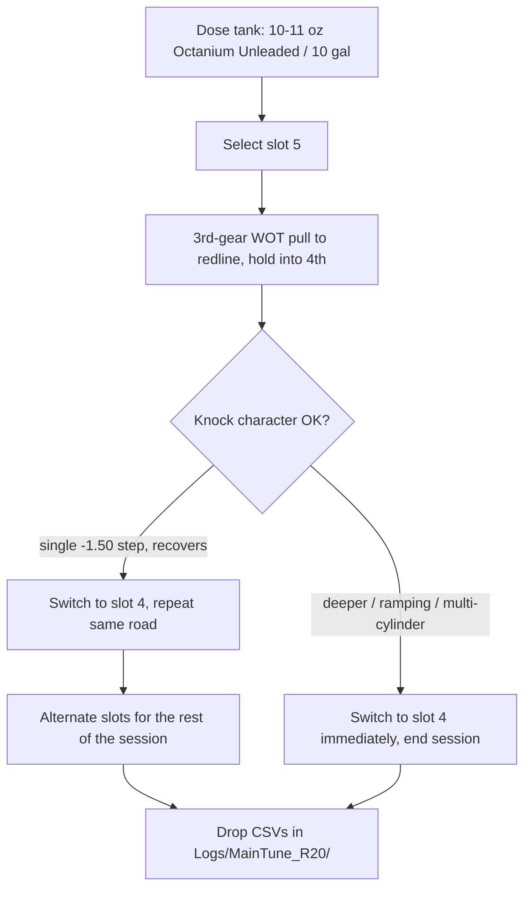

# Octane booster and map slot 5

> [!summary]
> From **R20** onward, **map slot 5 is the octane-boosted timing map**. It is
> calibrated for pump 92 AKI dosed with **VP Octanium Unleaded** at
> **10–11 oz per 10 US gallons**. **Slot 4 is the everyday map** and the
> in-drive fallback. Selecting slot 5 on an undosed tank will knock.
> Slot 5 stopped being the 10 psi valet map at R20.

Related: [[ecu-tuning-basics]], [[ecu-tuning-not-the-basics]],
[[sc8s50-switchpatch-xdf]]. Lineage record: `Tunes/REV_LOG.md` § R20.

## The product — and the one that must never go in this car

> [!danger] VP **Octanium 2855** contains TEL. Never use it.
> SKU 2855 is leaded (tetraethyl lead), and VP states it is for engines that do
> **not** have oxygen sensors or catalytic converters. This car has both, and
> **every log review in this repo depends on the wideband O2 sensor** — losing
> it does not just cost a part, it ends the measurement loop the whole tuning
> lineage runs on. The correct product is **VP Octanium Unleaded**, the
> O2/cat-safe formulation.

| Item                     | Value                                             |
| ------------------------ | ------------------------------------------------- |
| Product                  | **VP Octanium Unleaded** — NOT Octanium 2855      |
| Dose                     | 10–11 oz per 10 US gallons                        |
| Claimed gain             | 4.2 octane numbers at VP's 11 oz / 10 gal spec    |
| Assumed effective octane | 92 AKI → ~96 AKI                                  |
| Conversion used          | ~1 °CRK per octane number, **half taken**         |

> [!warning] 11 oz / 10 gal is a ceiling, not a step on the way to more
> VP's headline "up to 7 numbers" needs **23–32 oz per 10 gallons**, which is
> the **non-ECD** (non-emissions-compliant) dose. Do not chase the headline
> number on this car. 10–11 oz is the emissions-device-safe ceiling, and the
> ~4.2 numbers it buys is what slot 5 is calibrated against.

## What slot 5 spends that octane on

R20 writes the switch patch's per-slot `Spark modifier` grid for slot 5 — an
additive offset in °CRK onto the shared base ignition maps. It is the only way
to give one slot its own timing: the nine
`IP_IGA_BAS_IVVT_VVL_PORT_L[STND][i][e]` — Basic ignition angle maps are shared
by all five slots, so editing them would move slot 4 too.

Delivered timing at 1400 mg/stk, base plus modifier:

| rpm      |   3000 |   3500 |   4000 |   4500 |   5000 |   5500 |   6000 |   6500 |
| -------- | -----: | -----: | -----: | -----: | -----: | -----: | -----: | -----: |
| slot 4   | −7.500 | −6.750 | −4.500 | −3.750 | −2.250 | +0.750 | +1.875 | +3.375 |
| modifier | +1.125 | +1.500 | +2.250 | +3.000 | +3.750 | +2.250 | +1.500 | +1.125 |
| slot 5   | −6.375 | −5.250 | −2.250 | −0.750 | +1.500 | +3.000 | +3.375 | +4.500 |

The 1200 mg/stk row is identical. Every other cell of the 16 × 16 grid is
neutral at 0.00°, so slot 5 and slot 4 are the same calibration everywhere
except WOT above 3000 rpm.

**Only about half the octane credit is spent.** A ~4-number dose is worth
roughly $4°$ of knock margin at $\approx 1\ ^\circ\mathrm{CRK}$ per octane
number; slot 5 takes ~2°. The rest is deliberate reserve — the conversion rule
spans 0.5–1.5 °/number, it only applies where the engine is actually
knock-limited, and the octane of a partially-mixed dosed tank cannot be
verified. A follow-up revision may spend the remainder, gated on R20 logging
clean.

## Operating rules

- **Dosed tank only.** Slot 5 on plain 92 AKI will knock. That risk was accepted
  knowingly: the control is discipline, not calibration. Knock control still
  catches it at −1.50 °CRK per event (R19's halved cut), but being caught by
  knock control is not the same as being safe to run.
- **Slot 4 is the fallback.** It is byte-identical to R19 and is the map to
  return to at the first sign of trouble, mid-drive, without stopping.
- **There is no valet map any more.** R12 made slot 5 a flat 10 psi gauge cap
  and R20 spent the slot. Slots 1 (stock ~21.6 psi), 2 (conservative) and 3
  (intermediate) remain as tamer maps, but nothing hard-caps a stranger to
  10 psi. Accepted; see `Tunes/REV_LOG.md` § R20.

## Stop signals

Switch to slot 4 immediately and end the session on any of:

- retard deeper than −1.50 °CRK on any `Knock Cyl n` channel;
- retard that **ramps** rather than decaying;
- two cylinders retarding within the same sample;
- accumulated retard approaching the untouched `IP_IGA_MAX_KNK` — Maximum value
  for spark retard floor;
- loss of lambda or fuel-pressure control.

These are about **character, not depth**. A single settled event that recovers
is the expected behaviour of a working knock loop.
