# SimosTools — App Guide

Walkthrough of the **[[SimosTools]]** Android app, by Kyle (kr250). Assumes the prerequisites in [[tuning-getting-started]] (compatible OBD2 dongle — the [[Macchina A0]]). Beta versions via Google Play Beta Tester signup.

> **Note on screenshots:** images below are from Kyle's original guide (SimosTools v0.76). The **Get Info** captures show an example Audi/DQ250 vehicle (VIN `WAUB8GFF…`, engine `CNTC`, part `5G0906259A`) — **not** this car (`5G0906259L`, see [[index]]). Treat their values as illustrative of the *screen*, not this car's data.

## Main screen

Six buttons: **Logging, Flashing, Log Viewer, Utilities, Settings, Exit.** Connection ribbon along the top: **red = not connected**, **green = connected**, **blue = "Logging"** (actively logging). The green ribbon shows the connected dongle name (e.g. `BLE_TO_ISOTP…`).

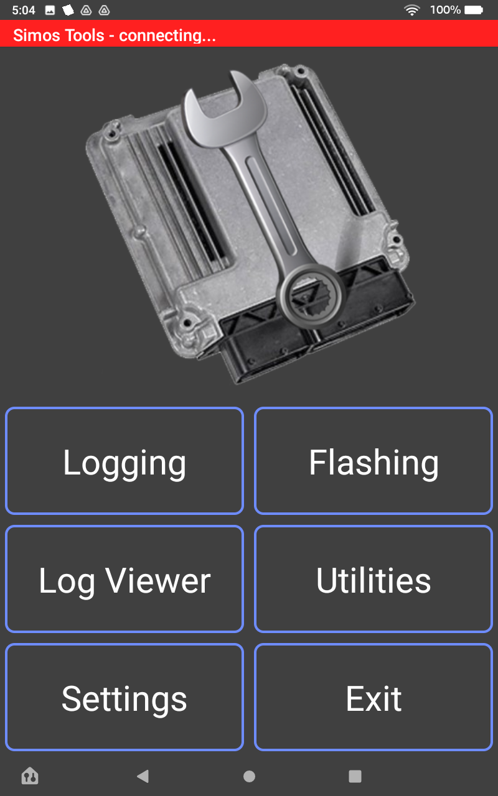

## Settings

The Settings screen is tabbed across the top: **GENERAL · CAR · MODE22 · MODE3E · MODEDSG**.

### Logging modes
- **Mode22** — standard diagnostic PIDs (pre-installed list ships with the app; logs out of the box).
- **Mode3E** — high-speed logging, enables additional parameters (PIDs). Requires the bin to be patched with High Speed Logging (HSL) — import an `HSL.CSV`.
- **LogDSG?** checkbox — enables DSG logging.

### Log trigger
Triggered by single or multiple variables via the **"Assign To:"** field in the PID list. Assign a letter to a PID, then set the trigger expression in the General tab. Examples:
- `d` on Pedal Pos, trigger `d>70` → logs above 70% pedal, stops below.
- `a` on boost, trigger `a>20` → logs when boost > 20.
- Cruise-control stalk `c>1` → manual trigger (one of the most common setups).

Don't assign the same letter to two PIDs. **Log lead in / Log end delay** control how quickly logging starts/stops (default 2000 ms each).

### Log output
Where logs are saved on device: **Directory** (Downloads / Documents / Application) plus a **Sub directory** (default `logs`). Ensure storage permissions are granted.

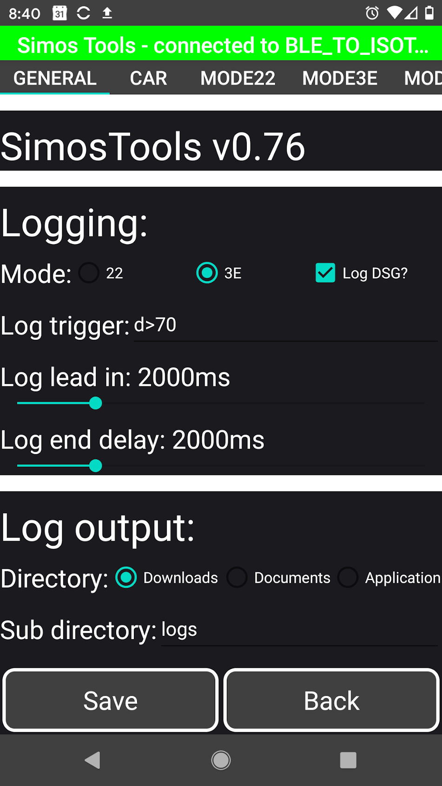

### Import PID CSV
Configure live logging either via the GUI per mode or by importing a CSV. Buttons: **22 CSV / 3E CSV / DSG CSV** to import, and **Reset 22/3E/DSG CSV** to restore defaults. A CSV sets units, equation, format, max/min, warning thresholds, smoothing, and tab assignment (Default, Airflow, Fuel, etc.). Works with or without a dongle connected.

### Gauges
Layout configurable globally — **Bar horizontal, Bar vertical, Basic, or Round** — overridable per parameter via `|BAR_V` or `|Round`.

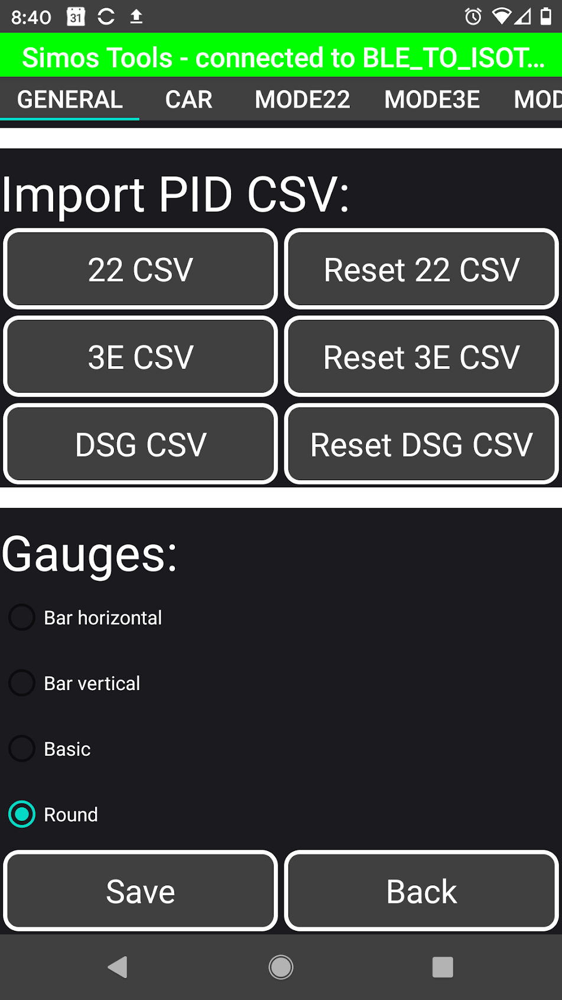

### Connection settings (advanced)
Older devices may need tuning to raise sample rates so logs aren't jiggy/jaggy. Newer devices (e.g. FireTab HD8plus) shouldn't need this. Fields include **Max display rate** (e.g. 15 Hz), **Max logging rate** (e.g. 100 Hz), **Q correction** (10 ms), **ECU / DSG STMIN** (350 µs), and **ECU / DSG PIDS Per Request** (8 / 6).

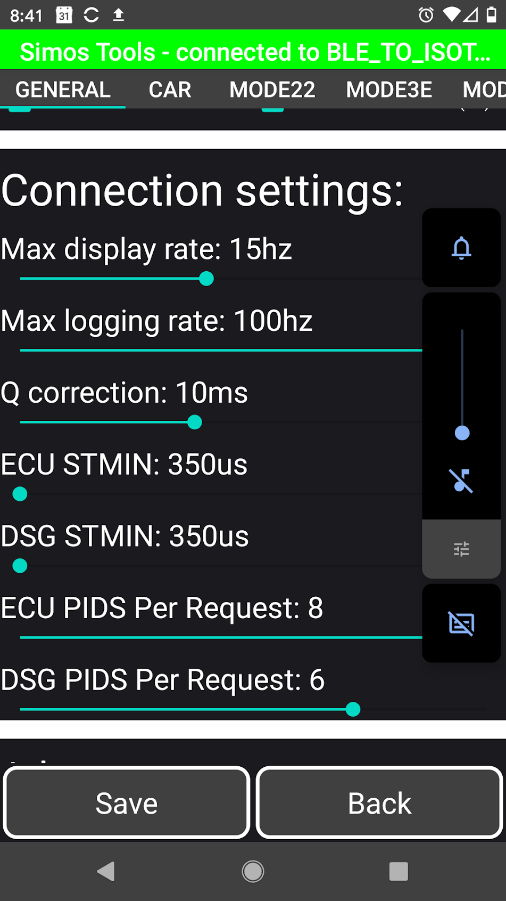

### Options / Car settings
- **Options (Color options)** — every color in the app and gauges: background normal/warning, text, gauge normal/warn, gauge normal/warning background, gauge value, state error/none. Go wild.
- **Car settings (CAR tab)** — car details for speed/HP/torque calc: curb weight, tire diameter, coefficient of drag, frontal area, **Velocity Imperial?** toggle (imperial/metric), and **Gear 1–5+ ratios**.

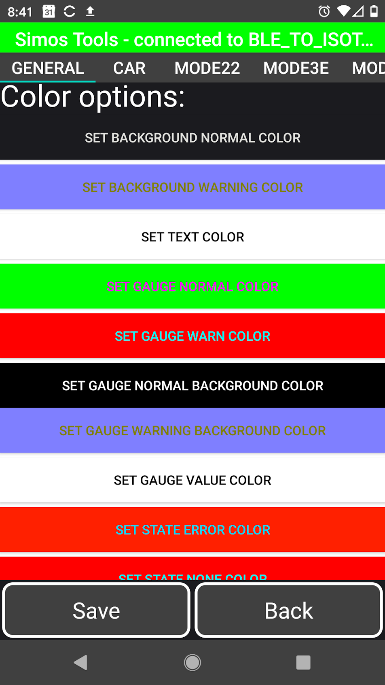

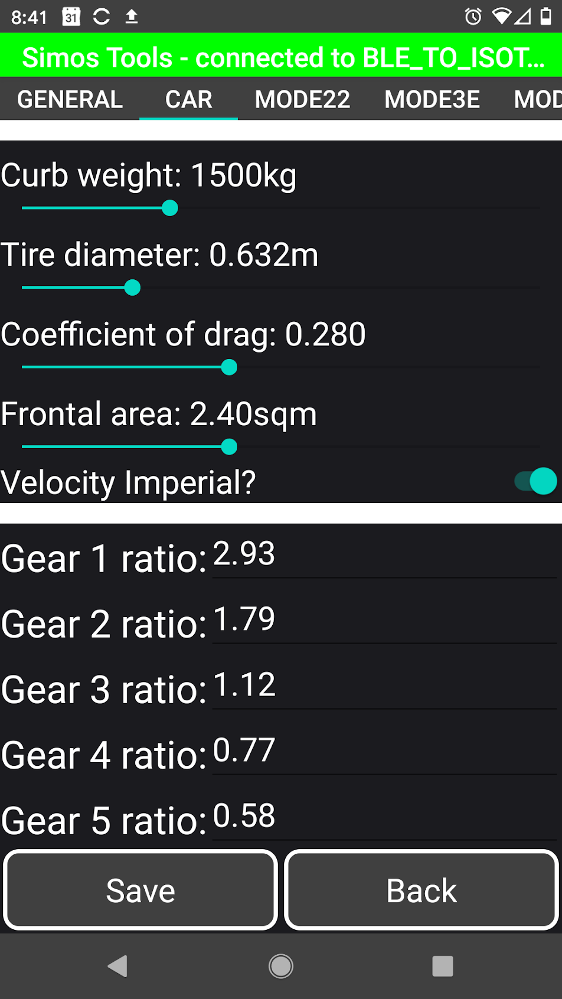

### MODE22 / MODE3E / MODEDSG
Per-mode PID configuration. Each PID entry exposes: **Name, Unit, Address, Length, Gauge Min/Max, Warn Min/Max, Equation, Format, Smoothing, Assign To, Enabled** toggle, and **Tabs** (which live tab it appears on, e.g. FUEL). Up/down arrows reorder PIDs.

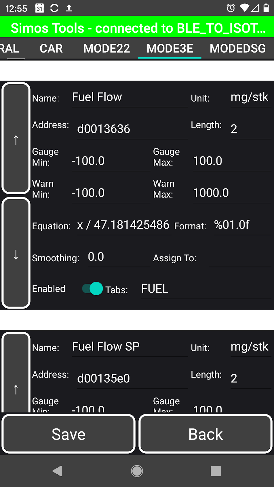

## Logging (live)
Main tab → LOGGING (ribbon shows "Polling") displays gauges for all PIDs, grouped into tabs per CSV setup (e.g. **DEFAULT · AIRFLOW · FUEL · IGNITION · MISC**). An **fps** readout shows the live refresh rate; **Quick View** and **Back** at the bottom.

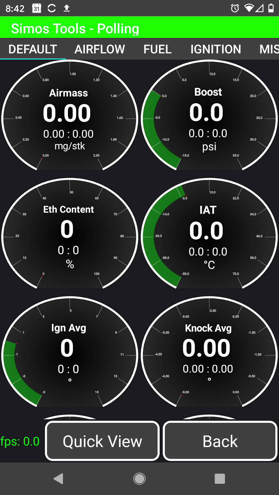

Each gauge shows current value (big), plus **Min (left)** and **Max (right)** since data started. Hold a gauge ~few seconds to reset it.

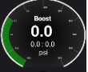

## Log viewer
Review logs on-device without a computer — an overlaid multi-trace chart with a scrub cursor showing each PID's value at that point (e.g. Boost, Calc HP, Knock Avg, IAT, Engine Speed). **Zoom `Z[…]` and time `T[…]`** shown top corners. **Load CSV** to load a log; **Set PIDS** to pick chart data; **Set Tabs** to filter by tab groups.

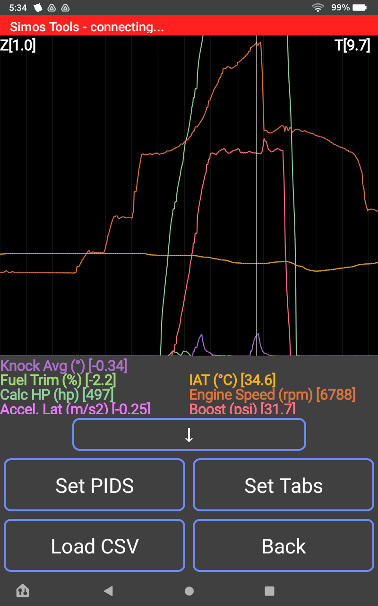

## Flashing
The Flashing screen streams per-block progress (erasing → transferring → checksum, then verify → reset ECU → clear DTC) and ends with *"turn key to off for at least 5 seconds before starting vehicle."*
- **Flash Full** — first flash must be a full BIN flash (up to ~7 min). Battery on a charger. Select **unlock** on first flash.
- **Flash CAL** — subsequent changes (e.g. boost/timing tweaks) only need a CAL flash (<1 min, overwrites Block 5 only).
- **Project clarification for patched tune updates** — use a full flash to
  install, remove, or change a patch/code component. Once the ECU already has
  the same verified patch set, subsequent calibration/tune changes may use
  **Flash CAL**; CAL-only must not be used to introduce or upgrade a patch.

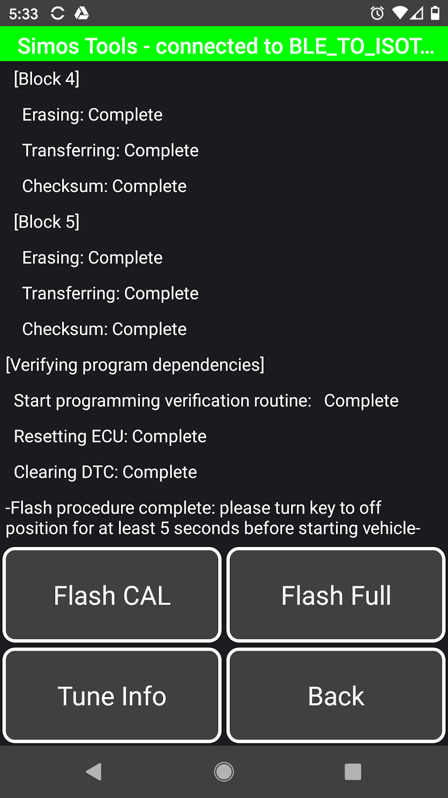

## Tune info / Utilities
- **Tune Info** — displays loaded tune file name.
- **DTC** — read codes.
- **Adaptation** — (more info needed).
- **Get Info** — short press: ECU/engine info (VIN, ASAM/ODX ID, calibration version, VW spare part / ASW version, hardware number, engine code, block dates); long press: DSG info.

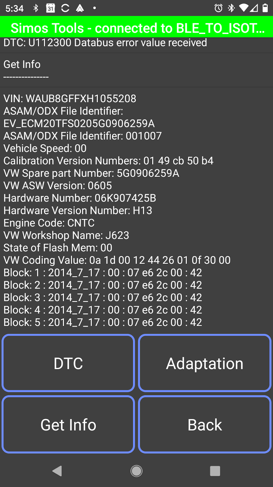

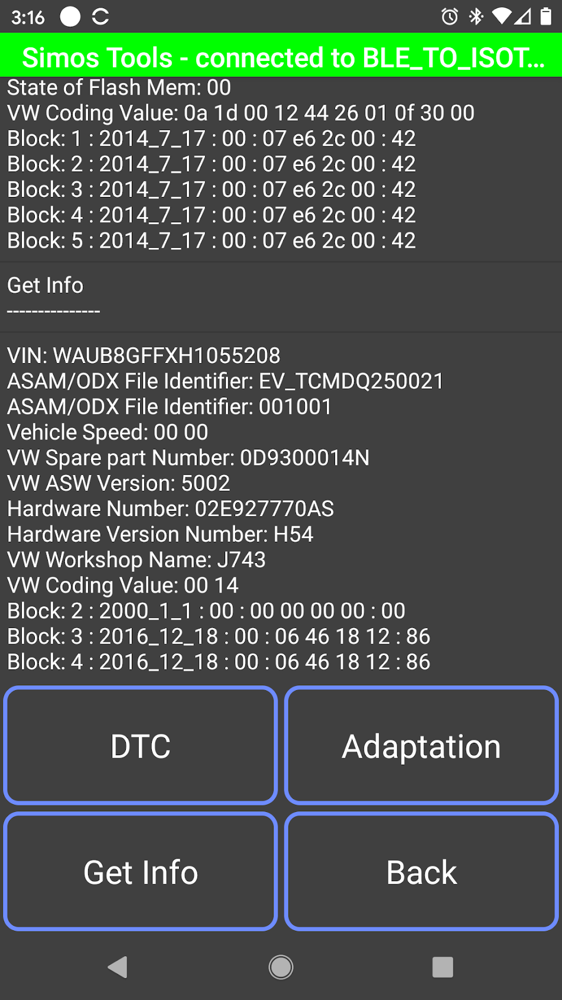

Related: [[tuning-getting-started]], [[ecu-tuning-basics]]
